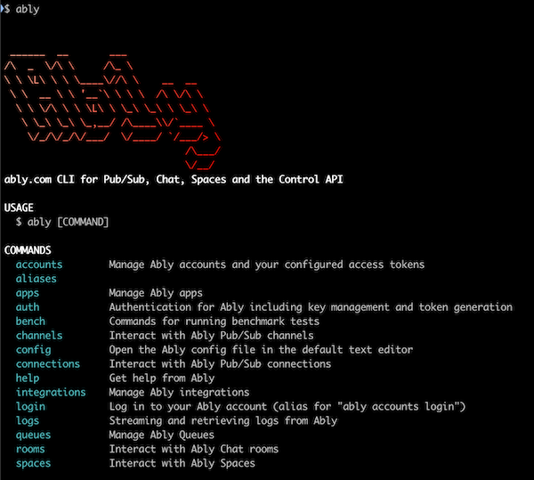

# Ably CLI and MCP server

[](https://badge.fury.io/js/@ably%2Fcli)

[Ably](https://ably.com) CLI and MCP server for [Ably Pub/Sub](https://ably.com/pubsub), [Ably Spaces](https://ably.com/spaces), [Ably Chat](https://ably.com/chat) and the [Ably Control API](https://ably.com/docs/account/control-api).

> [!NOTE]
> This project is in beta and this CLI and MCP server project is being actively developed.
> Please [raise an issue](https://github.com/ably/ably-cli/issues) if you have feedback, feature requests or want to report a bug. We welcome [pull requests too](https://github.com/ably/ably-cli/pulls).



<!-- toc -->
* [Ably CLI and MCP server](#ably-cli-and-mcp-server)
* [CLI Usage](#cli-usage)
* [MCP Usage](#mcp-usage)
* [Commands](#commands)
* [MCP Server](#mcp-server)
* [Contributing](#contributing)
* [or](#or)
<!-- tocstop -->

# CLI Usage

<!-- usage -->
```sh-session
$ npm install -g @ably/cli
$ ably COMMAND
running command...
$ ably (--version)
@ably/cli/0.15.0 darwin-arm64 node-v22.14.0
$ ably --help [COMMAND]
USAGE
  $ ably COMMAND
...
```
<!-- usagestop -->

```sh-session
LOGIN (recommended first step)
  $ ably login
```

## Auto-completion

The Ably CLI supports shell auto-completion for bash, zsh, and PowerShell. This helps you discover and use commands more efficiently.

To set up auto-completion:
```sh-session
$ ably autocomplete
```

This will display installation instructions specific to your shell. Follow them to enable tab completion for commands, subcommands, and flags.

For more details, see the [Auto-completion documentation](docs/Auto-completion.md).

## Interactive Mode

The Ably CLI includes an interactive shell mode that provides a more convenient way to work with multiple commands:

```sh-session
$ ably-interactive
```

### Features

- **Command history**: Previous commands are saved and can be accessed with up/down arrows
- **Tab completion**: Full support for command and flag completion
- **Ctrl+C handling**:
  - Single Ctrl+C interrupts the current command and returns to prompt
  - Double Ctrl+C (within 500ms) force quits the shell
- **No "ably" prefix needed**: Commands can be typed directly (e.g., just `channels list` instead of `ably channels list`)

# MCP Usage

> [!WARNING]
> The MCP server is currently experimental. Please [raise an issue](https://github.com/ably/ably-cli/issues) if you have feedback or suggestions for features.

1. Install the CLI following the [CLI usage](#cli-usage) steps.
2. Follow the instructions for your tool to set up an MCP server, such as [Claude desktop](https://modelcontextprotocol.io/quickstart/user), and configure:
   1. `command` as ably mcp start-server

See [MCP Server section](#mcp-server) for more details on how to use the MCP Server.

> [!NOTE]
> If you are having trouble getting the MCP server running, use [MCP inspector](https://github.com/modelcontextprotocol/inspector)

# Commands

<!-- commands -->
* [`ably accounts`](#ably-accounts)
* [`ably accounts current`](#ably-accounts-current)
* [`ably accounts list`](#ably-accounts-list)
* [`ably accounts login [TOKEN]`](#ably-accounts-login-token)
* [`ably accounts logout [ALIAS]`](#ably-accounts-logout-alias)
* [`ably accounts stats`](#ably-accounts-stats)
* [`ably accounts switch [ALIAS]`](#ably-accounts-switch-alias)
* [`ably apps`](#ably-apps)
* [`ably apps channel-rules`](#ably-apps-channel-rules)
* [`ably apps channel-rules create`](#ably-apps-channel-rules-create)
* [`ably apps channel-rules delete NAMEORID`](#ably-apps-channel-rules-delete-nameorid)
* [`ably apps channel-rules list`](#ably-apps-channel-rules-list)
* [`ably apps channel-rules update NAMEORID`](#ably-apps-channel-rules-update-nameorid)
* [`ably apps create`](#ably-apps-create)
* [`ably apps current`](#ably-apps-current)
* [`ably apps delete [APPID]`](#ably-apps-delete-appid)
* [`ably apps list`](#ably-apps-list)
* [`ably apps logs`](#ably-apps-logs)
* [`ably apps logs history`](#ably-apps-logs-history)
* [`ably apps logs subscribe`](#ably-apps-logs-subscribe)
* [`ably apps stats [ID]`](#ably-apps-stats-id)
* [`ably apps switch [APPID]`](#ably-apps-switch-appid)
* [`ably apps update ID`](#ably-apps-update-id)
* [`ably auth`](#ably-auth)
* [`ably auth issue-ably-token`](#ably-auth-issue-ably-token)
* [`ably auth issue-jwt-token`](#ably-auth-issue-jwt-token)
* [`ably auth keys`](#ably-auth-keys)
* [`ably auth keys create`](#ably-auth-keys-create)
* [`ably auth keys current`](#ably-auth-keys-current)
* [`ably auth keys get KEYNAMEORVALUE`](#ably-auth-keys-get-keynameorvalue)
* [`ably auth keys list`](#ably-auth-keys-list)
* [`ably auth keys revoke KEYNAME`](#ably-auth-keys-revoke-keyname)
* [`ably auth keys switch [KEYNAMEORVALUE]`](#ably-auth-keys-switch-keynameorvalue)
* [`ably auth keys update KEYNAME`](#ably-auth-keys-update-keyname)
* [`ably auth revoke-token TOKEN`](#ably-auth-revoke-token-token)
* [`ably autocomplete [SHELL]`](#ably-autocomplete-shell)
* [`ably bench`](#ably-bench)
* [`ably bench publisher CHANNEL`](#ably-bench-publisher-channel)
* [`ably bench subscriber CHANNEL`](#ably-bench-subscriber-channel)
* [`ably channels`](#ably-channels)
* [`ably channels batch-publish [MESSAGE]`](#ably-channels-batch-publish-message)
* [`ably channels history CHANNEL`](#ably-channels-history-channel)
* [`ably channels list`](#ably-channels-list)
* [`ably channels logs [TOPIC]`](#ably-channels-logs-topic)
* [`ably channels occupancy`](#ably-channels-occupancy)
* [`ably channels occupancy get CHANNEL`](#ably-channels-occupancy-get-channel)
* [`ably channels occupancy subscribe CHANNEL`](#ably-channels-occupancy-subscribe-channel)
* [`ably channels presence`](#ably-channels-presence)
* [`ably channels presence enter CHANNEL`](#ably-channels-presence-enter-channel)
* [`ably channels presence subscribe CHANNEL`](#ably-channels-presence-subscribe-channel)
* [`ably channels publish CHANNEL MESSAGE`](#ably-channels-publish-channel-message)
* [`ably channels subscribe CHANNELS`](#ably-channels-subscribe-channels)
* [`ably config`](#ably-config)
* [`ably config path`](#ably-config-path)
* [`ably config show`](#ably-config-show)
* [`ably connections`](#ably-connections)
* [`ably connections logs [TOPIC]`](#ably-connections-logs-topic)
* [`ably connections stats`](#ably-connections-stats)
* [`ably connections test`](#ably-connections-test)
* [`ably help [COMMANDS]`](#ably-help-commands)
* [`ably integrations`](#ably-integrations)
* [`ably integrations create`](#ably-integrations-create)
* [`ably integrations delete INTEGRATIONID`](#ably-integrations-delete-integrationid)
* [`ably integrations get RULEID`](#ably-integrations-get-ruleid)
* [`ably integrations list`](#ably-integrations-list)
* [`ably integrations update RULEID`](#ably-integrations-update-ruleid)
* [`ably login [TOKEN]`](#ably-login-token)
* [`ably logs`](#ably-logs)
* [`ably logs app`](#ably-logs-app)
* [`ably logs app history`](#ably-logs-app-history)
* [`ably logs app subscribe`](#ably-logs-app-subscribe)
* [`ably logs channel-lifecycle`](#ably-logs-channel-lifecycle)
* [`ably logs channel-lifecycle subscribe`](#ably-logs-channel-lifecycle-subscribe)
* [`ably logs connection-lifecycle`](#ably-logs-connection-lifecycle)
* [`ably logs connection-lifecycle history`](#ably-logs-connection-lifecycle-history)
* [`ably logs connection-lifecycle subscribe`](#ably-logs-connection-lifecycle-subscribe)
* [`ably logs connection subscribe`](#ably-logs-connection-subscribe)
* [`ably logs push`](#ably-logs-push)
* [`ably logs push history`](#ably-logs-push-history)
* [`ably logs push subscribe`](#ably-logs-push-subscribe)
* [`ably mcp`](#ably-mcp)
* [`ably mcp start-server`](#ably-mcp-start-server)
* [`ably push`](#ably-push)
* [`ably push batch-publish`](#ably-push-batch-publish)
* [`ably push channels`](#ably-push-channels)
* [`ably push channels list`](#ably-push-channels-list)
* [`ably push channels list-channels`](#ably-push-channels-list-channels)
* [`ably push channels remove`](#ably-push-channels-remove)
* [`ably push channels remove-where`](#ably-push-channels-remove-where)
* [`ably push channels save`](#ably-push-channels-save)
* [`ably push config`](#ably-push-config)
* [`ably push config clear-apns`](#ably-push-config-clear-apns)
* [`ably push config clear-fcm`](#ably-push-config-clear-fcm)
* [`ably push config set-apns`](#ably-push-config-set-apns)
* [`ably push config set-fcm`](#ably-push-config-set-fcm)
* [`ably push config show`](#ably-push-config-show)
* [`ably push devices`](#ably-push-devices)
* [`ably push devices get DEVICEID`](#ably-push-devices-get-deviceid)
* [`ably push devices list`](#ably-push-devices-list)
* [`ably push devices remove DEVICEID`](#ably-push-devices-remove-deviceid)
* [`ably push devices remove-where`](#ably-push-devices-remove-where)
* [`ably push devices save`](#ably-push-devices-save)
* [`ably push publish`](#ably-push-publish)
* [`ably queues`](#ably-queues)
* [`ably queues create`](#ably-queues-create)
* [`ably queues delete QUEUEID`](#ably-queues-delete-queueid)
* [`ably queues list`](#ably-queues-list)
* [`ably rooms`](#ably-rooms)
* [`ably rooms list`](#ably-rooms-list)
* [`ably rooms messages`](#ably-rooms-messages)
* [`ably rooms messages history ROOM`](#ably-rooms-messages-history-room)
* [`ably rooms messages reactions`](#ably-rooms-messages-reactions)
* [`ably rooms messages reactions remove ROOM MESSAGESERIAL REACTION`](#ably-rooms-messages-reactions-remove-room-messageserial-reaction)
* [`ably rooms messages reactions send ROOM MESSAGESERIAL REACTION`](#ably-rooms-messages-reactions-send-room-messageserial-reaction)
* [`ably rooms messages reactions subscribe ROOM`](#ably-rooms-messages-reactions-subscribe-room)
* [`ably rooms messages send ROOM TEXT`](#ably-rooms-messages-send-room-text)
* [`ably rooms messages subscribe ROOMS`](#ably-rooms-messages-subscribe-rooms)
* [`ably rooms occupancy`](#ably-rooms-occupancy)
* [`ably rooms occupancy get ROOM`](#ably-rooms-occupancy-get-room)
* [`ably rooms occupancy subscribe ROOM`](#ably-rooms-occupancy-subscribe-room)
* [`ably rooms presence`](#ably-rooms-presence)
* [`ably rooms presence enter ROOM`](#ably-rooms-presence-enter-room)
* [`ably rooms presence subscribe ROOM`](#ably-rooms-presence-subscribe-room)
* [`ably rooms reactions`](#ably-rooms-reactions)
* [`ably rooms reactions send ROOM EMOJI`](#ably-rooms-reactions-send-room-emoji)
* [`ably rooms reactions subscribe ROOM`](#ably-rooms-reactions-subscribe-room)
* [`ably rooms typing`](#ably-rooms-typing)
* [`ably rooms typing keystroke ROOM`](#ably-rooms-typing-keystroke-room)
* [`ably rooms typing subscribe ROOM`](#ably-rooms-typing-subscribe-room)
* [`ably spaces`](#ably-spaces)
* [`ably spaces cursors`](#ably-spaces-cursors)
* [`ably spaces cursors get-all SPACE`](#ably-spaces-cursors-get-all-space)
* [`ably spaces cursors set SPACE`](#ably-spaces-cursors-set-space)
* [`ably spaces cursors subscribe SPACE`](#ably-spaces-cursors-subscribe-space)
* [`ably spaces list`](#ably-spaces-list)
* [`ably spaces locations`](#ably-spaces-locations)
* [`ably spaces locations get-all SPACE`](#ably-spaces-locations-get-all-space)
* [`ably spaces locations set SPACE`](#ably-spaces-locations-set-space)
* [`ably spaces locations subscribe SPACE`](#ably-spaces-locations-subscribe-space)
* [`ably spaces locks`](#ably-spaces-locks)
* [`ably spaces locks acquire SPACE LOCKID`](#ably-spaces-locks-acquire-space-lockid)
* [`ably spaces locks get SPACE LOCKID`](#ably-spaces-locks-get-space-lockid)
* [`ably spaces locks get-all SPACE`](#ably-spaces-locks-get-all-space)
* [`ably spaces locks subscribe SPACE`](#ably-spaces-locks-subscribe-space)
* [`ably spaces members`](#ably-spaces-members)
* [`ably spaces members enter SPACE`](#ably-spaces-members-enter-space)
* [`ably spaces members subscribe SPACE`](#ably-spaces-members-subscribe-space)
* [`ably status`](#ably-status)
* [`ably support`](#ably-support)
* [`ably support ask QUESTION`](#ably-support-ask-question)
* [`ably support contact`](#ably-support-contact)

## `ably accounts`

Manage Ably accounts and your configured access tokens

```
USAGE
  $ ably accounts

DESCRIPTION
  Manage Ably accounts and your configured access tokens

EXAMPLES
  $ ably accounts login

  $ ably accounts list

  $ ably accounts current

  $ ably accounts logout

  $ ably accounts switch my-account

  $ ably accounts stats

COMMANDS
  ably accounts current         Show the current Ably account
  ably accounts list            List locally configured Ably accounts
  ably accounts login           Log in to your Ably account
  ably accounts logout          Log out from an Ably account
  ably accounts stats           Get account stats with optional live updates
  ably accounts switch          Switch to a different Ably account
```

_See code: [src/commands/accounts/index.ts](https://github.com/ably/ably-cli/blob/v0.15.0/src/commands/accounts/index.ts)_

## `ably accounts current`

Show the current Ably account

```
USAGE
  $ ably accounts current [--access-token <value>] [--api-key <value>] [--client-id <value>] [--env <value>]
    [--endpoint <value>] [--host <value>] [--json | --pretty-json] [--token <value>] [-v]

FLAGS
  -v, --verbose               Output verbose logs
      --access-token=<value>  Overrides any configured access token used for the Control API
      --api-key=<value>       Overrides any configured API key used for the product APIs
      --client-id=<value>     Overrides any default client ID when using API authentication. Use "none" to explicitly
                              set no client ID. Not applicable when using token authentication.
      --endpoint=<value>      Override the endpoint for all product API calls
      --env=<value>           Override the environment for all product API calls
      --host=<value>          Override the host endpoint for all product API calls
      --json                  Output in JSON format
      --pretty-json           Output in colorized JSON format
      --token=<value>         Authenticate using an Ably Token or JWT Token instead of an API key

DESCRIPTION
  Show the current Ably account

EXAMPLES
  $ ably accounts current

  $ ably accounts current --json

  $ ably accounts current --pretty-json
```

_See code: [src/commands/accounts/current.ts](https://github.com/ably/ably-cli/blob/v0.15.0/src/commands/accounts/current.ts)_

## `ably accounts list`

List locally configured Ably accounts

```
USAGE
  $ ably accounts list [--access-token <value>] [--api-key <value>] [--client-id <value>] [--env <value>]
    [--endpoint <value>] [--host <value>] [--json | --pretty-json] [--token <value>] [-v]

FLAGS
  -v, --verbose               Output verbose logs
      --access-token=<value>  Overrides any configured access token used for the Control API
      --api-key=<value>       Overrides any configured API key used for the product APIs
      --client-id=<value>     Overrides any default client ID when using API authentication. Use "none" to explicitly
                              set no client ID. Not applicable when using token authentication.
      --endpoint=<value>      Override the endpoint for all product API calls
      --env=<value>           Override the environment for all product API calls
      --host=<value>          Override the host endpoint for all product API calls
      --json                  Output in JSON format
      --pretty-json           Output in colorized JSON format
      --token=<value>         Authenticate using an Ably Token or JWT Token instead of an API key

DESCRIPTION
  List locally configured Ably accounts

EXAMPLES
  $ ably accounts list

  $ ably accounts list --json

  $ ably accounts list --pretty-json
```

_See code: [src/commands/accounts/list.ts](https://github.com/ably/ably-cli/blob/v0.15.0/src/commands/accounts/list.ts)_

## `ably accounts login [TOKEN]`

Log in to your Ably account

```
USAGE
  $ ably accounts login [TOKEN] [--access-token <value>] [--api-key <value>] [--client-id <value>] [--env <value>]
    [--endpoint <value>] [--host <value>] [--json | --pretty-json] [--token <value>] [-v] [-a <value>] [--no-browser]

ARGUMENTS
  TOKEN  Access token (if not provided, will prompt for it)

FLAGS
  -a, --alias=<value>         Alias for this account (default account if not specified)
  -v, --verbose               Output verbose logs
      --access-token=<value>  Overrides any configured access token used for the Control API
      --api-key=<value>       Overrides any configured API key used for the product APIs
      --client-id=<value>     Overrides any default client ID when using API authentication. Use "none" to explicitly
                              set no client ID. Not applicable when using token authentication.
      --endpoint=<value>      Override the endpoint for all product API calls
      --env=<value>           Override the environment for all product API calls
      --host=<value>          Override the host endpoint for all product API calls
      --json                  Output in JSON format
      --no-browser            Do not open a browser
      --pretty-json           Output in colorized JSON format
      --token=<value>         Authenticate using an Ably Token or JWT Token instead of an API key

DESCRIPTION
  Log in to your Ably account

EXAMPLES
  $ ably accounts login

  $ ably accounts login --alias mycompany

  $ ably accounts login --json

  $ ably accounts login --pretty-json
```

_See code: [src/commands/accounts/login.ts](https://github.com/ably/ably-cli/blob/v0.15.0/src/commands/accounts/login.ts)_

## `ably accounts logout [ALIAS]`

Log out from an Ably account

```
USAGE
  $ ably accounts logout [ALIAS] [--access-token <value>] [--api-key <value>] [--client-id <value>] [--env <value>]
    [--endpoint <value>] [--host <value>] [--json | --pretty-json] [--token <value>] [-v] [-f]

ARGUMENTS
  ALIAS  Alias of the account to log out from (defaults to current account)

FLAGS
  -f, --force                 Force logout without confirmation
  -v, --verbose               Output verbose logs
      --access-token=<value>  Overrides any configured access token used for the Control API
      --api-key=<value>       Overrides any configured API key used for the product APIs
      --client-id=<value>     Overrides any default client ID when using API authentication. Use "none" to explicitly
                              set no client ID. Not applicable when using token authentication.
      --endpoint=<value>      Override the endpoint for all product API calls
      --env=<value>           Override the environment for all product API calls
      --host=<value>          Override the host endpoint for all product API calls
      --json                  Output in JSON format
      --pretty-json           Output in colorized JSON format
      --token=<value>         Authenticate using an Ably Token or JWT Token instead of an API key

DESCRIPTION
  Log out from an Ably account

EXAMPLES
  $ ably accounts logout

  $ ably accounts logout mycompany

  $ ably accounts logout --json

  $ ably accounts logout --pretty-json
```

_See code: [src/commands/accounts/logout.ts](https://github.com/ably/ably-cli/blob/v0.15.0/src/commands/accounts/logout.ts)_

## `ably accounts stats`

Get account stats with optional live updates

```
USAGE
  $ ably accounts stats [--access-token <value>] [--api-key <value>] [--client-id <value>] [--env <value>]
    [--endpoint <value>] [--host <value>] [--json | --pretty-json] [--token <value>] [-v] [--debug] [--end <value>]
    [--interval <value>] [--limit <value>] [--live] [--start <value>] [--unit minute|hour|day|month]

FLAGS
  -v, --verbose               Output verbose logs
      --access-token=<value>  Overrides any configured access token used for the Control API
      --api-key=<value>       Overrides any configured API key used for the product APIs
      --client-id=<value>     Overrides any default client ID when using API authentication. Use "none" to explicitly
                              set no client ID. Not applicable when using token authentication.
      --debug                 Show debug information for live stats polling
      --end=<value>           End time in milliseconds since epoch
      --endpoint=<value>      Override the endpoint for all product API calls
      --env=<value>           Override the environment for all product API calls
      --host=<value>          Override the host endpoint for all product API calls
      --interval=<value>      [default: 6] Polling interval in seconds (only used with --live)
      --json                  Output in JSON format
      --limit=<value>         [default: 10] Maximum number of stats records to return
      --live                  Subscribe to live stats updates (uses minute interval)
      --pretty-json           Output in colorized JSON format
      --start=<value>         Start time in milliseconds since epoch
      --token=<value>         Authenticate using an Ably Token or JWT Token instead of an API key
      --unit=<option>         [default: minute] Time unit for stats
                              <options: minute|hour|day|month>

DESCRIPTION
  Get account stats with optional live updates

EXAMPLES
  $ ably accounts stats

  $ ably accounts stats --unit hour

  $ ably accounts stats --start 1618005600000 --end 1618091999999

  $ ably accounts stats --limit 10

  $ ably accounts stats --json

  $ ably accounts stats --pretty-json

  $ ably accounts stats --live

  $ ably accounts stats --live --interval 15
```

_See code: [src/commands/accounts/stats/index.ts](https://github.com/ably/ably-cli/blob/v0.15.0/src/commands/accounts/stats/index.ts)_

## `ably accounts switch [ALIAS]`

Switch to a different Ably account

```
USAGE
  $ ably accounts switch [ALIAS] [--access-token <value>] [--api-key <value>] [--client-id <value>] [--env <value>]
    [--endpoint <value>] [--host <value>] [--json | --pretty-json] [--token <value>] [-v]

ARGUMENTS
  ALIAS  Alias of the account to switch to

FLAGS
  -v, --verbose               Output verbose logs
      --access-token=<value>  Overrides any configured access token used for the Control API
      --api-key=<value>       Overrides any configured API key used for the product APIs
      --client-id=<value>     Overrides any default client ID when using API authentication. Use "none" to explicitly
                              set no client ID. Not applicable when using token authentication.
      --endpoint=<value>      Override the endpoint for all product API calls
      --env=<value>           Override the environment for all product API calls
      --host=<value>          Override the host endpoint for all product API calls
      --json                  Output in JSON format
      --pretty-json           Output in colorized JSON format
      --token=<value>         Authenticate using an Ably Token or JWT Token instead of an API key

DESCRIPTION
  Switch to a different Ably account

EXAMPLES
  $ ably accounts switch

  $ ably accounts switch mycompany

  $ ably accounts switch --json

  $ ably accounts switch --pretty-json
```

_See code: [src/commands/accounts/switch.ts](https://github.com/ably/ably-cli/blob/v0.15.0/src/commands/accounts/switch.ts)_

## `ably apps`

Manage Ably apps

```
USAGE
  $ ably apps

DESCRIPTION
  Manage Ably apps

EXAMPLES
  $ ably apps list

  $ ably apps create

  $ ably apps update

  $ ably apps delete

  $ ably apps set-apns-p12

  $ ably apps stats

  $ ably apps channel-rules list

  $ ably apps switch my-app

COMMANDS
  ably apps channel-rules       Manage Ably channel rules (namespaces)
  ably apps create              Create a new app
  ably apps current             Show the currently selected app
  ably apps delete              Delete an app
  ably apps list                List all apps in the current account
  ably apps logs                Stream or retrieve app logs
  ably apps stats               Get app stats with optional live updates
  ably apps switch              Switch to a different Ably app
  ably apps update              Update an app
```

_See code: [src/commands/apps/index.ts](https://github.com/ably/ably-cli/blob/v0.15.0/src/commands/apps/index.ts)_

## `ably apps channel-rules`

Manage Ably channel rules (namespaces)

```
USAGE
  $ ably apps channel-rules

DESCRIPTION
  Manage Ably channel rules (namespaces)

EXAMPLES
  $ ably apps channel-rules list

  $ ably apps channel-rules create --name "chat" --persisted

  $ ably apps channel-rules update chat --push-enabled

  $ ably apps channel-rules delete chat
```

_See code: [src/commands/apps/channel-rules/index.ts](https://github.com/ably/ably-cli/blob/v0.15.0/src/commands/apps/channel-rules/index.ts)_

## `ably apps channel-rules create`

Create a channel rule

```
USAGE
  $ ably apps channel-rules create --name <value> [--access-token <value>] [--api-key <value>] [--client-id <value>] [--env
    <value>] [--endpoint <value>] [--host <value>] [--json | --pretty-json] [--token <value>] [-v] [--app <value>]
    [--authenticated] [--batching-enabled] [--batching-interval <value>] [--conflation-enabled] [--conflation-interval
    <value>] [--conflation-key <value>] [--expose-time-serial] [--persist-last] [--persisted]
    [--populate-channel-registry] [--push-enabled] [--tls-only]

FLAGS
  -v, --verbose                      Output verbose logs
      --access-token=<value>         Overrides any configured access token used for the Control API
      --api-key=<value>              Overrides any configured API key used for the product APIs
      --app=<value>                  App ID or name to create the channel rule in
      --authenticated                Whether channels matching this rule require clients to be authenticated
      --batching-enabled             Whether to enable batching for messages on channels matching this rule
      --batching-interval=<value>    The batching interval for messages on channels matching this rule
      --client-id=<value>            Overrides any default client ID when using API authentication. Use "none" to
                                     explicitly set no client ID. Not applicable when using token authentication.
      --conflation-enabled           Whether to enable conflation for messages on channels matching this rule
      --conflation-interval=<value>  The conflation interval for messages on channels matching this rule
      --conflation-key=<value>       The conflation key for messages on channels matching this rule
      --endpoint=<value>             Override the endpoint for all product API calls
      --env=<value>                  Override the environment for all product API calls
      --expose-time-serial           Whether to expose the time serial for messages on channels matching this rule
      --host=<value>                 Override the host endpoint for all product API calls
      --json                         Output in JSON format
      --name=<value>                 (required) Name of the channel rule
      --persist-last                 Whether to persist only the last message on channels matching this rule
      --persisted                    Whether messages on channels matching this rule should be persisted
      --populate-channel-registry    Whether to populate the channel registry for channels matching this rule
      --pretty-json                  Output in colorized JSON format
      --push-enabled                 Whether push notifications should be enabled for channels matching this rule
      --tls-only                     Whether to enforce TLS for channels matching this rule
      --token=<value>                Authenticate using an Ably Token or JWT Token instead of an API key

DESCRIPTION
  Create a channel rule

EXAMPLES
  $ ably apps channel-rules create --name "chat" --persisted

  $ ably apps channel-rules create --name "events" --push-enabled

  $ ably apps channel-rules create --name "notifications" --persisted --push-enabled --app "My App"
```

_See code: [src/commands/apps/channel-rules/create.ts](https://github.com/ably/ably-cli/blob/v0.15.0/src/commands/apps/channel-rules/create.ts)_

## `ably apps channel-rules delete NAMEORID`

Delete a channel rule

```
USAGE
  $ ably apps channel-rules delete NAMEORID [--access-token <value>] [--api-key <value>] [--client-id <value>] [--env <value>]
    [--endpoint <value>] [--host <value>] [--json | --pretty-json] [--token <value>] [-v] [--app <value>] [-f]

ARGUMENTS
  NAMEORID  Name or ID of the channel rule to delete

FLAGS
  -f, --force                 Force deletion without confirmation
  -v, --verbose               Output verbose logs
      --access-token=<value>  Overrides any configured access token used for the Control API
      --api-key=<value>       Overrides any configured API key used for the product APIs
      --app=<value>           App ID or name to delete the channel rule from
      --client-id=<value>     Overrides any default client ID when using API authentication. Use "none" to explicitly
                              set no client ID. Not applicable when using token authentication.
      --endpoint=<value>      Override the endpoint for all product API calls
      --env=<value>           Override the environment for all product API calls
      --host=<value>          Override the host endpoint for all product API calls
      --json                  Output in JSON format
      --pretty-json           Output in colorized JSON format
      --token=<value>         Authenticate using an Ably Token or JWT Token instead of an API key

DESCRIPTION
  Delete a channel rule

EXAMPLES
  $ ably apps channel-rules delete chat

  $ ably apps channel-rules delete events --app "My App"

  $ ably apps channel-rules delete notifications --force

  $ ably apps channel-rules delete chat --json

  $ ably apps channel-rules delete chat --pretty-json
```

_See code: [src/commands/apps/channel-rules/delete.ts](https://github.com/ably/ably-cli/blob/v0.15.0/src/commands/apps/channel-rules/delete.ts)_

## `ably apps channel-rules list`

List channel rules for an app

```
USAGE
  $ ably apps channel-rules list

DESCRIPTION
  List channel rules for an app

EXAMPLES
  $ ably apps:channel-rules:list

  $ ably apps:channel-rules:list --app-id my-app-id

  $ ably apps:channel-rules:list --json

  $ ably apps:channel-rules:list --pretty-json
```

_See code: [src/commands/apps/channel-rules/list.ts](https://github.com/ably/ably-cli/blob/v0.15.0/src/commands/apps/channel-rules/list.ts)_

## `ably apps channel-rules update NAMEORID`

Update a channel rule

```
USAGE
  $ ably apps channel-rules update NAMEORID [--access-token <value>] [--api-key <value>] [--client-id <value>] [--env <value>]
    [--endpoint <value>] [--host <value>] [--json | --pretty-json] [--token <value>] [-v] [--app <value>]
    [--authenticated] [--batching-enabled] [--batching-interval <value>] [--conflation-enabled] [--conflation-interval
    <value>] [--conflation-key <value>] [--expose-time-serial] [--persist-last] [--persisted]
    [--populate-channel-registry] [--push-enabled] [--tls-only]

ARGUMENTS
  NAMEORID  Name or ID of the channel rule to update

FLAGS
  -v, --verbose                         Output verbose logs
      --access-token=<value>            Overrides any configured access token used for the Control API
      --api-key=<value>                 Overrides any configured API key used for the product APIs
      --app=<value>                     App ID or name to update the channel rule in
      --[no-]authenticated              Whether channels matching this rule require clients to be authenticated
      --[no-]batching-enabled           Whether to enable batching for messages on channels matching this rule
      --batching-interval=<value>       The batching interval for messages on channels matching this rule
      --client-id=<value>               Overrides any default client ID when using API authentication. Use "none" to
                                        explicitly set no client ID. Not applicable when using token authentication.
      --[no-]conflation-enabled         Whether to enable conflation for messages on channels matching this rule
      --conflation-interval=<value>     The conflation interval for messages on channels matching this rule
      --conflation-key=<value>          The conflation key for messages on channels matching this rule
      --endpoint=<value>                Override the endpoint for all product API calls
      --env=<value>                     Override the environment for all product API calls
      --[no-]expose-time-serial         Whether to expose the time serial for messages on channels matching this rule
      --host=<value>                    Override the host endpoint for all product API calls
      --json                            Output in JSON format
      --[no-]persist-last               Whether to persist only the last message on channels matching this rule
      --[no-]persisted                  Whether messages on channels matching this rule should be persisted
      --[no-]populate-channel-registry  Whether to populate the channel registry for channels matching this rule
      --pretty-json                     Output in colorized JSON format
      --[no-]push-enabled               Whether push notifications should be enabled for channels matching this rule
      --[no-]tls-only                   Whether to enforce TLS for channels matching this rule
      --token=<value>                   Authenticate using an Ably Token or JWT Token instead of an API key

DESCRIPTION
  Update a channel rule

EXAMPLES
  $ ably apps channel-rules update chat --persisted

  $ ably apps channel-rules update events --push-enabled=false

  $ ably apps channel-rules update notifications --persisted --push-enabled --app "My App"
```

_See code: [src/commands/apps/channel-rules/update.ts](https://github.com/ably/ably-cli/blob/v0.15.0/src/commands/apps/channel-rules/update.ts)_

## `ably apps create`

Create a new app

```
USAGE
  $ ably apps create --name <value> [--access-token <value>] [--api-key <value>] [--client-id <value>] [--env
    <value>] [--endpoint <value>] [--host <value>] [--json | --pretty-json] [--token <value>] [-v] [--tls-only]

FLAGS
  -v, --verbose               Output verbose logs
      --access-token=<value>  Overrides any configured access token used for the Control API
      --api-key=<value>       Overrides any configured API key used for the product APIs
      --client-id=<value>     Overrides any default client ID when using API authentication. Use "none" to explicitly
                              set no client ID. Not applicable when using token authentication.
      --endpoint=<value>      Override the endpoint for all product API calls
      --env=<value>           Override the environment for all product API calls
      --host=<value>          Override the host endpoint for all product API calls
      --json                  Output in JSON format
      --name=<value>          (required) Name of the app
      --pretty-json           Output in colorized JSON format
      --tls-only              Whether the app should accept TLS connections only
      --token=<value>         Authenticate using an Ably Token or JWT Token instead of an API key

DESCRIPTION
  Create a new app

EXAMPLES
  $ ably apps create --name "My New App"

  $ ably apps create --name "My New App" --tls-only

  $ ably apps create --name "My New App" --access-token "YOUR_ACCESS_TOKEN"
```

_See code: [src/commands/apps/create.ts](https://github.com/ably/ably-cli/blob/v0.15.0/src/commands/apps/create.ts)_

## `ably apps current`

Show the currently selected app

```
USAGE
  $ ably apps current [--access-token <value>] [--api-key <value>] [--client-id <value>] [--env <value>]
    [--endpoint <value>] [--host <value>] [--json | --pretty-json] [--token <value>] [-v]

FLAGS
  -v, --verbose               Output verbose logs
      --access-token=<value>  Overrides any configured access token used for the Control API
      --api-key=<value>       Overrides any configured API key used for the product APIs
      --client-id=<value>     Overrides any default client ID when using API authentication. Use "none" to explicitly
                              set no client ID. Not applicable when using token authentication.
      --endpoint=<value>      Override the endpoint for all product API calls
      --env=<value>           Override the environment for all product API calls
      --host=<value>          Override the host endpoint for all product API calls
      --json                  Output in JSON format
      --pretty-json           Output in colorized JSON format
      --token=<value>         Authenticate using an Ably Token or JWT Token instead of an API key

DESCRIPTION
  Show the currently selected app

EXAMPLES
  $ ably apps current

  $ ably apps current --json

  $ ably apps current --pretty-json
```

_See code: [src/commands/apps/current.ts](https://github.com/ably/ably-cli/blob/v0.15.0/src/commands/apps/current.ts)_

## `ably apps delete [APPID]`

Delete an app

```
USAGE
  $ ably apps delete [APPID] [--access-token <value>] [--api-key <value>] [--client-id <value>] [--env <value>]
    [--endpoint <value>] [--host <value>] [--json | --pretty-json] [--token <value>] [-v] [-f] [--app <value>]

ARGUMENTS
  APPID  App ID to delete (uses current app if not specified)

FLAGS
  -f, --force                 Skip confirmation prompt
  -v, --verbose               Output verbose logs
      --access-token=<value>  Overrides any configured access token used for the Control API
      --api-key=<value>       Overrides any configured API key used for the product APIs
      --app=<value>           App ID to delete (overrides argument and current app)
      --client-id=<value>     Overrides any default client ID when using API authentication. Use "none" to explicitly
                              set no client ID. Not applicable when using token authentication.
      --endpoint=<value>      Override the endpoint for all product API calls
      --env=<value>           Override the environment for all product API calls
      --host=<value>          Override the host endpoint for all product API calls
      --json                  Output in JSON format
      --pretty-json           Output in colorized JSON format
      --token=<value>         Authenticate using an Ably Token or JWT Token instead of an API key

DESCRIPTION
  Delete an app

EXAMPLES
  $ ably apps delete

  $ ably apps delete app-id

  $ ably apps delete --app app-id

  $ ably apps delete app-id --access-token "YOUR_ACCESS_TOKEN"

  $ ably apps delete app-id --force

  $ ably apps delete app-id --json

  $ ably apps delete app-id --pretty-json
```

_See code: [src/commands/apps/delete.ts](https://github.com/ably/ably-cli/blob/v0.15.0/src/commands/apps/delete.ts)_

## `ably apps list`

List all apps in the current account

```
USAGE
  $ ably apps list [--access-token <value>] [--api-key <value>] [--client-id <value>] [--env <value>]
    [--endpoint <value>] [--host <value>] [--json | --pretty-json] [--token <value>] [-v]

FLAGS
  -v, --verbose               Output verbose logs
      --access-token=<value>  Overrides any configured access token used for the Control API
      --api-key=<value>       Overrides any configured API key used for the product APIs
      --client-id=<value>     Overrides any default client ID when using API authentication. Use "none" to explicitly
                              set no client ID. Not applicable when using token authentication.
      --endpoint=<value>      Override the endpoint for all product API calls
      --env=<value>           Override the environment for all product API calls
      --host=<value>          Override the host endpoint for all product API calls
      --json                  Output in JSON format
      --pretty-json           Output in colorized JSON format
      --token=<value>         Authenticate using an Ably Token or JWT Token instead of an API key

DESCRIPTION
  List all apps in the current account

EXAMPLES
  $ ably apps list

  $ ably apps list --json

  $ ably apps list --pretty-json
```

_See code: [src/commands/apps/list.ts](https://github.com/ably/ably-cli/blob/v0.15.0/src/commands/apps/list.ts)_

## `ably apps logs`

Stream or retrieve app logs

```
USAGE
  $ ably apps logs

DESCRIPTION
  Stream or retrieve app logs

EXAMPLES
  $ ably apps logs subscribe

  $ ably apps logs subscribe --rewind 10

  $ ably apps logs history
```

_See code: [src/commands/apps/logs/index.ts](https://github.com/ably/ably-cli/blob/v0.15.0/src/commands/apps/logs/index.ts)_

## `ably apps logs history`

Alias for `ably logs app history`

```
USAGE
  $ ably apps logs history [--access-token <value>] [--api-key <value>] [--client-id <value>] [--env <value>]
    [--endpoint <value>] [--host <value>] [--pretty-json | --json] [--token <value>] [-v] [--direction
    backwards|forwards] [--limit <value>]

FLAGS
  -v, --verbose               Output verbose logs
      --access-token=<value>  Overrides any configured access token used for the Control API
      --api-key=<value>       Overrides any configured API key used for the product APIs
      --client-id=<value>     Overrides any default client ID when using API authentication. Use "none" to explicitly
                              set no client ID. Not applicable when using token authentication.
      --direction=<option>    [default: backwards] Direction of message retrieval
                              <options: backwards|forwards>
      --endpoint=<value>      Override the endpoint for all product API calls
      --env=<value>           Override the environment for all product API calls
      --host=<value>          Override the host endpoint for all product API calls
      --json                  Output results in JSON format
      --limit=<value>         [default: 100] Maximum number of messages to retrieve
      --pretty-json           Output in colorized JSON format
      --token=<value>         Authenticate using an Ably Token or JWT Token instead of an API key

DESCRIPTION
  Alias for `ably logs app history`

EXAMPLES
  $ ably apps logs history

  $ ably apps logs history --limit 20

  $ ably apps logs history --direction forwards

  $ ably apps logs history --json

  $ ably apps logs history --pretty-json
```

_See code: [src/commands/apps/logs/history.ts](https://github.com/ably/ably-cli/blob/v0.15.0/src/commands/apps/logs/history.ts)_

## `ably apps logs subscribe`

Alias for ably logs app subscribe

```
USAGE
  $ ably apps logs subscribe [--access-token <value>] [--api-key <value>] [--client-id <value>] [--env <value>]
    [--endpoint <value>] [--host <value>] [--pretty-json | --json] [--token <value>] [-v] [--rewind <value>]

FLAGS
  -v, --verbose               Output verbose logs
      --access-token=<value>  Overrides any configured access token used for the Control API
      --api-key=<value>       Overrides any configured API key used for the product APIs
      --client-id=<value>     Overrides any default client ID when using API authentication. Use "none" to explicitly
                              set no client ID. Not applicable when using token authentication.
      --endpoint=<value>      Override the endpoint for all product API calls
      --env=<value>           Override the environment for all product API calls
      --host=<value>          Override the host endpoint for all product API calls
      --json                  Output results as JSON
      --pretty-json           Output in colorized JSON format
      --rewind=<value>        Number of messages to rewind when subscribing
      --token=<value>         Authenticate using an Ably Token or JWT Token instead of an API key

DESCRIPTION
  Alias for ably logs app subscribe

EXAMPLES
  $ ably apps logs subscribe

  $ ably apps logs subscribe --rewind 10
```

_See code: [src/commands/apps/logs/subscribe.ts](https://github.com/ably/ably-cli/blob/v0.15.0/src/commands/apps/logs/subscribe.ts)_

## `ably apps stats [ID]`

Get app stats with optional live updates

```
USAGE
  $ ably apps stats [ID] [--access-token <value>] [--api-key <value>] [--client-id <value>] [--env <value>]
    [--endpoint <value>] [--host <value>] [--json | --pretty-json] [--token <value>] [-v] [--debug] [--end <value>]
    [--interval <value>] [--limit <value>] [--live] [--start <value>] [--unit minute|hour|day|month]

ARGUMENTS
  ID  App ID to get stats for (uses default app if not provided)

FLAGS
  -v, --verbose               Output verbose logs
      --access-token=<value>  Overrides any configured access token used for the Control API
      --api-key=<value>       Overrides any configured API key used for the product APIs
      --client-id=<value>     Overrides any default client ID when using API authentication. Use "none" to explicitly
                              set no client ID. Not applicable when using token authentication.
      --debug                 Show debug information for live stats polling
      --end=<value>           End time in milliseconds since epoch
      --endpoint=<value>      Override the endpoint for all product API calls
      --env=<value>           Override the environment for all product API calls
      --host=<value>          Override the host endpoint for all product API calls
      --interval=<value>      [default: 6] Polling interval in seconds (only used with --live)
      --json                  Output in JSON format
      --limit=<value>         [default: 10] Maximum number of stats records to return
      --live                  Subscribe to live stats updates (uses minute interval)
      --pretty-json           Output in colorized JSON format
      --start=<value>         Start time in milliseconds since epoch
      --token=<value>         Authenticate using an Ably Token or JWT Token instead of an API key
      --unit=<option>         [default: minute] Time unit for stats
                              <options: minute|hour|day|month>

DESCRIPTION
  Get app stats with optional live updates

EXAMPLES
  $ ably apps stats

  $ ably apps stats app-id

  $ ably apps stats --unit hour

  $ ably apps stats app-id --unit hour

  $ ably apps stats app-id --start 1618005600000 --end 1618091999999

  $ ably apps stats app-id --limit 10

  $ ably apps stats app-id --json

  $ ably apps stats app-id --pretty-json

  $ ably apps stats --live

  $ ably apps stats app-id --live

  $ ably apps stats --live --interval 15
```

_See code: [src/commands/apps/stats/index.ts](https://github.com/ably/ably-cli/blob/v0.15.0/src/commands/apps/stats/index.ts)_

## `ably apps switch [APPID]`

Switch to a different Ably app

```
USAGE
  $ ably apps switch [APPID] [--access-token <value>] [--api-key <value>] [--client-id <value>] [--env <value>]
    [--endpoint <value>] [--host <value>] [--json | --pretty-json] [--token <value>] [-v]

ARGUMENTS
  APPID  ID of the app to switch to

FLAGS
  -v, --verbose               Output verbose logs
      --access-token=<value>  Overrides any configured access token used for the Control API
      --api-key=<value>       Overrides any configured API key used for the product APIs
      --client-id=<value>     Overrides any default client ID when using API authentication. Use "none" to explicitly
                              set no client ID. Not applicable when using token authentication.
      --endpoint=<value>      Override the endpoint for all product API calls
      --env=<value>           Override the environment for all product API calls
      --host=<value>          Override the host endpoint for all product API calls
      --json                  Output in JSON format
      --pretty-json           Output in colorized JSON format
      --token=<value>         Authenticate using an Ably Token or JWT Token instead of an API key

DESCRIPTION
  Switch to a different Ably app

EXAMPLES
  $ ably apps switch APP_ID

  $ ably apps switch
```

_See code: [src/commands/apps/switch.ts](https://github.com/ably/ably-cli/blob/v0.15.0/src/commands/apps/switch.ts)_

## `ably apps update ID`

Update an app

```
USAGE
  $ ably apps update ID [--access-token <value>] [--api-key <value>] [--client-id <value>] [--env <value>]
    [--endpoint <value>] [--host <value>] [--json | --pretty-json] [--token <value>] [-v] [--name <value>] [--tls-only]

ARGUMENTS
  ID  App ID to update

FLAGS
  -v, --verbose               Output verbose logs
      --access-token=<value>  Overrides any configured access token used for the Control API
      --api-key=<value>       Overrides any configured API key used for the product APIs
      --client-id=<value>     Overrides any default client ID when using API authentication. Use "none" to explicitly
                              set no client ID. Not applicable when using token authentication.
      --endpoint=<value>      Override the endpoint for all product API calls
      --env=<value>           Override the environment for all product API calls
      --host=<value>          Override the host endpoint for all product API calls
      --json                  Output in JSON format
      --name=<value>          New name for the app
      --pretty-json           Output in colorized JSON format
      --tls-only              Whether the app should accept TLS connections only
      --token=<value>         Authenticate using an Ably Token or JWT Token instead of an API key

DESCRIPTION
  Update an app

EXAMPLES
  $ ably apps update app-id --name "Updated App Name"

  $ ably apps update app-id --tls-only

  $ ably apps update app-id --name "Updated App Name" --tls-only

  $ ably apps update app-id --name "Updated App Name" --access-token "YOUR_ACCESS_TOKEN"
```

_See code: [src/commands/apps/update.ts](https://github.com/ably/ably-cli/blob/v0.15.0/src/commands/apps/update.ts)_

## `ably auth`

Manage authentication, keys and tokens

```
USAGE
  $ ably auth

DESCRIPTION
  Manage authentication, keys and tokens

EXAMPLES
  $ ably auth keys list

  $ ably auth issue-jwt-token

  $ ably auth issue-ably-token

COMMANDS
  ably auth issue-ably-token    Creates an Ably Token with capabilities
  ably auth issue-jwt-token     Creates an Ably JWT token with capabilities
  ably auth keys                Key management commands
  ably auth revoke-token        Revokes the token provided
```

_See code: [src/commands/auth/index.ts](https://github.com/ably/ably-cli/blob/v0.15.0/src/commands/auth/index.ts)_

## `ably auth issue-ably-token`

Creates an Ably Token with capabilities

```
USAGE
  $ ably auth issue-ably-token [--access-token <value>] [--api-key <value>] [--client-id <value>] [--env <value>]
    [--endpoint <value>] [--host <value>] [--json | --pretty-json] [--token <value>] [-v] [--app <value>] [--capability
    <value>] [--token-only] [--ttl <value>]

FLAGS
  -v, --verbose               Output verbose logs
      --access-token=<value>  Overrides any configured access token used for the Control API
      --api-key=<value>       Overrides any configured API key used for the product APIs
      --app=<value>           App ID to use (uses current app if not specified)
      --capability=<value>    [default: {"*":["*"]}] Capabilities JSON string (e.g. {"channel":["publish","subscribe"]})
      --client-id=<value>     Client ID to associate with the token. Use "none" to explicitly issue a token with no
                              client ID, otherwise a default will be generated.
      --endpoint=<value>      Override the endpoint for all product API calls
      --env=<value>           Override the environment for all product API calls
      --host=<value>          Override the host endpoint for all product API calls
      --json                  Output in JSON format
      --pretty-json           Output in colorized JSON format
      --token=<value>         Authenticate using an Ably Token or JWT Token instead of an API key
      --token-only            Output only the token string without any formatting or additional information
      --ttl=<value>           [default: 3600] Time to live in seconds (default: 3600, 1 hour)

DESCRIPTION
  Creates an Ably Token with capabilities

EXAMPLES
  $ ably auth issue-ably-token

  $ ably auth issue-ably-token --capability '{"*":["*"]}'

  $ ably auth issue-ably-token --capability '{"chat:*":["publish","subscribe"], "status:*":["subscribe"]}' --ttl 3600

  $ ably auth issue-ably-token --client-id client123 --ttl 86400

  $ ably auth issue-ably-token --client-id "none" --ttl 3600

  $ ably auth issue-ably-token --json

  $ ably auth issue-ably-token --pretty-json

  $ ably auth issue-ably-token --token-only

  $ ably channels publish --token "$(ably auth issue-ably-token --token-only)" my-channel "Hello"
```

_See code: [src/commands/auth/issue-ably-token.ts](https://github.com/ably/ably-cli/blob/v0.15.0/src/commands/auth/issue-ably-token.ts)_

## `ably auth issue-jwt-token`

Creates an Ably JWT token with capabilities

```
USAGE
  $ ably auth issue-jwt-token [--access-token <value>] [--api-key <value>] [--client-id <value>] [--env <value>]
    [--endpoint <value>] [--host <value>] [--json | --pretty-json] [--token <value>] [-v] [--app <value>] [--capability
    <value>] [--token-only] [--ttl <value>]

FLAGS
  -v, --verbose               Output verbose logs
      --access-token=<value>  Overrides any configured access token used for the Control API
      --api-key=<value>       Overrides any configured API key used for the product APIs
      --app=<value>           App ID to use (uses current app if not specified)
      --capability=<value>    [default: {"*":["*"]}] Capabilities JSON string (e.g. {"channel":["publish","subscribe"]})
      --client-id=<value>     Client ID to associate with the token. Use "none" to explicitly issue a token with no
                              client ID, otherwise a default will be generated.
      --endpoint=<value>      Override the endpoint for all product API calls
      --env=<value>           Override the environment for all product API calls
      --host=<value>          Override the host endpoint for all product API calls
      --json                  Output in JSON format
      --pretty-json           Output in colorized JSON format
      --token=<value>         Authenticate using an Ably Token or JWT Token instead of an API key
      --token-only            Output only the token string without any formatting or additional information
      --ttl=<value>           [default: 3600] Time to live in seconds (default: 3600, 1 hour)

DESCRIPTION
  Creates an Ably JWT token with capabilities

EXAMPLES
  $ ably auth issue-jwt-token

  $ ably auth issue-jwt-token --capability '{"*":["*"]}'

  $ ably auth issue-jwt-token --capability '{"chat:*":["publish","subscribe"], "status:*":["subscribe"]}' --ttl 3600

  $ ably auth issue-jwt-token --client-id client123 --ttl 86400

  $ ably auth issue-jwt-token --json

  $ ably auth issue-jwt-token --pretty-json

  $ ably auth issue-jwt-token --token-only

  $ ably channels publish --token "$(ably auth issue-jwt-token --token-only)" my-channel "Hello"
```

_See code: [src/commands/auth/issue-jwt-token.ts](https://github.com/ably/ably-cli/blob/v0.15.0/src/commands/auth/issue-jwt-token.ts)_

## `ably auth keys`

Key management commands

```
USAGE
  $ ably auth keys

DESCRIPTION
  Key management commands

EXAMPLES
  $ ably auth keys list

  $ ably auth keys create --name "My New Key"

  $ ably auth keys get KEY_ID

  $ ably auth keys revoke KEY_ID

  $ ably auth keys update KEY_ID

  $ ably auth keys switch KEY_ID
```

_See code: [src/commands/auth/keys/index.ts](https://github.com/ably/ably-cli/blob/v0.15.0/src/commands/auth/keys/index.ts)_

## `ably auth keys create`

Create a new API key for an app

```
USAGE
  $ ably auth keys create --name <value> [--access-token <value>] [--api-key <value>] [--client-id <value>] [--env
    <value>] [--endpoint <value>] [--host <value>] [--json | --pretty-json] [--token <value>] [-v] [--app <value>]
    [--capabilities <value>]

FLAGS
  -v, --verbose               Output verbose logs
      --access-token=<value>  Overrides any configured access token used for the Control API
      --api-key=<value>       Overrides any configured API key used for the product APIs
      --app=<value>           App ID the key belongs to (uses current app if not specified)
      --capabilities=<value>  [default: {"*":["*"]}] Capability object as a JSON string. Example:
                              '{"channel:*":["publish"]}'
      --client-id=<value>     Overrides any default client ID when using API authentication. Use "none" to explicitly
                              set no client ID. Not applicable when using token authentication.
      --endpoint=<value>      Override the endpoint for all product API calls
      --env=<value>           Override the environment for all product API calls
      --host=<value>          Override the host endpoint for all product API calls
      --json                  Output in JSON format
      --name=<value>          (required) Name of the key
      --pretty-json           Output in colorized JSON format
      --token=<value>         Authenticate using an Ably Token or JWT Token instead of an API key

DESCRIPTION
  Create a new API key for an app

EXAMPLES
  $ ably auth keys create --name "My New Key"

  $ ably auth keys create --name "My New Key" --app APP_ID

  $ ably auth keys create --name "My New Key" --capabilities '{"*":["*"]}'

  $ ably auth keys create --name "My New Key" --capabilities '{"channel1":["publish","subscribe"],"channel2":["history"]}'

  $ ably auth keys create --name "My New Key" --json

  $ ably auth keys create --name "My New Key" --pretty-json

  $ ably auth keys create --app <appId> --name "MyKey" --capabilities '{"channel:*":["publish"]}'

  $ ably auth keys create --app <appId> --name "MyOtherKey" --capabilities '{"channel:chat-*":["subscribe"],"channel:updates":["publish"]}' --ttl 86400

  $ ably auth keys create --name "My New Key" --capabilities '{"channel1":["publish","subscribe"],"channel2":["history"]}'
```

_See code: [src/commands/auth/keys/create.ts](https://github.com/ably/ably-cli/blob/v0.15.0/src/commands/auth/keys/create.ts)_

## `ably auth keys current`

Show the current API key for the selected app

```
USAGE
  $ ably auth keys current [--access-token <value>] [--api-key <value>] [--client-id <value>] [--env <value>]
    [--endpoint <value>] [--host <value>] [--json | --pretty-json] [--token <value>] [-v] [--app <value>]

FLAGS
  -v, --verbose               Output verbose logs
      --access-token=<value>  Overrides any configured access token used for the Control API
      --api-key=<value>       Overrides any configured API key used for the product APIs
      --app=<value>           App ID to check key for (uses current app if not specified)
      --client-id=<value>     Overrides any default client ID when using API authentication. Use "none" to explicitly
                              set no client ID. Not applicable when using token authentication.
      --endpoint=<value>      Override the endpoint for all product API calls
      --env=<value>           Override the environment for all product API calls
      --host=<value>          Override the host endpoint for all product API calls
      --json                  Output in JSON format
      --pretty-json           Output in colorized JSON format
      --token=<value>         Authenticate using an Ably Token or JWT Token instead of an API key

DESCRIPTION
  Show the current API key for the selected app

EXAMPLES
  $ ably auth keys current

  $ ably auth keys current --app APP_ID

  $ ably auth keys current --json

  $ ably auth keys current --pretty-json
```

_See code: [src/commands/auth/keys/current.ts](https://github.com/ably/ably-cli/blob/v0.15.0/src/commands/auth/keys/current.ts)_

## `ably auth keys get KEYNAMEORVALUE`

Get details for a specific key

```
USAGE
  $ ably auth keys get KEYNAMEORVALUE [--access-token <value>] [--api-key <value>] [--client-id <value>] [--env
    <value>] [--endpoint <value>] [--host <value>] [--json | --pretty-json] [--token <value>] [-v] [--app <value>]

ARGUMENTS
  KEYNAMEORVALUE  Key name (APP_ID.KEY_ID) or full value of the key to get details for

FLAGS
  -v, --verbose               Output verbose logs
      --access-token=<value>  Overrides any configured access token used for the Control API
      --api-key=<value>       Overrides any configured API key used for the product APIs
      --app=<value>           App ID the key belongs to (uses current app if not specified)
      --client-id=<value>     Overrides any default client ID when using API authentication. Use "none" to explicitly
                              set no client ID. Not applicable when using token authentication.
      --endpoint=<value>      Override the endpoint for all product API calls
      --env=<value>           Override the environment for all product API calls
      --host=<value>          Override the host endpoint for all product API calls
      --json                  Output in JSON format
      --pretty-json           Output in colorized JSON format
      --token=<value>         Authenticate using an Ably Token or JWT Token instead of an API key

DESCRIPTION
  Get details for a specific key

EXAMPLES
  $ ably auth keys get APP_ID.KEY_ID

  $ ably auth keys get KEY_ID --app APP_ID

  $ ably auth keys get APP_ID.KEY_ID --json

  $ ably auth keys get APP_ID.KEY_ID --pretty-json
```

_See code: [src/commands/auth/keys/get.ts](https://github.com/ably/ably-cli/blob/v0.15.0/src/commands/auth/keys/get.ts)_

## `ably auth keys list`

List all keys in the app

```
USAGE
  $ ably auth keys list [--access-token <value>] [--api-key <value>] [--client-id <value>] [--env <value>]
    [--endpoint <value>] [--host <value>] [--json | --pretty-json] [--token <value>] [-v] [--app <value>]

FLAGS
  -v, --verbose               Output verbose logs
      --access-token=<value>  Overrides any configured access token used for the Control API
      --api-key=<value>       Overrides any configured API key used for the product APIs
      --app=<value>           App ID to list keys for (uses current app if not specified)
      --client-id=<value>     Overrides any default client ID when using API authentication. Use "none" to explicitly
                              set no client ID. Not applicable when using token authentication.
      --endpoint=<value>      Override the endpoint for all product API calls
      --env=<value>           Override the environment for all product API calls
      --host=<value>          Override the host endpoint for all product API calls
      --json                  Output in JSON format
      --pretty-json           Output in colorized JSON format
      --token=<value>         Authenticate using an Ably Token or JWT Token instead of an API key

DESCRIPTION
  List all keys in the app

EXAMPLES
  $ ably auth keys list

  $ ably auth keys list --app APP_ID

  $ ably auth keys list --json

  $ ably auth keys list --pretty-json
```

_See code: [src/commands/auth/keys/list.ts](https://github.com/ably/ably-cli/blob/v0.15.0/src/commands/auth/keys/list.ts)_

## `ably auth keys revoke KEYNAME`

Revoke an API key (permanently disables the key)

```
USAGE
  $ ably auth keys revoke KEYNAME [--access-token <value>] [--api-key <value>] [--client-id <value>] [--env <value>]
    [--endpoint <value>] [--host <value>] [--json | --pretty-json] [--token <value>] [-v] [--app <value>] [--force]

ARGUMENTS
  KEYNAME  Key name (APP_ID.KEY_ID) of the key to revoke

FLAGS
  -v, --verbose               Output verbose logs
      --access-token=<value>  Overrides any configured access token used for the Control API
      --api-key=<value>       Overrides any configured API key used for the product APIs
      --app=<value>           App ID the key belongs to (uses current app if not specified)
      --client-id=<value>     Overrides any default client ID when using API authentication. Use "none" to explicitly
                              set no client ID. Not applicable when using token authentication.
      --endpoint=<value>      Override the endpoint for all product API calls
      --env=<value>           Override the environment for all product API calls
      --force                 Skip confirmation prompt
      --host=<value>          Override the host endpoint for all product API calls
      --json                  Output in JSON format
      --pretty-json           Output in colorized JSON format
      --token=<value>         Authenticate using an Ably Token or JWT Token instead of an API key

DESCRIPTION
  Revoke an API key (permanently disables the key)

EXAMPLES
  $ ably auth keys revoke APP_ID.KEY_ID

  $ ably auth keys revoke KEY_ID --app APP_ID

  $ ably auth keys revoke APP_ID.KEY_ID --force

  $ ably auth keys revoke APP_ID.KEY_ID --json

  $ ably auth keys revoke APP_ID.KEY_ID --pretty-json
```

_See code: [src/commands/auth/keys/revoke.ts](https://github.com/ably/ably-cli/blob/v0.15.0/src/commands/auth/keys/revoke.ts)_

## `ably auth keys switch [KEYNAMEORVALUE]`

Switch to a different API key for the current app

```
USAGE
  $ ably auth keys switch [KEYNAMEORVALUE] [--access-token <value>] [--api-key <value>] [--client-id <value>] [--env
    <value>] [--endpoint <value>] [--host <value>] [--json | --pretty-json] [--token <value>] [-v] [--app <value>]

ARGUMENTS
  KEYNAMEORVALUE  Key name (APP_ID.KEY_ID) or full value of the key to switch to

FLAGS
  -v, --verbose               Output verbose logs
      --access-token=<value>  Overrides any configured access token used for the Control API
      --api-key=<value>       Overrides any configured API key used for the product APIs
      --app=<value>           App ID to switch keys for (uses current app if not specified)
      --client-id=<value>     Overrides any default client ID when using API authentication. Use "none" to explicitly
                              set no client ID. Not applicable when using token authentication.
      --endpoint=<value>      Override the endpoint for all product API calls
      --env=<value>           Override the environment for all product API calls
      --host=<value>          Override the host endpoint for all product API calls
      --json                  Output in JSON format
      --pretty-json           Output in colorized JSON format
      --token=<value>         Authenticate using an Ably Token or JWT Token instead of an API key

DESCRIPTION
  Switch to a different API key for the current app

EXAMPLES
  $ ably auth keys switch

  $ ably auth keys switch APP_ID.KEY_ID

  $ ably auth keys switch KEY_ID --app APP_ID
```

_See code: [src/commands/auth/keys/switch.ts](https://github.com/ably/ably-cli/blob/v0.15.0/src/commands/auth/keys/switch.ts)_

## `ably auth keys update KEYNAME`

Update a key's properties

```
USAGE
  $ ably auth keys update KEYNAME [--access-token <value>] [--api-key <value>] [--client-id <value>] [--env <value>]
    [--endpoint <value>] [--host <value>] [--json | --pretty-json] [--token <value>] [-v] [--app <value>]
    [--capabilities <value>] [--name <value>]

ARGUMENTS
  KEYNAME  Key name (APP_ID.KEY_ID) of the key to update

FLAGS
  -v, --verbose               Output verbose logs
      --access-token=<value>  Overrides any configured access token used for the Control API
      --api-key=<value>       Overrides any configured API key used for the product APIs
      --app=<value>           App ID the key belongs to (uses current app if not specified)
      --capabilities=<value>  New capabilities for the key (comma-separated list)
      --client-id=<value>     Overrides any default client ID when using API authentication. Use "none" to explicitly
                              set no client ID. Not applicable when using token authentication.
      --endpoint=<value>      Override the endpoint for all product API calls
      --env=<value>           Override the environment for all product API calls
      --host=<value>          Override the host endpoint for all product API calls
      --json                  Output in JSON format
      --name=<value>          New name for the key
      --pretty-json           Output in colorized JSON format
      --token=<value>         Authenticate using an Ably Token or JWT Token instead of an API key

DESCRIPTION
  Update a key's properties

EXAMPLES
  $ ably auth keys update APP_ID.KEY_ID --name "New Name"

  $ ably auth keys update KEY_ID --app APP_ID --capabilities "publish,subscribe"

  $ ably auth keys update APP_ID.KEY_ID --name "New Name" --capabilities "publish,subscribe"
```

_See code: [src/commands/auth/keys/update.ts](https://github.com/ably/ably-cli/blob/v0.15.0/src/commands/auth/keys/update.ts)_

## `ably auth revoke-token TOKEN`

Revokes the token provided

```
USAGE
  $ ably auth revoke-token TOKEN [--access-token <value>] [--api-key <value>] [-c <value>] [--env <value>] [--endpoint
    <value>] [--host <value>] [--json | --pretty-json] [--token <value>] [-v] [--app <value>] [--debug]

ARGUMENTS
  TOKEN  Token to revoke

FLAGS
  -c, --client-id=<value>     Client ID to revoke tokens for
  -v, --verbose               Output verbose logs
      --access-token=<value>  Overrides any configured access token used for the Control API
      --api-key=<value>       Overrides any configured API key used for the product APIs
      --app=<value>           App ID to use (uses current app if not specified)
      --debug                 Show debug information
      --endpoint=<value>      Override the endpoint for all product API calls
      --env=<value>           Override the environment for all product API calls
      --host=<value>          Override the host endpoint for all product API calls
      --json                  Output in JSON format
      --pretty-json           Output in colorized JSON format
      --token=<value>         Authenticate using an Ably Token or JWT Token instead of an API key

DESCRIPTION
  Revokes the token provided

EXAMPLES
  $ ably auth revoke-token TOKEN

  $ ably auth revoke-token TOKEN --client-id clientid

  $ ably auth revoke-token TOKEN --json

  $ ably auth revoke-token TOKEN --pretty-json
```

_See code: [src/commands/auth/revoke-token.ts](https://github.com/ably/ably-cli/blob/v0.15.0/src/commands/auth/revoke-token.ts)_

## `ably autocomplete [SHELL]`

Display autocomplete installation instructions.

```
USAGE
  $ ably autocomplete [SHELL] [-r]

ARGUMENTS
  SHELL  (zsh|bash|powershell) Shell type

FLAGS
  -r, --refresh-cache  Refresh cache (ignores displaying instructions)

DESCRIPTION
  Display autocomplete installation instructions.

EXAMPLES
  $ ably autocomplete

  $ ably autocomplete bash

  $ ably autocomplete zsh

  $ ably autocomplete powershell

  $ ably autocomplete --refresh-cache
```

_See code: [@oclif/plugin-autocomplete](https://github.com/oclif/plugin-autocomplete/blob/v3.2.30/src/commands/autocomplete/index.ts)_

## `ably bench`

Commands for running benchmark tests

```
USAGE
  $ ably bench

DESCRIPTION
  Commands for running benchmark tests

EXAMPLES
  $ ably bench publisher my-channel

  $ ably bench subscriber my-channel

COMMANDS
  ably bench publisher          Run a publisher benchmark test
  ably bench subscriber         Run a subscriber benchmark test
```

_See code: [src/commands/bench/index.ts](https://github.com/ably/ably-cli/blob/v0.15.0/src/commands/bench/index.ts)_

## `ably bench publisher CHANNEL`

Run a publisher benchmark test

```
USAGE
  $ ably bench publisher CHANNEL [--access-token <value>] [--api-key <value>] [--client-id <value>] [--env <value>]
    [--endpoint <value>] [--host <value>] [--json | --pretty-json] [--token <value>] [-v] [--message-size <value>] [-m
    <value>] [-r <value>] [-t rest|realtime] [--wait-for-subscribers]

ARGUMENTS
  CHANNEL  The channel name to publish to

FLAGS
  -m, --messages=<value>      [default: 1000] Number of messages to publish (max 10,000)
  -r, --rate=<value>          [default: 15] Messages per second to publish (max 20)
  -t, --transport=<option>    [default: realtime] Transport to use for publishing
                              <options: rest|realtime>
  -v, --verbose               Output verbose logs
      --access-token=<value>  Overrides any configured access token used for the Control API
      --api-key=<value>       Overrides any configured API key used for the product APIs
      --client-id=<value>     Overrides any default client ID when using API authentication. Use "none" to explicitly
                              set no client ID. Not applicable when using token authentication.
      --endpoint=<value>      Override the endpoint for all product API calls
      --env=<value>           Override the environment for all product API calls
      --host=<value>          Override the host endpoint for all product API calls
      --json                  Output in JSON format
      --message-size=<value>  [default: 100] Size of the message payload in bytes
      --pretty-json           Output in colorized JSON format
      --token=<value>         Authenticate using an Ably Token or JWT Token instead of an API key
      --wait-for-subscribers  Wait for subscribers to be present before starting

DESCRIPTION
  Run a publisher benchmark test

EXAMPLES
  $ ably bench publisher my-channel

  $ ably bench publisher --messages 5000 --rate 10 my-channel

  $ ably bench publisher --transport realtime my-channel
```

_See code: [src/commands/bench/publisher.ts](https://github.com/ably/ably-cli/blob/v0.15.0/src/commands/bench/publisher.ts)_

## `ably bench subscriber CHANNEL`

Run a subscriber benchmark test

```
USAGE
  $ ably bench subscriber CHANNEL [--access-token <value>] [--api-key <value>] [--client-id <value>] [--env <value>]
    [--endpoint <value>] [--host <value>] [--json | --pretty-json] [--token <value>] [-v] [-d <value>]

ARGUMENTS
  CHANNEL  The channel name to subscribe to

FLAGS
  -d, --duration=<value>      Duration to subscribe for in seconds (default: indefinite until Ctrl+C)
  -v, --verbose               Output verbose logs
      --access-token=<value>  Overrides any configured access token used for the Control API
      --api-key=<value>       Overrides any configured API key used for the product APIs
      --client-id=<value>     Overrides any default client ID when using API authentication. Use "none" to explicitly
                              set no client ID. Not applicable when using token authentication.
      --endpoint=<value>      Override the endpoint for all product API calls
      --env=<value>           Override the environment for all product API calls
      --host=<value>          Override the host endpoint for all product API calls
      --json                  Output in JSON format
      --pretty-json           Output in colorized JSON format
      --token=<value>         Authenticate using an Ably Token or JWT Token instead of an API key

DESCRIPTION
  Run a subscriber benchmark test

EXAMPLES
  $ ably bench subscriber my-channel
```

_See code: [src/commands/bench/subscriber.ts](https://github.com/ably/ably-cli/blob/v0.15.0/src/commands/bench/subscriber.ts)_

## `ably channels`

Interact with Ably Pub/Sub channels

```
USAGE
  $ ably channels

DESCRIPTION
  Interact with Ably Pub/Sub channels

EXAMPLES
  $ ably channels publish my-channel '{"name":"message","data":"Hello, World"}'

  $ ably channels subscribe my-channel

  $ ably channels list

COMMANDS
  ably channels batch-publish   Publish messages to multiple Ably channels with a single request
  ably channels history         Retrieve message history for a channel
  ably channels list            List active channels using the channel enumeration API
  ably channels logs            Alias for ably logs channel-lifecycle subscribe
  ably channels occupancy       Get occupancy metrics for a channel
  ably channels presence        Manage presence on Ably channels
  ably channels publish         Publish a message to an Ably channel
  ably channels subscribe       Subscribe to messages published on one or more Ably channels
```

_See code: [src/commands/channels/index.ts](https://github.com/ably/ably-cli/blob/v0.15.0/src/commands/channels/index.ts)_

## `ably channels batch-publish [MESSAGE]`

Publish messages to multiple Ably channels with a single request

```
USAGE
  $ ably channels batch-publish [MESSAGE] [--access-token <value>] [--api-key <value>] [--client-id <value>] [--env <value>]
    [--endpoint <value>] [--host <value>] [--json | --pretty-json] [--token <value>] [-v] [--channels <value> |
    --channels-json <value> | --spec <value>] [-e <value> | ] [-n <value> | ]

ARGUMENTS
  MESSAGE  The message to publish (JSON format or plain text, not needed if using --spec)

FLAGS
  -e, --encoding=<value>       The encoding for the message (not used with --spec)
  -n, --name=<value>           The event name (if not specified in the message JSON, not used with --spec)
  -v, --verbose                Output verbose logs
      --access-token=<value>   Overrides any configured access token used for the Control API
      --api-key=<value>        Overrides any configured API key used for the product APIs
      --channels=<value>       Comma-separated list of channel names to publish to (mutually exclusive with
                               --channels-json and --spec)
      --channels-json=<value>  JSON array of channel names to publish to (mutually exclusive with --channels and --spec)
      --client-id=<value>      Overrides any default client ID when using API authentication. Use "none" to explicitly
                               set no client ID. Not applicable when using token authentication.
      --endpoint=<value>       Override the endpoint for all product API calls
      --env=<value>            Override the environment for all product API calls
      --host=<value>           Override the host endpoint for all product API calls
      --json                   Output in JSON format
      --pretty-json            Output in colorized JSON format
      --spec=<value>           Complete batch spec JSON (either a single BatchSpec object or an array of BatchSpec
                               objects). When used, --channels, --channels-json, --name, and --encoding are ignored
      --token=<value>          Authenticate using an Ably Token or JWT Token instead of an API key

DESCRIPTION
  Publish messages to multiple Ably channels with a single request

EXAMPLES
  $ ably channels batch-publish --channels channel1,channel2 '{"data":"Message to multiple channels"}'

  $ ably channels batch-publish --channels channel1,channel2 --name event '{"text":"Hello World"}'

  $ ably channels batch-publish --channels-json '["channel1", "channel2"]' '{"data":"Using JSON array for channels"}'

  $ ably channels batch-publish --spec '{"channels": ["channel1", "channel2"], "messages": {"data": "Using complete batch spec"}}'

  $ ably channels batch-publish --spec '[{"channels": "channel1", "messages": {"data": "First spec"}}, {"channels": "channel2", "messages": {"data": "Second spec"}}]'

  $ ably channels batch-publish --channels channel1,channel2 '{"data":"Message"}' --json

  $ ably channels batch-publish --channels channel1,channel2 '{"data":"Message"}' --pretty-json
```

_See code: [src/commands/channels/batch-publish.ts](https://github.com/ably/ably-cli/blob/v0.15.0/src/commands/channels/batch-publish.ts)_

## `ably channels history CHANNEL`

Retrieve message history for a channel

```
USAGE
  $ ably channels history CHANNEL [--access-token <value>] [--api-key <value>] [--client-id <value>] [--env <value>]
    [--endpoint <value>] [--host <value>] [--json | --pretty-json] [--token <value>] [-v] [--cipher <value>]
    [--direction backwards|forwards] [--end <value>] [--limit <value>] [--start <value>]

ARGUMENTS
  CHANNEL  Channel name to retrieve history for

FLAGS
  -v, --verbose               Output verbose logs
      --access-token=<value>  Overrides any configured access token used for the Control API
      --api-key=<value>       Overrides any configured API key used for the product APIs
      --cipher=<value>        Decryption key for encrypted messages (AES-128)
      --client-id=<value>     Overrides any default client ID when using API authentication. Use "none" to explicitly
                              set no client ID. Not applicable when using token authentication.
      --direction=<option>    [default: backwards] Direction of message retrieval (default: backwards)
                              <options: backwards|forwards>
      --end=<value>           End time for the history query (ISO 8601 format)
      --endpoint=<value>      Override the endpoint for all product API calls
      --env=<value>           Override the environment for all product API calls
      --host=<value>          Override the host endpoint for all product API calls
      --json                  Output in JSON format
      --limit=<value>         [default: 50] Maximum number of messages to retrieve (default: 50)
      --pretty-json           Output in colorized JSON format
      --start=<value>         Start time for the history query (ISO 8601 format)
      --token=<value>         Authenticate using an Ably Token or JWT Token instead of an API key

DESCRIPTION
  Retrieve message history for a channel

EXAMPLES
  $ ably channels history my-channel

  $ ably channels history my-channel --json

  $ ably channels history my-channel --pretty-json

  $ ably channels history my-channel --start "2023-01-01T00:00:00Z" --end "2023-01-02T00:00:00Z"

  $ ably channels history my-channel --limit 100

  $ ably channels history my-channel --direction forward
```

_See code: [src/commands/channels/history.ts](https://github.com/ably/ably-cli/blob/v0.15.0/src/commands/channels/history.ts)_

## `ably channels list`

List active channels using the channel enumeration API

```
USAGE
  $ ably channels list [--access-token <value>] [--api-key <value>] [--client-id <value>] [--env <value>]
    [--endpoint <value>] [--host <value>] [--json | --pretty-json] [--token <value>] [-v] [--limit <value>] [-p <value>]

FLAGS
  -p, --prefix=<value>        Filter channels by prefix
  -v, --verbose               Output verbose logs
      --access-token=<value>  Overrides any configured access token used for the Control API
      --api-key=<value>       Overrides any configured API key used for the product APIs
      --client-id=<value>     Overrides any default client ID when using API authentication. Use "none" to explicitly
                              set no client ID. Not applicable when using token authentication.
      --endpoint=<value>      Override the endpoint for all product API calls
      --env=<value>           Override the environment for all product API calls
      --host=<value>          Override the host endpoint for all product API calls
      --json                  Output in JSON format
      --limit=<value>         [default: 100] Maximum number of channels to return (default: 100)
      --pretty-json           Output in colorized JSON format
      --token=<value>         Authenticate using an Ably Token or JWT Token instead of an API key

DESCRIPTION
  List active channels using the channel enumeration API

EXAMPLES
  $ ably channels list

  $ ably channels list --prefix my-channel

  $ ably channels list --limit 50

  $ ably channels list --json

  $ ably channels list --pretty-json
```

_See code: [src/commands/channels/list.ts](https://github.com/ably/ably-cli/blob/v0.15.0/src/commands/channels/list.ts)_

## `ably channels logs [TOPIC]`

Alias for ably logs channel-lifecycle subscribe

```
USAGE
  $ ably channels logs [TOPIC] [--access-token <value>] [--api-key <value>] [--client-id <value>] [--env <value>]
    [--endpoint <value>] [--host <value>] [--pretty-json | --json] [--token <value>] [-v] [--rewind <value>]

ARGUMENTS
  TOPIC  [default: channel-lifecycle] Log topic to subscribe to (currently only channel-lifecycle is supported)

FLAGS
  -v, --verbose               Output verbose logs
      --access-token=<value>  Overrides any configured access token used for the Control API
      --api-key=<value>       Overrides any configured API key used for the product APIs
      --client-id=<value>     Overrides any default client ID when using API authentication. Use "none" to explicitly
                              set no client ID. Not applicable when using token authentication.
      --endpoint=<value>      Override the endpoint for all product API calls
      --env=<value>           Override the environment for all product API calls
      --host=<value>          Override the host endpoint for all product API calls
      --json                  Output results as JSON
      --pretty-json           Output in colorized JSON format
      --rewind=<value>        Number of messages to rewind when subscribing
      --token=<value>         Authenticate using an Ably Token or JWT Token instead of an API key

DESCRIPTION
  Alias for ably logs channel-lifecycle subscribe

EXAMPLES
  $ ably channels logs channel-lifecycle

  $ ably channels logs channel-lifecycle --rewind 10
```

_See code: [src/commands/channels/logs.ts](https://github.com/ably/ably-cli/blob/v0.15.0/src/commands/channels/logs.ts)_

## `ably channels occupancy`

Get occupancy metrics for a channel

```
USAGE
  $ ably channels occupancy

DESCRIPTION
  Get occupancy metrics for a channel

EXAMPLES
  $ ably channels occupancy get my-channel

  $ ably channels occupancy subscribe my-channel
```

_See code: [src/commands/channels/occupancy.ts](https://github.com/ably/ably-cli/blob/v0.15.0/src/commands/channels/occupancy.ts)_

## `ably channels occupancy get CHANNEL`

Get current occupancy metrics for a channel

```
USAGE
  $ ably channels occupancy get CHANNEL [--access-token <value>] [--api-key <value>] [--client-id <value>] [--env <value>]
    [--endpoint <value>] [--host <value>] [--json | --pretty-json] [--token <value>] [-v]

ARGUMENTS
  CHANNEL  Channel name to get occupancy for

FLAGS
  -v, --verbose               Output verbose logs
      --access-token=<value>  Overrides any configured access token used for the Control API
      --api-key=<value>       Overrides any configured API key used for the product APIs
      --client-id=<value>     Overrides any default client ID when using API authentication. Use "none" to explicitly
                              set no client ID. Not applicable when using token authentication.
      --endpoint=<value>      Override the endpoint for all product API calls
      --env=<value>           Override the environment for all product API calls
      --host=<value>          Override the host endpoint for all product API calls
      --json                  Output in JSON format
      --pretty-json           Output in colorized JSON format
      --token=<value>         Authenticate using an Ably Token or JWT Token instead of an API key

DESCRIPTION
  Get current occupancy metrics for a channel

EXAMPLES
  $ ably channels occupancy get my-channel

  $ ably channels occupancy get --api-key "YOUR_API_KEY" my-channel

  $ ably channels occupancy get my-channel --json

  $ ably channels occupancy get my-channel --pretty-json
```

_See code: [src/commands/channels/occupancy/get.ts](https://github.com/ably/ably-cli/blob/v0.15.0/src/commands/channels/occupancy/get.ts)_

## `ably channels occupancy subscribe CHANNEL`

Subscribe to occupancy events on a channel

```
USAGE
  $ ably channels occupancy subscribe CHANNEL [--access-token <value>] [--api-key <value>] [--client-id <value>] [--env <value>]
    [--endpoint <value>] [--host <value>] [--json | --pretty-json] [--token <value>] [-v] [-D <value>]

ARGUMENTS
  CHANNEL  Channel name to subscribe to occupancy events

FLAGS
  -D, --duration=<value>      Automatically exit after the given number of seconds (0 = run indefinitely)
  -v, --verbose               Output verbose logs
      --access-token=<value>  Overrides any configured access token used for the Control API
      --api-key=<value>       Overrides any configured API key used for the product APIs
      --client-id=<value>     Overrides any default client ID when using API authentication. Use "none" to explicitly
                              set no client ID. Not applicable when using token authentication.
      --endpoint=<value>      Override the endpoint for all product API calls
      --env=<value>           Override the environment for all product API calls
      --host=<value>          Override the host endpoint for all product API calls
      --json                  Output in JSON format
      --pretty-json           Output in colorized JSON format
      --token=<value>         Authenticate using an Ably Token or JWT Token instead of an API key

DESCRIPTION
  Subscribe to occupancy events on a channel

EXAMPLES
  $ ably channels occupancy subscribe my-channel

  $ ably channels occupancy subscribe my-channel --api-key "YOUR_API_KEY"

  $ ably channels occupancy subscribe my-channel --token "YOUR_ABLY_TOKEN"

  $ ably channels occupancy subscribe my-channel --json

  $ ably channels occupancy subscribe my-channel --pretty-json

  $ ably channels occupancy subscribe my-channel --duration 30
```

_See code: [src/commands/channels/occupancy/subscribe.ts](https://github.com/ably/ably-cli/blob/v0.15.0/src/commands/channels/occupancy/subscribe.ts)_

## `ably channels presence`

Manage presence on Ably channels

```
USAGE
  $ ably channels presence

DESCRIPTION
  Manage presence on Ably channels

EXAMPLES
  $ ably channels presence enter my-channel

  $ ably channels presence subscribe my-channel
```

_See code: [src/commands/channels/presence.ts](https://github.com/ably/ably-cli/blob/v0.15.0/src/commands/channels/presence.ts)_

## `ably channels presence enter CHANNEL`

Enter presence on a channel and listen for presence events

```
USAGE
  $ ably channels presence enter CHANNEL [--access-token <value>] [--api-key <value>] [--client-id <value>] [--env <value>]
    [--endpoint <value>] [--host <value>] [--json | --pretty-json] [--token <value>] [-v] [--data <value>] [-D <value>]
    [--show-others] [--sequence-numbers]

ARGUMENTS
  CHANNEL  Channel to enter presence on

FLAGS
  -D, --duration=<value>      Automatically exit after the given number of seconds (0 = run indefinitely)
  -v, --verbose               Output verbose logs
      --access-token=<value>  Overrides any configured access token used for the Control API
      --api-key=<value>       Overrides any configured API key used for the product APIs
      --client-id=<value>     Overrides any default client ID when using API authentication. Use "none" to explicitly
                              set no client ID. Not applicable when using token authentication.
      --data=<value>          Optional JSON data to associate with the presence
      --endpoint=<value>      Override the endpoint for all product API calls
      --env=<value>           Override the environment for all product API calls
      --host=<value>          Override the host endpoint for all product API calls
      --json                  Output in JSON format
      --pretty-json           Output in colorized JSON format
      --sequence-numbers      Include sequence numbers in output
      --show-others           Show other presence events while present (default: false)
      --token=<value>         Authenticate using an Ably Token or JWT Token instead of an API key

DESCRIPTION
  Enter presence on a channel and listen for presence events

EXAMPLES
  $ ably channels presence enter my-channel --client-id "client123"

  $ ably channels presence enter my-channel --client-id "client123" --data '{"name":"John","status":"online"}'

  $ ably channels presence enter my-channel --api-key "YOUR_API_KEY"

  $ ably channels presence enter my-channel --token "YOUR_ABLY_TOKEN"

  $ ably channels presence enter my-channel --show-others

  $ ably channels presence enter my-channel --json

  $ ably channels presence enter my-channel --pretty-json

  $ ably channels presence enter my-channel --duration 30
```

_See code: [src/commands/channels/presence/enter.ts](https://github.com/ably/ably-cli/blob/v0.15.0/src/commands/channels/presence/enter.ts)_

## `ably channels presence subscribe CHANNEL`

Subscribe to presence events on a channel

```
USAGE
  $ ably channels presence subscribe CHANNEL [--access-token <value>] [--api-key <value>] [--client-id <value>] [--env <value>]
    [--endpoint <value>] [--host <value>] [--json | --pretty-json] [--token <value>] [-v] [-D <value>]

ARGUMENTS
  CHANNEL  Channel name to subscribe to presence events

FLAGS
  -D, --duration=<value>      Automatically exit after the given number of seconds (0 = run indefinitely)
  -v, --verbose               Output verbose logs
      --access-token=<value>  Overrides any configured access token used for the Control API
      --api-key=<value>       Overrides any configured API key used for the product APIs
      --client-id=<value>     Overrides any default client ID when using API authentication. Use "none" to explicitly
                              set no client ID. Not applicable when using token authentication.
      --endpoint=<value>      Override the endpoint for all product API calls
      --env=<value>           Override the environment for all product API calls
      --host=<value>          Override the host endpoint for all product API calls
      --json                  Output in JSON format
      --pretty-json           Output in colorized JSON format
      --token=<value>         Authenticate using an Ably Token or JWT Token instead of an API key

DESCRIPTION
  Subscribe to presence events on a channel

EXAMPLES
  $ ably channels presence subscribe my-channel

  $ ably channels presence subscribe my-channel --client-id "filter123"

  $ ably channels presence subscribe my-channel --api-key "YOUR_API_KEY"

  $ ably channels presence subscribe my-channel --token "YOUR_ABLY_TOKEN"

  $ ably channels presence subscribe my-channel --json

  $ ably channels presence subscribe my-channel --pretty-json

  $ ably channels presence subscribe my-channel --duration 30
```

_See code: [src/commands/channels/presence/subscribe.ts](https://github.com/ably/ably-cli/blob/v0.15.0/src/commands/channels/presence/subscribe.ts)_

## `ably channels publish CHANNEL MESSAGE`

Publish a message to an Ably channel

```
USAGE
  $ ably channels publish CHANNEL MESSAGE [--access-token <value>] [--api-key <value>] [--client-id <value>] [--env
    <value>] [--endpoint <value>] [--host <value>] [--json | --pretty-json] [--token <value>] [-v] [-c <value>] [-d
    <value>] [-e <value>] [-n <value>] [--transport rest|realtime]

ARGUMENTS
  CHANNEL  The channel name to publish to
  MESSAGE  The message to publish (JSON format or plain text)

FLAGS
  -c, --count=<value>         [default: 1] Number of messages to publish (default: 1)
  -d, --delay=<value>         [default: 40] Delay between messages in milliseconds (default: 40ms, max 25 msgs/sec)
  -e, --encoding=<value>      The encoding for the message
  -n, --name=<value>          The event name (if not specified in the message JSON)
  -v, --verbose               Output verbose logs
      --access-token=<value>  Overrides any configured access token used for the Control API
      --api-key=<value>       Overrides any configured API key used for the product APIs
      --client-id=<value>     Overrides any default client ID when using API authentication. Use "none" to explicitly
                              set no client ID. Not applicable when using token authentication.
      --endpoint=<value>      Override the endpoint for all product API calls
      --env=<value>           Override the environment for all product API calls
      --host=<value>          Override the host endpoint for all product API calls
      --json                  Output in JSON format
      --pretty-json           Output in colorized JSON format
      --token=<value>         Authenticate using an Ably Token or JWT Token instead of an API key
      --transport=<option>    Transport method to use for publishing (rest or realtime)
                              <options: rest|realtime>

DESCRIPTION
  Publish a message to an Ably channel

EXAMPLES
  $ ably channels publish my-channel '{"name":"event","data":"Hello World"}'

  $ ably channels publish --api-key "YOUR_API_KEY" my-channel '{"data":"Simple message"}'

  $ ably channels publish --token "YOUR_ABLY_TOKEN" my-channel '{"data":"Using token auth"}'

  $ ably channels publish --name event my-channel '{"text":"Hello World"}'

  $ ably channels publish my-channel "Hello World"

  $ ably channels publish --name event my-channel "Plain text message"

  $ ably channels publish --count 5 my-channel "Message number {{.Count}}"

  $ ably channels publish --count 10 --delay 1000 my-channel "Message at {{.Timestamp}}"

  $ ably channels publish --transport realtime my-channel "Using realtime transport"

  $ ably channels publish my-channel "Hello World" --json

  $ ably channels publish my-channel "Hello World" --pretty-json
```

_See code: [src/commands/channels/publish.ts](https://github.com/ably/ably-cli/blob/v0.15.0/src/commands/channels/publish.ts)_

## `ably channels subscribe CHANNELS`

Subscribe to messages published on one or more Ably channels

```
USAGE
  $ ably channels subscribe CHANNELS... [--access-token <value>] [--api-key <value>] [--client-id <value>] [--env
    <value>] [--endpoint <value>] [--host <value>] [--json | --pretty-json] [--token <value>] [-v] [--cipher-algorithm
    <value>] [--cipher-key <value>] [--cipher-key-length <value>] [--cipher-mode <value>] [--delta] [-D <value>]
    [--rewind <value>] [--sequence-numbers]

ARGUMENTS
  CHANNELS...  Channel name(s) to subscribe to

FLAGS
  -D, --duration=<value>           Automatically exit after the given number of seconds (0 = run indefinitely)
  -v, --verbose                    Output verbose logs
      --access-token=<value>       Overrides any configured access token used for the Control API
      --api-key=<value>            Overrides any configured API key used for the product APIs
      --cipher-algorithm=<value>   [default: aes] Encryption algorithm to use (default: aes)
      --cipher-key=<value>         Encryption key for decrypting messages (hex-encoded)
      --cipher-key-length=<value>  [default: 256] Length of encryption key in bits (default: 256)
      --cipher-mode=<value>        [default: cbc] Cipher mode to use (default: cbc)
      --client-id=<value>          Overrides any default client ID when using API authentication. Use "none" to
                                   explicitly set no client ID. Not applicable when using token authentication.
      --delta                      Enable delta compression for messages
      --endpoint=<value>           Override the endpoint for all product API calls
      --env=<value>                Override the environment for all product API calls
      --host=<value>               Override the host endpoint for all product API calls
      --json                       Output in JSON format
      --pretty-json                Output in colorized JSON format
      --rewind=<value>             Number of messages to rewind when subscribing (default: 0)
      --sequence-numbers           Include sequence numbers in output
      --token=<value>              Authenticate using an Ably Token or JWT Token instead of an API key

DESCRIPTION
  Subscribe to messages published on one or more Ably channels

EXAMPLES
  $ ably channels subscribe my-channel

  $ ably channels subscribe my-channel another-channel

  $ ably channels subscribe --api-key "YOUR_API_KEY" my-channel

  $ ably channels subscribe --token "YOUR_ABLY_TOKEN" my-channel

  $ ably channels subscribe --rewind 10 my-channel

  $ ably channels subscribe --delta my-channel

  $ ably channels subscribe --cipher-key YOUR_CIPHER_KEY my-channel

  $ ably channels subscribe my-channel --json

  $ ably channels subscribe my-channel --pretty-json

  $ ably channels subscribe my-channel --duration 30
```

_See code: [src/commands/channels/subscribe.ts](https://github.com/ably/ably-cli/blob/v0.15.0/src/commands/channels/subscribe.ts)_

## `ably config`

Manage Ably CLI configuration

```
USAGE
  $ ably config [--access-token <value>] [--api-key <value>] [--client-id <value>] [--env <value>]
    [--endpoint <value>] [--host <value>] [--json | --pretty-json] [--token <value>] [-v]

FLAGS
  -v, --verbose               Output verbose logs
      --access-token=<value>  Overrides any configured access token used for the Control API
      --api-key=<value>       Overrides any configured API key used for the product APIs
      --client-id=<value>     Overrides any default client ID when using API authentication. Use "none" to explicitly
                              set no client ID. Not applicable when using token authentication.
      --endpoint=<value>      Override the endpoint for all product API calls
      --env=<value>           Override the environment for all product API calls
      --host=<value>          Override the host endpoint for all product API calls
      --json                  Output in JSON format
      --pretty-json           Output in colorized JSON format
      --token=<value>         Authenticate using an Ably Token or JWT Token instead of an API key

DESCRIPTION
  Manage Ably CLI configuration

EXAMPLES
  $ ably config path

  $ ably config show

COMMANDS
  ably config path              Print the path to the Ably CLI config file
  ably config show              Display the contents of the Ably CLI config file
```

_See code: [src/commands/config/index.ts](https://github.com/ably/ably-cli/blob/v0.15.0/src/commands/config/index.ts)_

## `ably config path`

Print the path to the Ably CLI config file

```
USAGE
  $ ably config path [--access-token <value>] [--api-key <value>] [--client-id <value>] [--env <value>]
    [--endpoint <value>] [--host <value>] [--json | --pretty-json] [--token <value>] [-v]

FLAGS
  -v, --verbose               Output verbose logs
      --access-token=<value>  Overrides any configured access token used for the Control API
      --api-key=<value>       Overrides any configured API key used for the product APIs
      --client-id=<value>     Overrides any default client ID when using API authentication. Use "none" to explicitly
                              set no client ID. Not applicable when using token authentication.
      --endpoint=<value>      Override the endpoint for all product API calls
      --env=<value>           Override the environment for all product API calls
      --host=<value>          Override the host endpoint for all product API calls
      --json                  Output in JSON format
      --pretty-json           Output in colorized JSON format
      --token=<value>         Authenticate using an Ably Token or JWT Token instead of an API key

DESCRIPTION
  Print the path to the Ably CLI config file

EXAMPLES
  $ ably config path

  # Open in your preferred editor:

  code $(ably config path)

  vim $(ably config path)
```

_See code: [src/commands/config/path.ts](https://github.com/ably/ably-cli/blob/v0.15.0/src/commands/config/path.ts)_

## `ably config show`

Display the contents of the Ably CLI config file

```
USAGE
  $ ably config show [--access-token <value>] [--api-key <value>] [--client-id <value>] [--env <value>]
    [--endpoint <value>] [--host <value>] [--json | --pretty-json] [--token <value>] [-v]

FLAGS
  -v, --verbose               Output verbose logs
      --access-token=<value>  Overrides any configured access token used for the Control API
      --api-key=<value>       Overrides any configured API key used for the product APIs
      --client-id=<value>     Overrides any default client ID when using API authentication. Use "none" to explicitly
                              set no client ID. Not applicable when using token authentication.
      --endpoint=<value>      Override the endpoint for all product API calls
      --env=<value>           Override the environment for all product API calls
      --host=<value>          Override the host endpoint for all product API calls
      --json                  Output in JSON format
      --pretty-json           Output in colorized JSON format
      --token=<value>         Authenticate using an Ably Token or JWT Token instead of an API key

DESCRIPTION
  Display the contents of the Ably CLI config file

EXAMPLES
  $ ably config show

  $ ably config show --json
```

_See code: [src/commands/config/show.ts](https://github.com/ably/ably-cli/blob/v0.15.0/src/commands/config/show.ts)_

## `ably connections`

Interact with Ably Pub/Sub connections

```
USAGE
  $ ably connections

DESCRIPTION
  Interact with Ably Pub/Sub connections

EXAMPLES
  $ ably connections stats

  $ ably connections logs connections-lifecycle

  $ ably connections test

COMMANDS
  ably connections logs         Alias for ably logs connection-lifecycle subscribe
  ably connections stats        View connection statistics for an Ably app
  ably connections test         Test connection to Ably
```

_See code: [src/commands/connections/index.ts](https://github.com/ably/ably-cli/blob/v0.15.0/src/commands/connections/index.ts)_

## `ably connections logs [TOPIC]`

Alias for ably logs connection-lifecycle subscribe

```
USAGE
  $ ably connections logs [TOPIC] [--access-token <value>] [--api-key <value>] [--client-id <value>] [--env <value>]
    [--endpoint <value>] [--host <value>] [--pretty-json | --json] [--token <value>] [-v] [--rewind <value>]

ARGUMENTS
  TOPIC  [default: connections-lifecycle] Log topic to subscribe to (currently only connections-lifecycle is supported)

FLAGS
  -v, --verbose               Output verbose logs
      --access-token=<value>  Overrides any configured access token used for the Control API
      --api-key=<value>       Overrides any configured API key used for the product APIs
      --client-id=<value>     Overrides any default client ID when using API authentication. Use "none" to explicitly
                              set no client ID. Not applicable when using token authentication.
      --endpoint=<value>      Override the endpoint for all product API calls
      --env=<value>           Override the environment for all product API calls
      --host=<value>          Override the host endpoint for all product API calls
      --json                  Output results as JSON
      --pretty-json           Output in colorized JSON format
      --rewind=<value>        Number of messages to rewind when subscribing
      --token=<value>         Authenticate using an Ably Token or JWT Token instead of an API key

DESCRIPTION
  Alias for ably logs connection-lifecycle subscribe

EXAMPLES
  $ ably connections logs connections-lifecycle

  $ ably connections logs connections-lifecycle --rewind 10
```

_See code: [src/commands/connections/logs.ts](https://github.com/ably/ably-cli/blob/v0.15.0/src/commands/connections/logs.ts)_

## `ably connections stats`

View connection statistics for an Ably app

```
USAGE
  $ ably connections stats [--access-token <value>] [--api-key <value>] [--client-id <value>] [--env <value>]
    [--endpoint <value>] [--host <value>] [--json | --pretty-json] [--token <value>] [-v] [--debug] [--end <value>]
    [--interval <value>] [--limit <value>] [--live] [--start <value>] [--unit minute|hour|day|month]

FLAGS
  -v, --verbose               Output verbose logs
      --access-token=<value>  Overrides any configured access token used for the Control API
      --api-key=<value>       Overrides any configured API key used for the product APIs
      --client-id=<value>     Overrides any default client ID when using API authentication. Use "none" to explicitly
                              set no client ID. Not applicable when using token authentication.
      --debug                 Show debug information for live stats polling
      --end=<value>           End time in milliseconds since epoch
      --endpoint=<value>      Override the endpoint for all product API calls
      --env=<value>           Override the environment for all product API calls
      --host=<value>          Override the host endpoint for all product API calls
      --interval=<value>      [default: 6] Polling interval in seconds (only used with --live)
      --json                  Output in JSON format
      --limit=<value>         [default: 10] Maximum number of stats records to return
      --live                  Subscribe to live stats updates (uses minute interval)
      --pretty-json           Output in colorized JSON format
      --start=<value>         Start time in milliseconds since epoch
      --token=<value>         Authenticate using an Ably Token or JWT Token instead of an API key
      --unit=<option>         [default: minute] Time unit for stats
                              <options: minute|hour|day|month>

DESCRIPTION
  View connection statistics for an Ably app

EXAMPLES
  $ ably connections stats

  $ ably connections stats --unit hour

  $ ably connections stats --start 1618005600000 --end 1618091999999

  $ ably connections stats --limit 10

  $ ably connections stats --json

  $ ably connections stats --pretty-json

  $ ably connections stats --live
```

_See code: [src/commands/connections/stats.ts](https://github.com/ably/ably-cli/blob/v0.15.0/src/commands/connections/stats.ts)_

## `ably connections test`

Test connection to Ably

```
USAGE
  $ ably connections test [--access-token <value>] [--api-key <value>] [--client-id <value>] [--env <value>]
    [--endpoint <value>] [--host <value>] [--json | --pretty-json] [--token <value>] [-v] [--transport ws|xhr|all]

FLAGS
  -v, --verbose               Output verbose logs
      --access-token=<value>  Overrides any configured access token used for the Control API
      --api-key=<value>       Overrides any configured API key used for the product APIs
      --client-id=<value>     Overrides any default client ID when using API authentication. Use "none" to explicitly
                              set no client ID. Not applicable when using token authentication.
      --endpoint=<value>      Override the endpoint for all product API calls
      --env=<value>           Override the environment for all product API calls
      --host=<value>          Override the host endpoint for all product API calls
      --json                  Output in JSON format
      --pretty-json           Output in colorized JSON format
      --token=<value>         Authenticate using an Ably Token or JWT Token instead of an API key
      --transport=<option>    [default: all] Transport protocol to use (ws for WebSockets, xhr for HTTP)
                              <options: ws|xhr|all>

DESCRIPTION
  Test connection to Ably

EXAMPLES
  $ ably connections test

  $ ably connections test --transport ws

  $ ably connections test --transport xhr
```

_See code: [src/commands/connections/test.ts](https://github.com/ably/ably-cli/blob/v0.15.0/src/commands/connections/test.ts)_

## `ably help [COMMANDS]`

Display help for ably

```
USAGE
  $ ably help [COMMANDS...]

ARGUMENTS
  COMMANDS...  Command to show help for

DESCRIPTION
  Display help for ably

EXAMPLES
  $ ably help

  $ ably help channels

  $ ably help channels publish
```

_See code: [src/commands/help.ts](https://github.com/ably/ably-cli/blob/v0.15.0/src/commands/help.ts)_

## `ably integrations`

Manage Ably integrations

```
USAGE
  $ ably integrations

DESCRIPTION
  Manage Ably integrations

EXAMPLES
  $ ably integrations list

  $ ably integrations get rule123

  $ ably integrations create

COMMANDS
  ably integrations create      Create an integration
  ably integrations delete      Delete an integration
  ably integrations get         Get an integration rule by ID
  ably integrations list        List all integrations
  ably integrations update      Update an integration rule
```

_See code: [src/commands/integrations/index.ts](https://github.com/ably/ably-cli/blob/v0.15.0/src/commands/integrations/index.ts)_

## `ably integrations create`

Create an integration

```
USAGE
  $ ably integrations create --rule-type http|amqp|kinesis|firehose|pulsar|kafka|azure|azure-functions|mqtt|cloudmqtt
    --source-type channel.message|channel.presence|channel.lifecycle|presence.message [--access-token <value>]
    [--api-key <value>] [--client-id <value>] [--env <value>] [--endpoint <value>] [--host <value>] [--json |
    --pretty-json] [--token <value>] [-v] [--app <value>] [--channel-filter <value>] [--request-mode single|batch]
    [--status enabled|disabled] [--target-url <value>]

FLAGS
  -v, --verbose                 Output verbose logs
      --access-token=<value>    Overrides any configured access token used for the Control API
      --api-key=<value>         Overrides any configured API key used for the product APIs
      --app=<value>             App ID or name to create the integration in
      --channel-filter=<value>  Channel filter pattern
      --client-id=<value>       Overrides any default client ID when using API authentication. Use "none" to explicitly
                                set no client ID. Not applicable when using token authentication.
      --endpoint=<value>        Override the endpoint for all product API calls
      --env=<value>             Override the environment for all product API calls
      --host=<value>            Override the host endpoint for all product API calls
      --json                    Output in JSON format
      --pretty-json             Output in colorized JSON format
      --request-mode=<option>   [default: single] Request mode for the integration (default: single)
                                <options: single|batch>
      --rule-type=<option>      (required) Type of integration (http, amqp, etc.)
                                <options: http|amqp|kinesis|firehose|pulsar|kafka|azure|azure-functions|mqtt|cloudmqtt>
      --source-type=<option>    (required) The event source type
                                <options: channel.message|channel.presence|channel.lifecycle|presence.message>
      --status=<option>         [default: enabled] Initial status of the integration (default: enabled)
                                <options: enabled|disabled>
      --target-url=<value>      Target URL for HTTP integrations
      --token=<value>           Authenticate using an Ably Token or JWT Token instead of an API key

DESCRIPTION
  Create an integration

EXAMPLES
  $ ably integrations create --rule-type "http" --source-type "channel.message" --target-url "https://example.com/webhook"

  $ ably integrations create --rule-type "amqp" --source-type "channel.message" --channel-filter "chat:*"
```

_See code: [src/commands/integrations/create.ts](https://github.com/ably/ably-cli/blob/v0.15.0/src/commands/integrations/create.ts)_

## `ably integrations delete INTEGRATIONID`

Delete an integration

```
USAGE
  $ ably integrations delete INTEGRATIONID [--access-token <value>] [--api-key <value>] [--client-id <value>] [--env
    <value>] [--endpoint <value>] [--host <value>] [--json | --pretty-json] [--token <value>] [-v] [--app <value>] [-f]

ARGUMENTS
  INTEGRATIONID  The integration ID to delete

FLAGS
  -f, --force                 Force deletion without confirmation
  -v, --verbose               Output verbose logs
      --access-token=<value>  Overrides any configured access token used for the Control API
      --api-key=<value>       Overrides any configured API key used for the product APIs
      --app=<value>           App ID or name to delete the integration from
      --client-id=<value>     Overrides any default client ID when using API authentication. Use "none" to explicitly
                              set no client ID. Not applicable when using token authentication.
      --endpoint=<value>      Override the endpoint for all product API calls
      --env=<value>           Override the environment for all product API calls
      --host=<value>          Override the host endpoint for all product API calls
      --json                  Output in JSON format
      --pretty-json           Output in colorized JSON format
      --token=<value>         Authenticate using an Ably Token or JWT Token instead of an API key

DESCRIPTION
  Delete an integration

EXAMPLES
  $ ably integrations delete integration123

  $ ably integrations delete integration123 --app "My App"

  $ ably integrations delete integration123 --force
```

_See code: [src/commands/integrations/delete.ts](https://github.com/ably/ably-cli/blob/v0.15.0/src/commands/integrations/delete.ts)_

## `ably integrations get RULEID`

Get an integration rule by ID

```
USAGE
  $ ably integrations get RULEID [--access-token <value>] [--api-key <value>] [--client-id <value>] [--env <value>]
    [--endpoint <value>] [--host <value>] [--json | --pretty-json] [--token <value>] [-v] [--app <value>]

ARGUMENTS
  RULEID  The rule ID to get

FLAGS
  -v, --verbose               Output verbose logs
      --access-token=<value>  Overrides any configured access token used for the Control API
      --api-key=<value>       Overrides any configured API key used for the product APIs
      --app=<value>           App ID or name to get the integration rule from
      --client-id=<value>     Overrides any default client ID when using API authentication. Use "none" to explicitly
                              set no client ID. Not applicable when using token authentication.
      --endpoint=<value>      Override the endpoint for all product API calls
      --env=<value>           Override the environment for all product API calls
      --host=<value>          Override the host endpoint for all product API calls
      --json                  Output in JSON format
      --pretty-json           Output in colorized JSON format
      --token=<value>         Authenticate using an Ably Token or JWT Token instead of an API key

DESCRIPTION
  Get an integration rule by ID

EXAMPLES
  $ ably integrations get rule123

  $ ably integrations get rule123 --json

  $ ably integrations get rule123 --app "My App" --pretty-json
```

_See code: [src/commands/integrations/get.ts](https://github.com/ably/ably-cli/blob/v0.15.0/src/commands/integrations/get.ts)_

## `ably integrations list`

List all integrations

```
USAGE
  $ ably integrations list [--access-token <value>] [--api-key <value>] [--client-id <value>] [--env <value>]
    [--endpoint <value>] [--host <value>] [--json | --pretty-json] [--token <value>] [-v] [--app <value>]

FLAGS
  -v, --verbose               Output verbose logs
      --access-token=<value>  Overrides any configured access token used for the Control API
      --api-key=<value>       Overrides any configured API key used for the product APIs
      --app=<value>           App ID or name to list integrations for
      --client-id=<value>     Overrides any default client ID when using API authentication. Use "none" to explicitly
                              set no client ID. Not applicable when using token authentication.
      --endpoint=<value>      Override the endpoint for all product API calls
      --env=<value>           Override the environment for all product API calls
      --host=<value>          Override the host endpoint for all product API calls
      --json                  Output in JSON format
      --pretty-json           Output in colorized JSON format
      --token=<value>         Authenticate using an Ably Token or JWT Token instead of an API key

DESCRIPTION
  List all integrations

EXAMPLES
  $ ably integrations list

  $ ably integrations list --app "My App" --json

  $ ably integrations list --app "My App" --pretty-json
```

_See code: [src/commands/integrations/list.ts](https://github.com/ably/ably-cli/blob/v0.15.0/src/commands/integrations/list.ts)_

## `ably integrations update RULEID`

Update an integration rule

```
USAGE
  $ ably integrations update RULEID [--access-token <value>] [--api-key <value>] [--client-id <value>] [--env <value>]
    [--endpoint <value>] [--host <value>] [--json | --pretty-json] [--token <value>] [-v] [--app <value>]
    [--channel-filter <value>] [--status enabled|disabled] [--target-url <value>] [--request-mode <value>] [--source
    <value>] [--target <value>]

ARGUMENTS
  RULEID  The rule ID to update

FLAGS
  -v, --verbose                 Output verbose logs
      --access-token=<value>    Overrides any configured access token used for the Control API
      --api-key=<value>         Overrides any configured API key used for the product APIs
      --app=<value>             App ID or name of the app containing the integration rule
      --channel-filter=<value>  Channel filter pattern
      --client-id=<value>       Overrides any default client ID when using API authentication. Use "none" to explicitly
                                set no client ID. Not applicable when using token authentication.
      --endpoint=<value>        Override the endpoint for all product API calls
      --env=<value>             Override the environment for all product API calls
      --host=<value>            Override the host endpoint for all product API calls
      --json                    Output in JSON format
      --pretty-json             Output in colorized JSON format
      --request-mode=<value>    Request mode of the rule
      --source=<value>          Source of the rule
      --status=<option>         Status of the rule
                                <options: enabled|disabled>
      --target=<value>          Target of the rule
      --target-url=<value>      Target URL for HTTP rules
      --token=<value>           Authenticate using an Ably Token or JWT Token instead of an API key

DESCRIPTION
  Update an integration rule

EXAMPLES
  $ ably integrations update rule123 --status disabled

  $ ably integrations update rule123 --channel-filter "chat:*"

  $ ably integrations update rule123 --target-url "https://new-example.com/webhook"
```

_See code: [src/commands/integrations/update.ts](https://github.com/ably/ably-cli/blob/v0.15.0/src/commands/integrations/update.ts)_

## `ably login [TOKEN]`

Log in to your Ably account (alias for "ably accounts login")

```
USAGE
  $ ably login [TOKEN] [--access-token <value>] [--api-key <value>] [--client-id <value>] [--env <value>]
    [--endpoint <value>] [--host <value>] [--json | --pretty-json] [--token <value>] [-v] [-a <value>] [--no-browser]

ARGUMENTS
  TOKEN  Access token (if not provided, will prompt for it)

FLAGS
  -a, --alias=<value>         Alias for this account (default account if not specified)
  -v, --verbose               Output verbose logs
      --access-token=<value>  Overrides any configured access token used for the Control API
      --api-key=<value>       Overrides any configured API key used for the product APIs
      --client-id=<value>     Overrides any default client ID when using API authentication. Use "none" to explicitly
                              set no client ID. Not applicable when using token authentication.
      --endpoint=<value>      Override the endpoint for all product API calls
      --env=<value>           Override the environment for all product API calls
      --host=<value>          Override the host endpoint for all product API calls
      --json                  Output in JSON format
      --no-browser            Do not open a browser
      --pretty-json           Output in colorized JSON format
      --token=<value>         Authenticate using an Ably Token or JWT Token instead of an API key

DESCRIPTION
  Log in to your Ably account (alias for "ably accounts login")

EXAMPLES
  $ ably login

  $ ably login --alias mycompany
```

_See code: [src/commands/login.ts](https://github.com/ably/ably-cli/blob/v0.15.0/src/commands/login.ts)_

## `ably logs`

Streaming and retrieving logs from Ably

```
USAGE
  $ ably logs

DESCRIPTION
  Streaming and retrieving logs from Ably

EXAMPLES
  $ ably logs app subscribe

  $ ably logs app history

  $ ably logs channel-lifecycle subscribe

COMMANDS
  ably logs app                 Stream or retrieve logs from the app-wide meta channel [meta]log
  ably logs channel-lifecycle   Stream logs from [meta]channel.lifecycle meta channel
  ably logs connection-lifecycleStream logs from [meta]connection.lifecycle meta channel
  ably logs push                Stream or retrieve push notification logs from [meta]log:push
```

_See code: [src/commands/logs/index.ts](https://github.com/ably/ably-cli/blob/v0.15.0/src/commands/logs/index.ts)_

## `ably logs app`

Stream or retrieve logs from the app-wide meta channel [meta]log

```
USAGE
  $ ably logs app

DESCRIPTION
  Stream or retrieve logs from the app-wide meta channel [meta]log

EXAMPLES
  $ ably logs app subscribe

  $ ably logs app subscribe --rewind 10

  $ ably logs app history
```

_See code: [src/commands/logs/app/index.ts](https://github.com/ably/ably-cli/blob/v0.15.0/src/commands/logs/app/index.ts)_

## `ably logs app history`

Retrieve application log history

```
USAGE
  $ ably logs app history [--access-token <value>] [--api-key <value>] [--client-id <value>] [--env <value>]
    [--endpoint <value>] [--host <value>] [--json | --pretty-json] [--token <value>] [-v] [--direction
    backwards|forwards] [--limit <value>]

FLAGS
  -v, --verbose               Output verbose logs
      --access-token=<value>  Overrides any configured access token used for the Control API
      --api-key=<value>       Overrides any configured API key used for the product APIs
      --client-id=<value>     Overrides any default client ID when using API authentication. Use "none" to explicitly
                              set no client ID. Not applicable when using token authentication.
      --direction=<option>    [default: backwards] Direction of log retrieval
                              <options: backwards|forwards>
      --endpoint=<value>      Override the endpoint for all product API calls
      --env=<value>           Override the environment for all product API calls
      --host=<value>          Override the host endpoint for all product API calls
      --json                  Output in JSON format
      --limit=<value>         [default: 100] Maximum number of logs to retrieve
      --pretty-json           Output in colorized JSON format
      --token=<value>         Authenticate using an Ably Token or JWT Token instead of an API key

DESCRIPTION
  Retrieve application log history

EXAMPLES
  $ ably logs app history

  $ ably logs app history --limit 20

  $ ably logs app history --direction forwards

  $ ably logs app history --json

  $ ably logs app history --pretty-json
```

_See code: [src/commands/logs/app/history.ts](https://github.com/ably/ably-cli/blob/v0.15.0/src/commands/logs/app/history.ts)_

## `ably logs app subscribe`

Subscribe to live app logs

```
USAGE
  $ ably logs app subscribe [--access-token <value>] [--api-key <value>] [--client-id <value>] [--env <value>]
    [--endpoint <value>] [--host <value>] [--json | --pretty-json] [--token <value>] [-v] [-D <value>] [--rewind
    <value>] [--type channel.lifecycle|channel.occupancy|channel.presence|connection.lifecycle|push.publish]

FLAGS
  -D, --duration=<value>      Automatically exit after the given number of seconds (0 = run indefinitely)
  -v, --verbose               Output verbose logs
      --access-token=<value>  Overrides any configured access token used for the Control API
      --api-key=<value>       Overrides any configured API key used for the product APIs
      --client-id=<value>     Overrides any default client ID when using API authentication. Use "none" to explicitly
                              set no client ID. Not applicable when using token authentication.
      --endpoint=<value>      Override the endpoint for all product API calls
      --env=<value>           Override the environment for all product API calls
      --host=<value>          Override the host endpoint for all product API calls
      --json                  Output in JSON format
      --pretty-json           Output in colorized JSON format
      --rewind=<value>        Number of messages to rewind when subscribing
      --token=<value>         Authenticate using an Ably Token or JWT Token instead of an API key
      --type=<option>         Filter by log type
                              <options:
                              channel.lifecycle|channel.occupancy|channel.presence|connection.lifecycle|push.publish>

DESCRIPTION
  Subscribe to live app logs

EXAMPLES
  $ ably logs app subscribe

  $ ably logs app subscribe --rewind 10

  $ ably logs app subscribe --type channel.lifecycle

  $ ably logs app subscribe --json

  $ ably logs app subscribe --pretty-json

  $ ably logs app subscribe --duration 30
```

_See code: [src/commands/logs/app/subscribe.ts](https://github.com/ably/ably-cli/blob/v0.15.0/src/commands/logs/app/subscribe.ts)_

## `ably logs channel-lifecycle`

Stream logs from [meta]channel.lifecycle meta channel

```
USAGE
  $ ably logs channel-lifecycle [--access-token <value>] [--api-key <value>] [--client-id <value>] [--env <value>]
    [--endpoint <value>] [--host <value>] [--pretty-json | --json] [--token <value>] [-v] [--rewind <value>]

FLAGS
  -v, --verbose               Output verbose logs
      --access-token=<value>  Overrides any configured access token used for the Control API
      --api-key=<value>       Overrides any configured API key used for the product APIs
      --client-id=<value>     Overrides any default client ID when using API authentication. Use "none" to explicitly
                              set no client ID. Not applicable when using token authentication.
      --endpoint=<value>      Override the endpoint for all product API calls
      --env=<value>           Override the environment for all product API calls
      --host=<value>          Override the host endpoint for all product API calls
      --json                  Output results as JSON
      --pretty-json           Output in colorized JSON format
      --rewind=<value>        Number of messages to rewind when subscribing
      --token=<value>         Authenticate using an Ably Token or JWT Token instead of an API key

DESCRIPTION
  Stream logs from [meta]channel.lifecycle meta channel

EXAMPLES
  $ ably logs channel-lifecycle subscribe

  $ ably logs channel-lifecycle subscribe --rewind 10
```

_See code: [src/commands/logs/channel-lifecycle/index.ts](https://github.com/ably/ably-cli/blob/v0.15.0/src/commands/logs/channel-lifecycle/index.ts)_

## `ably logs channel-lifecycle subscribe`

Stream logs from [meta]channel.lifecycle meta channel

```
USAGE
  $ ably logs channel-lifecycle subscribe [--access-token <value>] [--api-key <value>] [--client-id <value>] [--env <value>]
    [--endpoint <value>] [--host <value>] [--pretty-json | --json] [--token <value>] [-v] [--rewind <value>]

FLAGS
  -v, --verbose               Output verbose logs
      --access-token=<value>  Overrides any configured access token used for the Control API
      --api-key=<value>       Overrides any configured API key used for the product APIs
      --client-id=<value>     Overrides any default client ID when using API authentication. Use "none" to explicitly
                              set no client ID. Not applicable when using token authentication.
      --endpoint=<value>      Override the endpoint for all product API calls
      --env=<value>           Override the environment for all product API calls
      --host=<value>          Override the host endpoint for all product API calls
      --json                  Output results as JSON
      --pretty-json           Output in colorized JSON format
      --rewind=<value>        Number of messages to rewind when subscribing
      --token=<value>         Authenticate using an Ably Token or JWT Token instead of an API key

DESCRIPTION
  Stream logs from [meta]channel.lifecycle meta channel

EXAMPLES
  $ ably logs channel-lifecycle subscribe

  $ ably logs channel-lifecycle subscribe --rewind 10
```

_See code: [src/commands/logs/channel-lifecycle/subscribe.ts](https://github.com/ably/ably-cli/blob/v0.15.0/src/commands/logs/channel-lifecycle/subscribe.ts)_

## `ably logs connection-lifecycle`

Stream logs from [meta]connection.lifecycle meta channel

```
USAGE
  $ ably logs connection-lifecycle

DESCRIPTION
  Stream logs from [meta]connection.lifecycle meta channel

EXAMPLES
  $ ably logs connection-lifecycle subscribe

  $ ably logs connection-lifecycle subscribe --rewind 10
```

_See code: [src/commands/logs/connection-lifecycle/index.ts](https://github.com/ably/ably-cli/blob/v0.15.0/src/commands/logs/connection-lifecycle/index.ts)_

## `ably logs connection-lifecycle history`

Retrieve connection lifecycle log history

```
USAGE
  $ ably logs connection-lifecycle history [--access-token <value>] [--api-key <value>] [--client-id <value>] [--env <value>]
    [--endpoint <value>] [--host <value>] [--json | --pretty-json] [--token <value>] [-v] [--direction
    backwards|forwards] [--limit <value>]

FLAGS
  -v, --verbose               Output verbose logs
      --access-token=<value>  Overrides any configured access token used for the Control API
      --api-key=<value>       Overrides any configured API key used for the product APIs
      --client-id=<value>     Overrides any default client ID when using API authentication. Use "none" to explicitly
                              set no client ID. Not applicable when using token authentication.
      --direction=<option>    [default: backwards] Direction of log retrieval
                              <options: backwards|forwards>
      --endpoint=<value>      Override the endpoint for all product API calls
      --env=<value>           Override the environment for all product API calls
      --host=<value>          Override the host endpoint for all product API calls
      --json                  Output in JSON format
      --limit=<value>         [default: 100] Maximum number of logs to retrieve
      --pretty-json           Output in colorized JSON format
      --token=<value>         Authenticate using an Ably Token or JWT Token instead of an API key

DESCRIPTION
  Retrieve connection lifecycle log history

EXAMPLES
  $ ably logs connection-lifecycle history

  $ ably logs connection-lifecycle history --limit 20

  $ ably logs connection-lifecycle history --direction forwards

  $ ably logs connection-lifecycle history --json

  $ ably logs connection-lifecycle history --pretty-json
```

_See code: [src/commands/logs/connection-lifecycle/history.ts](https://github.com/ably/ably-cli/blob/v0.15.0/src/commands/logs/connection-lifecycle/history.ts)_

## `ably logs connection-lifecycle subscribe`

Subscribe to live connection lifecycle logs

```
USAGE
  $ ably logs connection-lifecycle subscribe [--access-token <value>] [--api-key <value>] [--client-id <value>] [--env <value>]
    [--endpoint <value>] [--host <value>] [--json | --pretty-json] [--token <value>] [-v] [-D <value>] [--rewind
    <value>]

FLAGS
  -D, --duration=<value>      Automatically exit after the given number of seconds (0 = run indefinitely)
  -v, --verbose               Output verbose logs
      --access-token=<value>  Overrides any configured access token used for the Control API
      --api-key=<value>       Overrides any configured API key used for the product APIs
      --client-id=<value>     Overrides any default client ID when using API authentication. Use "none" to explicitly
                              set no client ID. Not applicable when using token authentication.
      --endpoint=<value>      Override the endpoint for all product API calls
      --env=<value>           Override the environment for all product API calls
      --host=<value>          Override the host endpoint for all product API calls
      --json                  Output in JSON format
      --pretty-json           Output in colorized JSON format
      --rewind=<value>        Number of messages to replay from history when subscribing
      --token=<value>         Authenticate using an Ably Token or JWT Token instead of an API key

DESCRIPTION
  Subscribe to live connection lifecycle logs

EXAMPLES
  $ ably logs connection-lifecycle subscribe

  $ ably logs connection-lifecycle subscribe --json

  $ ably logs connection-lifecycle subscribe --pretty-json

  $ ably logs connection-lifecycle subscribe --duration 30
```

_See code: [src/commands/logs/connection-lifecycle/subscribe.ts](https://github.com/ably/ably-cli/blob/v0.15.0/src/commands/logs/connection-lifecycle/subscribe.ts)_

## `ably logs connection subscribe`

Subscribe to live connection logs

```
USAGE
  $ ably logs connection subscribe [--access-token <value>] [--api-key <value>] [--client-id <value>] [--env <value>]
    [--endpoint <value>] [--host <value>] [--json | --pretty-json] [--token <value>] [-v] [-D <value>]

FLAGS
  -D, --duration=<value>      Automatically exit after the given number of seconds (0 = run indefinitely)
  -v, --verbose               Output verbose logs
      --access-token=<value>  Overrides any configured access token used for the Control API
      --api-key=<value>       Overrides any configured API key used for the product APIs
      --client-id=<value>     Overrides any default client ID when using API authentication. Use "none" to explicitly
                              set no client ID. Not applicable when using token authentication.
      --endpoint=<value>      Override the endpoint for all product API calls
      --env=<value>           Override the environment for all product API calls
      --host=<value>          Override the host endpoint for all product API calls
      --json                  Output in JSON format
      --pretty-json           Output in colorized JSON format
      --token=<value>         Authenticate using an Ably Token or JWT Token instead of an API key

DESCRIPTION
  Subscribe to live connection logs

EXAMPLES
  $ ably logs connection subscribe

  $ ably logs connection subscribe --json

  $ ably logs connection subscribe --pretty-json

  $ ably logs connection subscribe --duration 30
```

_See code: [src/commands/logs/connection/subscribe.ts](https://github.com/ably/ably-cli/blob/v0.15.0/src/commands/logs/connection/subscribe.ts)_

## `ably logs push`

Stream or retrieve push notification logs from [meta]log:push

```
USAGE
  $ ably logs push

DESCRIPTION
  Stream or retrieve push notification logs from [meta]log:push

EXAMPLES
  $ ably logs push subscribe

  $ ably logs push subscribe --rewind 10

  $ ably logs push history
```

_See code: [src/commands/logs/push/index.ts](https://github.com/ably/ably-cli/blob/v0.15.0/src/commands/logs/push/index.ts)_

## `ably logs push history`

Retrieve push notification log history

```
USAGE
  $ ably logs push history [--access-token <value>] [--api-key <value>] [--client-id <value>] [--env <value>]
    [--endpoint <value>] [--host <value>] [--json | --pretty-json] [--token <value>] [-v] [--direction
    backwards|forwards] [--limit <value>]

FLAGS
  -v, --verbose               Output verbose logs
      --access-token=<value>  Overrides any configured access token used for the Control API
      --api-key=<value>       Overrides any configured API key used for the product APIs
      --client-id=<value>     Overrides any default client ID when using API authentication. Use "none" to explicitly
                              set no client ID. Not applicable when using token authentication.
      --direction=<option>    [default: backwards] Direction of log retrieval
                              <options: backwards|forwards>
      --endpoint=<value>      Override the endpoint for all product API calls
      --env=<value>           Override the environment for all product API calls
      --host=<value>          Override the host endpoint for all product API calls
      --json                  Output in JSON format
      --limit=<value>         [default: 100] Maximum number of logs to retrieve
      --pretty-json           Output in colorized JSON format
      --token=<value>         Authenticate using an Ably Token or JWT Token instead of an API key

DESCRIPTION
  Retrieve push notification log history

EXAMPLES
  $ ably logs push history

  $ ably logs push history --limit 20

  $ ably logs push history --direction forwards

  $ ably logs push history --json

  $ ably logs push history --pretty-json
```

_See code: [src/commands/logs/push/history.ts](https://github.com/ably/ably-cli/blob/v0.15.0/src/commands/logs/push/history.ts)_

## `ably logs push subscribe`

Stream logs from the push notifications meta channel [meta]log:push

```
USAGE
  $ ably logs push subscribe [--access-token <value>] [--api-key <value>] [--client-id <value>] [--env <value>]
    [--endpoint <value>] [--host <value>] [--pretty-json | --json] [--token <value>] [-v] [--rewind <value>]

FLAGS
  -v, --verbose               Output verbose logs
      --access-token=<value>  Overrides any configured access token used for the Control API
      --api-key=<value>       Overrides any configured API key used for the product APIs
      --client-id=<value>     Overrides any default client ID when using API authentication. Use "none" to explicitly
                              set no client ID. Not applicable when using token authentication.
      --endpoint=<value>      Override the endpoint for all product API calls
      --env=<value>           Override the environment for all product API calls
      --host=<value>          Override the host endpoint for all product API calls
      --json                  Output results as JSON
      --pretty-json           Output in colorized JSON format
      --rewind=<value>        Number of messages to rewind when subscribing
      --token=<value>         Authenticate using an Ably Token or JWT Token instead of an API key

DESCRIPTION
  Stream logs from the push notifications meta channel [meta]log:push

EXAMPLES
  $ ably logs push subscribe

  $ ably logs push subscribe --rewind 10
```

_See code: [src/commands/logs/push/subscribe.ts](https://github.com/ably/ably-cli/blob/v0.15.0/src/commands/logs/push/subscribe.ts)_

## `ably mcp`

Experimental Model Context Protocol (MCP) commands for AI tools to interact with Ably

```
USAGE
  $ ably mcp

DESCRIPTION
  Experimental Model Context Protocol (MCP) commands for AI tools to interact with Ably

EXAMPLES
  $ ably mcp start-server

COMMANDS
  ably mcp start-server         Start an MCP server for AI tools to interact with Ably (currently experimental)
```

_See code: [src/commands/mcp/index.ts](https://github.com/ably/ably-cli/blob/v0.15.0/src/commands/mcp/index.ts)_

## `ably mcp start-server`

Start an MCP server for AI tools to interact with Ably (currently experimental)

```
USAGE
  $ ably mcp start-server

DESCRIPTION
  Start an MCP server for AI tools to interact with Ably (currently experimental)

EXAMPLES
  $ ably mcp start-server
```

_See code: [src/commands/mcp/start-server.ts](https://github.com/ably/ably-cli/blob/v0.15.0/src/commands/mcp/start-server.ts)_

## `ably push`

Manage push notifications, device registrations, and channel subscriptions

```
USAGE
  $ ably push

DESCRIPTION
  Manage push notifications, device registrations, and channel subscriptions

EXAMPLES
  $ ably push devices list

  $ ably push devices save --id my-device --platform android --form-factor phone --transport-type fcm --device-token TOKEN

  $ ably push channels save --channel alerts --device-id my-device

  $ ably push publish --device-id my-device --title "Hello" --body "World"

COMMANDS
  ably push batch-publish       Publish push notifications to multiple recipients in a single request (up to 10,000 notifications)
  ably push channels            Manage push notification channel subscriptions (maps to push.admin.channelSubscriptions)
  ably push config              Manage push notification configuration (APNs and FCM credentials)
  ably push devices             Manage push notification device registrations (maps to push.admin.deviceRegistrations)
  ably push publish             Publish a push notification directly to device(s) or client(s) (maps to push.admin.publish)
```

_See code: [src/commands/push/index.ts](https://github.com/ably/ably-cli/blob/v0.15.0/src/commands/push/index.ts)_

## `ably push batch-publish`

Publish push notifications to multiple recipients in a single request (up to 10,000 notifications)

```
USAGE
  $ ably push batch-publish --payload <value> [--access-token <value>] [--api-key <value>] [--client-id <value>] [--env
    <value>] [--endpoint <value>] [--host <value>] [--json | --pretty-json] [--token <value>] [-v]

FLAGS
  -v, --verbose               Output verbose logs
      --access-token=<value>  Overrides any configured access token used for the Control API
      --api-key=<value>       Overrides any configured API key used for the product APIs
      --client-id=<value>     Overrides any default client ID when using API authentication. Use "none" to explicitly
                              set no client ID. Not applicable when using token authentication.
      --endpoint=<value>      Override the endpoint for all product API calls
      --env=<value>           Override the environment for all product API calls
      --host=<value>          Override the host endpoint for all product API calls
      --json                  Output in JSON format
      --payload=<value>       (required) Batch payload as JSON array, file path, or - for stdin (required)
      --pretty-json           Output in colorized JSON format
      --token=<value>         Authenticate using an Ably Token or JWT Token instead of an API key

DESCRIPTION
  Publish push notifications to multiple recipients in a single request (up to 10,000 notifications)

EXAMPLES
  $ ably push batch-publish --payload ./batch-notifications.json

  $ ably push batch-publish --payload '[{"recipient":{"deviceId":"abc"},"payload":{"notification":{"title":"Hi"}}}]'

  $ cat batch.json | ably push batch-publish --payload -
```

_See code: [src/commands/push/batch-publish.ts](https://github.com/ably/ably-cli/blob/v0.15.0/src/commands/push/batch-publish.ts)_

## `ably push channels`

Manage push notification channel subscriptions (maps to push.admin.channelSubscriptions)

```
USAGE
  $ ably push channels

DESCRIPTION
  Manage push notification channel subscriptions (maps to push.admin.channelSubscriptions)

EXAMPLES
  $ ably push channels save --channel alerts --device-id my-device

  $ ably push channels list --channel alerts

  $ ably push channels list-channels

  $ ably push channels remove --channel alerts --device-id my-device
```

_See code: [src/commands/push/channels/index.ts](https://github.com/ably/ably-cli/blob/v0.15.0/src/commands/push/channels/index.ts)_

## `ably push channels list`

List push channel subscriptions (maps to push.admin.channelSubscriptions.list)

```
USAGE
  $ ably push channels list --channel <value> [--access-token <value>] [--api-key <value>] [--client-id <value>] [--env
    <value>] [--endpoint <value>] [--host <value>] [--json | --pretty-json] [--token <value>] [-v] [--device-id <value>]
    [--limit <value>]

FLAGS
  -v, --verbose               Output verbose logs
      --access-token=<value>  Overrides any configured access token used for the Control API
      --api-key=<value>       Overrides any configured API key used for the product APIs
      --channel=<value>       (required) Channel name to list subscriptions for
      --client-id=<value>     Filter by client ID
      --device-id=<value>     Filter by device ID
      --endpoint=<value>      Override the endpoint for all product API calls
      --env=<value>           Override the environment for all product API calls
      --host=<value>          Override the host endpoint for all product API calls
      --json                  Output in JSON format
      --limit=<value>         [default: 100] Maximum number of results (default: 100, max: 1000)
      --pretty-json           Output in colorized JSON format
      --token=<value>         Authenticate using an Ably Token or JWT Token instead of an API key

DESCRIPTION
  List push channel subscriptions (maps to push.admin.channelSubscriptions.list)

EXAMPLES
  $ ably push channels list --channel alerts

  $ ably push channels list --channel alerts --device-id my-device-123

  $ ably push channels list --channel alerts --client-id user-456

  $ ably push channels list --channel alerts --limit 50

  $ ably push channels list --channel alerts --json
```

_See code: [src/commands/push/channels/list.ts](https://github.com/ably/ably-cli/blob/v0.15.0/src/commands/push/channels/list.ts)_

## `ably push channels list-channels`

List all channels that have at least one push subscription (maps to push.admin.channelSubscriptions.listChannels)

```
USAGE
  $ ably push channels list-channels [--access-token <value>] [--api-key <value>] [--client-id <value>] [--env <value>]
    [--endpoint <value>] [--host <value>] [--json | --pretty-json] [--token <value>] [-v] [--limit <value>]

FLAGS
  -v, --verbose               Output verbose logs
      --access-token=<value>  Overrides any configured access token used for the Control API
      --api-key=<value>       Overrides any configured API key used for the product APIs
      --client-id=<value>     Overrides any default client ID when using API authentication. Use "none" to explicitly
                              set no client ID. Not applicable when using token authentication.
      --endpoint=<value>      Override the endpoint for all product API calls
      --env=<value>           Override the environment for all product API calls
      --host=<value>          Override the host endpoint for all product API calls
      --json                  Output in JSON format
      --limit=<value>         [default: 100] Maximum number of results (default: 100, max: 1000)
      --pretty-json           Output in colorized JSON format
      --token=<value>         Authenticate using an Ably Token or JWT Token instead of an API key

DESCRIPTION
  List all channels that have at least one push subscription (maps to push.admin.channelSubscriptions.listChannels)

EXAMPLES
  $ ably push channels list-channels

  $ ably push channels list-channels --limit 50

  $ ably push channels list-channels --json
```

_See code: [src/commands/push/channels/list-channels.ts](https://github.com/ably/ably-cli/blob/v0.15.0/src/commands/push/channels/list-channels.ts)_

## `ably push channels remove`

Remove a push channel subscription (maps to push.admin.channelSubscriptions.remove)

```
USAGE
  $ ably push channels remove --channel <value> [--access-token <value>] [--api-key <value>] [--client-id <value>] [--env
    <value>] [--endpoint <value>] [--host <value>] [--json | --pretty-json] [--token <value>] [-v] [--device-id <value>]
    [-f]

FLAGS
  -f, --force                 Skip confirmation prompt
  -v, --verbose               Output verbose logs
      --access-token=<value>  Overrides any configured access token used for the Control API
      --api-key=<value>       Overrides any configured API key used for the product APIs
      --channel=<value>       (required) Channel to unsubscribe from
      --client-id=<value>     Client ID to unsubscribe
      --device-id=<value>     Device ID to unsubscribe
      --endpoint=<value>      Override the endpoint for all product API calls
      --env=<value>           Override the environment for all product API calls
      --host=<value>          Override the host endpoint for all product API calls
      --json                  Output in JSON format
      --pretty-json           Output in colorized JSON format
      --token=<value>         Authenticate using an Ably Token or JWT Token instead of an API key

DESCRIPTION
  Remove a push channel subscription (maps to push.admin.channelSubscriptions.remove)

EXAMPLES
  $ ably push channels remove --channel alerts --device-id my-device-123

  $ ably push channels remove --channel alerts --client-id user-456

  $ ably push channels remove --channel alerts --device-id my-device-123 --force

  $ ably push channels remove --channel alerts --device-id my-device-123 --json
```

_See code: [src/commands/push/channels/remove.ts](https://github.com/ably/ably-cli/blob/v0.15.0/src/commands/push/channels/remove.ts)_

## `ably push channels remove-where`

Remove push channel subscriptions matching filter criteria (maps to push.admin.channelSubscriptions.removeWhere)

```
USAGE
  $ ably push channels remove-where --channel <value> [--access-token <value>] [--api-key <value>] [--client-id <value>] [--env
    <value>] [--endpoint <value>] [--host <value>] [--json | --pretty-json] [--token <value>] [-v] [--device-id <value>]
    [-f]

FLAGS
  -f, --force                 Skip confirmation prompt
  -v, --verbose               Output verbose logs
      --access-token=<value>  Overrides any configured access token used for the Control API
      --api-key=<value>       Overrides any configured API key used for the product APIs
      --channel=<value>       (required) Channel to remove subscriptions from
      --client-id=<value>     Filter by client ID
      --device-id=<value>     Filter by device ID
      --endpoint=<value>      Override the endpoint for all product API calls
      --env=<value>           Override the environment for all product API calls
      --host=<value>          Override the host endpoint for all product API calls
      --json                  Output in JSON format
      --pretty-json           Output in colorized JSON format
      --token=<value>         Authenticate using an Ably Token or JWT Token instead of an API key

DESCRIPTION
  Remove push channel subscriptions matching filter criteria (maps to push.admin.channelSubscriptions.removeWhere)

EXAMPLES
  $ ably push channels remove-where --channel alerts --device-id my-device-123 --force

  $ ably push channels remove-where --channel alerts --client-id user-456 --force

  $ ably push channels remove-where --channel alerts --device-id my-device-123 --json --force
```

_See code: [src/commands/push/channels/remove-where.ts](https://github.com/ably/ably-cli/blob/v0.15.0/src/commands/push/channels/remove-where.ts)_

## `ably push channels save`

Subscribe a device or client to a push-enabled channel (maps to push.admin.channelSubscriptions.save)

```
USAGE
  $ ably push channels save --channel <value> [--access-token <value>] [--api-key <value>] [--client-id <value>] [--env
    <value>] [--endpoint <value>] [--host <value>] [--json | --pretty-json] [--token <value>] [-v] [--device-id <value>]

FLAGS
  -v, --verbose               Output verbose logs
      --access-token=<value>  Overrides any configured access token used for the Control API
      --api-key=<value>       Overrides any configured API key used for the product APIs
      --channel=<value>       (required) Channel name to subscribe to
      --client-id=<value>     Client ID to subscribe (subscribes all of the client's devices)
      --device-id=<value>     Device ID to subscribe
      --endpoint=<value>      Override the endpoint for all product API calls
      --env=<value>           Override the environment for all product API calls
      --host=<value>          Override the host endpoint for all product API calls
      --json                  Output in JSON format
      --pretty-json           Output in colorized JSON format
      --token=<value>         Authenticate using an Ably Token or JWT Token instead of an API key

DESCRIPTION
  Subscribe a device or client to a push-enabled channel (maps to push.admin.channelSubscriptions.save)

EXAMPLES
  $ ably push channels save --channel alerts --device-id my-device-123

  $ ably push channels save --channel notifications --client-id user-456

  $ ably push channels save --channel alerts --device-id my-device-123 --json
```

_See code: [src/commands/push/channels/save.ts](https://github.com/ably/ably-cli/blob/v0.15.0/src/commands/push/channels/save.ts)_

## `ably push config`

Manage push notification configuration (APNs and FCM credentials)

```
USAGE
  $ ably push config

DESCRIPTION
  Manage push notification configuration (APNs and FCM credentials)

EXAMPLES
  $ ably push config show

  $ ably push config set-apns --certificate ./cert.p12 --password SECRET

  $ ably push config set-fcm --service-account ./firebase-sa.json

  $ ably push config clear-apns --force

  $ ably push config clear-fcm --force
```

_See code: [src/commands/push/config/index.ts](https://github.com/ably/ably-cli/blob/v0.15.0/src/commands/push/config/index.ts)_

## `ably push config clear-apns`

Remove APNs (Apple Push Notification service) configuration from an app

```
USAGE
  $ ably push config clear-apns [--access-token <value>] [--api-key <value>] [--client-id <value>] [--env <value>]
    [--endpoint <value>] [--host <value>] [--json | --pretty-json] [--token <value>] [-v] [--app <value>] [-f]

FLAGS
  -f, --force                 Skip confirmation prompt
  -v, --verbose               Output verbose logs
      --access-token=<value>  Overrides any configured access token used for the Control API
      --api-key=<value>       Overrides any configured API key used for the product APIs
      --app=<value>           App ID or name to clear APNs configuration for
      --client-id=<value>     Overrides any default client ID when using API authentication. Use "none" to explicitly
                              set no client ID. Not applicable when using token authentication.
      --endpoint=<value>      Override the endpoint for all product API calls
      --env=<value>           Override the environment for all product API calls
      --host=<value>          Override the host endpoint for all product API calls
      --json                  Output in JSON format
      --pretty-json           Output in colorized JSON format
      --token=<value>         Authenticate using an Ably Token or JWT Token instead of an API key

DESCRIPTION
  Remove APNs (Apple Push Notification service) configuration from an app

EXAMPLES
  $ ably push config clear-apns

  $ ably push config clear-apns --app my-app

  $ ably push config clear-apns --force
```

_See code: [src/commands/push/config/clear-apns.ts](https://github.com/ably/ably-cli/blob/v0.15.0/src/commands/push/config/clear-apns.ts)_

## `ably push config clear-fcm`

Remove Firebase Cloud Messaging (FCM) configuration from an app.

```
USAGE
  $ ably push config clear-fcm [--access-token <value>] [--api-key <value>] [--client-id <value>] [--env <value>]
    [--endpoint <value>] [--host <value>] [--json | --pretty-json] [--token <value>] [-v] [--app <value>] [-f]

FLAGS
  -f, --force                 Skip confirmation prompt
  -v, --verbose               Output verbose logs
      --access-token=<value>  Overrides any configured access token used for the Control API
      --api-key=<value>       Overrides any configured API key used for the product APIs
      --app=<value>           App ID or name to clear FCM configuration for
      --client-id=<value>     Overrides any default client ID when using API authentication. Use "none" to explicitly
                              set no client ID. Not applicable when using token authentication.
      --endpoint=<value>      Override the endpoint for all product API calls
      --env=<value>           Override the environment for all product API calls
      --host=<value>          Override the host endpoint for all product API calls
      --json                  Output in JSON format
      --pretty-json           Output in colorized JSON format
      --token=<value>         Authenticate using an Ably Token or JWT Token instead of an API key

DESCRIPTION
  Remove Firebase Cloud Messaging (FCM) configuration from an app.

EXAMPLES
  $ ably push config clear-fcm

  $ ably push config clear-fcm --app my-app

  $ ably push config clear-fcm --force
```

_See code: [src/commands/push/config/clear-fcm.ts](https://github.com/ably/ably-cli/blob/v0.15.0/src/commands/push/config/clear-fcm.ts)_

## `ably push config set-apns`

Configure Apple Push Notification service (APNs) credentials for an app. Supports both certificate-based (.p12) and token-based (.p8) authentication.

```
USAGE
  $ ably push config set-apns [--access-token <value>] [--api-key <value>] [--client-id <value>] [--env <value>]
    [--endpoint <value>] [--host <value>] [--json | --pretty-json] [--token <value>] [-v] [--app <value>] [--certificate
    <value>] [--password <value>] [--key-file <value>] [--key-id <value>] [--team-id <value>] [--bundle-id <value>]
    [--use-sandbox]

FLAGS
  -v, --verbose               Output verbose logs
      --access-token=<value>  Overrides any configured access token used for the Control API
      --api-key=<value>       Overrides any configured API key used for the product APIs
      --app=<value>           App ID or name to configure
      --bundle-id=<value>     App bundle identifier (token-based auth)
      --certificate=<value>   Path to .p12 certificate file
      --client-id=<value>     Overrides any default client ID when using API authentication. Use "none" to explicitly
                              set no client ID. Not applicable when using token authentication.
      --endpoint=<value>      Override the endpoint for all product API calls
      --env=<value>           Override the environment for all product API calls
      --host=<value>          Override the host endpoint for all product API calls
      --json                  Output in JSON format
      --key-file=<value>      Path to .p8 private key file (token-based auth)
      --key-id=<value>        Key ID from Apple Developer portal (token-based auth)
      --password=<value>      Password for the .p12 certificate
      --pretty-json           Output in colorized JSON format
      --team-id=<value>       Team ID from Apple Developer portal (token-based auth)
      --token=<value>         Authenticate using an Ably Token or JWT Token instead of an API key
      --use-sandbox           Use the APNs sandbox endpoint instead of production. Use this with development
                              certificates or when testing with sandbox device tokens.

DESCRIPTION
  Configure Apple Push Notification service (APNs) credentials for an app. Supports both certificate-based (.p12) and
  token-based (.p8) authentication.

EXAMPLES
  $ ably push config set-apns --certificate ./cert.p12 --password SECRET

  $ ably push config set-apns --certificate ./cert.p12 --password SECRET --use-sandbox

  $ ably push config set-apns --key-file ./AuthKey.p8 --key-id ABC123 --team-id XYZ789 --bundle-id com.myapp

  $ ably push config set-apns --key-file ./AuthKey.p8 --key-id ABC123 --team-id XYZ789 --bundle-id com.myapp --use-sandbox
```

_See code: [src/commands/push/config/set-apns.ts](https://github.com/ably/ably-cli/blob/v0.15.0/src/commands/push/config/set-apns.ts)_

## `ably push config set-fcm`

Configure Firebase Cloud Messaging (FCM) credentials for an app using a service account JSON file.

```
USAGE
  $ ably push config set-fcm --service-account <value> [--access-token <value>] [--api-key <value>] [--client-id <value>]
    [--env <value>] [--endpoint <value>] [--host <value>] [--json | --pretty-json] [--token <value>] [-v] [--app
    <value>]

FLAGS
  -v, --verbose                  Output verbose logs
      --access-token=<value>     Overrides any configured access token used for the Control API
      --api-key=<value>          Overrides any configured API key used for the product APIs
      --app=<value>              App ID or name to configure
      --client-id=<value>        Overrides any default client ID when using API authentication. Use "none" to explicitly
                                 set no client ID. Not applicable when using token authentication.
      --endpoint=<value>         Override the endpoint for all product API calls
      --env=<value>              Override the environment for all product API calls
      --host=<value>             Override the host endpoint for all product API calls
      --json                     Output in JSON format
      --pretty-json              Output in colorized JSON format
      --service-account=<value>  (required) Path to Firebase service account JSON file
      --token=<value>            Authenticate using an Ably Token or JWT Token instead of an API key

DESCRIPTION
  Configure Firebase Cloud Messaging (FCM) credentials for an app using a service account JSON file.

EXAMPLES
  $ ably push config set-fcm --service-account ./firebase-service-account.json

  $ ably push config set-fcm --app my-app --service-account ./firebase-prod.json
```

_See code: [src/commands/push/config/set-fcm.ts](https://github.com/ably/ably-cli/blob/v0.15.0/src/commands/push/config/set-fcm.ts)_

## `ably push config show`

Show push notification configuration status for an app

```
USAGE
  $ ably push config show [--access-token <value>] [--api-key <value>] [--client-id <value>] [--env <value>]
    [--endpoint <value>] [--host <value>] [--json | --pretty-json] [--token <value>] [-v] [--app <value>]

FLAGS
  -v, --verbose               Output verbose logs
      --access-token=<value>  Overrides any configured access token used for the Control API
      --api-key=<value>       Overrides any configured API key used for the product APIs
      --app=<value>           App ID or name to show configuration for
      --client-id=<value>     Overrides any default client ID when using API authentication. Use "none" to explicitly
                              set no client ID. Not applicable when using token authentication.
      --endpoint=<value>      Override the endpoint for all product API calls
      --env=<value>           Override the environment for all product API calls
      --host=<value>          Override the host endpoint for all product API calls
      --json                  Output in JSON format
      --pretty-json           Output in colorized JSON format
      --token=<value>         Authenticate using an Ably Token or JWT Token instead of an API key

DESCRIPTION
  Show push notification configuration status for an app

EXAMPLES
  $ ably push config show

  $ ably push config show --app my-app

  $ ably push config show --json
```

_See code: [src/commands/push/config/show.ts](https://github.com/ably/ably-cli/blob/v0.15.0/src/commands/push/config/show.ts)_

## `ably push devices`

Manage push notification device registrations (maps to push.admin.deviceRegistrations)

```
USAGE
  $ ably push devices

DESCRIPTION
  Manage push notification device registrations (maps to push.admin.deviceRegistrations)

EXAMPLES
  $ ably push devices list

  $ ably push devices list --client-id user-123

  $ ably push devices get DEVICE_ID

  $ ably push devices save --id my-device --platform android --form-factor phone --transport-type fcm --device-token TOKEN

  $ ably push devices remove DEVICE_ID

  $ ably push devices remove-where --client-id user-123
```

_See code: [src/commands/push/devices/index.ts](https://github.com/ably/ably-cli/blob/v0.15.0/src/commands/push/devices/index.ts)_

## `ably push devices get DEVICEID`

Get details of a registered push notification device (maps to push.admin.deviceRegistrations.get)

```
USAGE
  $ ably push devices get DEVICEID [--access-token <value>] [--api-key <value>] [--client-id <value>] [--env <value>]
    [--endpoint <value>] [--host <value>] [--json | --pretty-json] [--token <value>] [-v]

ARGUMENTS
  DEVICEID  The device ID to retrieve

FLAGS
  -v, --verbose               Output verbose logs
      --access-token=<value>  Overrides any configured access token used for the Control API
      --api-key=<value>       Overrides any configured API key used for the product APIs
      --client-id=<value>     Overrides any default client ID when using API authentication. Use "none" to explicitly
                              set no client ID. Not applicable when using token authentication.
      --endpoint=<value>      Override the endpoint for all product API calls
      --env=<value>           Override the environment for all product API calls
      --host=<value>          Override the host endpoint for all product API calls
      --json                  Output in JSON format
      --pretty-json           Output in colorized JSON format
      --token=<value>         Authenticate using an Ably Token or JWT Token instead of an API key

DESCRIPTION
  Get details of a registered push notification device (maps to push.admin.deviceRegistrations.get)

EXAMPLES
  $ ably push devices get DEVICE_ID

  $ ably push devices get my-device-123

  $ ably push devices get my-device-123 --json
```

_See code: [src/commands/push/devices/get.ts](https://github.com/ably/ably-cli/blob/v0.15.0/src/commands/push/devices/get.ts)_

## `ably push devices list`

List registered push notification devices (maps to push.admin.deviceRegistrations.list)

```
USAGE
  $ ably push devices list [--access-token <value>] [--api-key <value>] [--client-id <value>] [--env <value>]
    [--endpoint <value>] [--host <value>] [--json | --pretty-json] [--token <value>] [-v] [--device-id <value>] [--state
    ACTIVE|FAILING|FAILED] [--limit <value>]

FLAGS
  -v, --verbose               Output verbose logs
      --access-token=<value>  Overrides any configured access token used for the Control API
      --api-key=<value>       Overrides any configured API key used for the product APIs
      --client-id=<value>     Filter devices by client ID
      --device-id=<value>     Filter by device ID
      --endpoint=<value>      Override the endpoint for all product API calls
      --env=<value>           Override the environment for all product API calls
      --host=<value>          Override the host endpoint for all product API calls
      --json                  Output in JSON format
      --limit=<value>         [default: 100] Maximum number of devices to return (max: 1000)
      --pretty-json           Output in colorized JSON format
      --state=<option>        Filter by device state
                              <options: ACTIVE|FAILING|FAILED>
      --token=<value>         Authenticate using an Ably Token or JWT Token instead of an API key

DESCRIPTION
  List registered push notification devices (maps to push.admin.deviceRegistrations.list)

EXAMPLES
  $ ably push devices list

  $ ably push devices list --client-id user-123

  $ ably push devices list --device-id device-456

  $ ably push devices list --state ACTIVE

  $ ably push devices list --limit 50

  $ ably push devices list --json
```

_See code: [src/commands/push/devices/list.ts](https://github.com/ably/ably-cli/blob/v0.15.0/src/commands/push/devices/list.ts)_

## `ably push devices remove DEVICEID`

Remove a registered push notification device (maps to push.admin.deviceRegistrations.remove)

```
USAGE
  $ ably push devices remove DEVICEID [--access-token <value>] [--api-key <value>] [--client-id <value>] [--env <value>]
    [--endpoint <value>] [--host <value>] [--json | --pretty-json] [--token <value>] [-v] [-f]

ARGUMENTS
  DEVICEID  The device ID to remove

FLAGS
  -f, --force                 Skip confirmation prompt
  -v, --verbose               Output verbose logs
      --access-token=<value>  Overrides any configured access token used for the Control API
      --api-key=<value>       Overrides any configured API key used for the product APIs
      --client-id=<value>     Overrides any default client ID when using API authentication. Use "none" to explicitly
                              set no client ID. Not applicable when using token authentication.
      --endpoint=<value>      Override the endpoint for all product API calls
      --env=<value>           Override the environment for all product API calls
      --host=<value>          Override the host endpoint for all product API calls
      --json                  Output in JSON format
      --pretty-json           Output in colorized JSON format
      --token=<value>         Authenticate using an Ably Token or JWT Token instead of an API key

DESCRIPTION
  Remove a registered push notification device (maps to push.admin.deviceRegistrations.remove)

EXAMPLES
  $ ably push devices remove DEVICE_ID

  $ ably push devices remove my-device-123

  $ ably push devices remove my-device-123 --force

  $ ably push devices remove my-device-123 --json
```

_See code: [src/commands/push/devices/remove.ts](https://github.com/ably/ably-cli/blob/v0.15.0/src/commands/push/devices/remove.ts)_

## `ably push devices remove-where`

Remove all devices matching specified criteria (maps to push.admin.deviceRegistrations.removeWhere)

```
USAGE
  $ ably push devices remove-where [--access-token <value>] [--api-key <value>] [--client-id <value>] [--env <value>]
    [--endpoint <value>] [--host <value>] [--json | --pretty-json] [--token <value>] [-v] [--device-id <value>] [-f]

FLAGS
  -f, --force                 Skip confirmation prompt
  -v, --verbose               Output verbose logs
      --access-token=<value>  Overrides any configured access token used for the Control API
      --api-key=<value>       Overrides any configured API key used for the product APIs
      --client-id=<value>     Remove all devices for this client ID
      --device-id=<value>     Remove device with this ID
      --endpoint=<value>      Override the endpoint for all product API calls
      --env=<value>           Override the environment for all product API calls
      --host=<value>          Override the host endpoint for all product API calls
      --json                  Output in JSON format
      --pretty-json           Output in colorized JSON format
      --token=<value>         Authenticate using an Ably Token or JWT Token instead of an API key

DESCRIPTION
  Remove all devices matching specified criteria (maps to push.admin.deviceRegistrations.removeWhere)

EXAMPLES
  $ ably push devices remove-where --client-id user-123

  $ ably push devices remove-where --device-id device-prefix

  $ ably push devices remove-where --client-id user-123 --force
```

_See code: [src/commands/push/devices/remove-where.ts](https://github.com/ably/ably-cli/blob/v0.15.0/src/commands/push/devices/remove-where.ts)_

## `ably push devices save`

Register a new device or update an existing device registration (maps to push.admin.deviceRegistrations.save)

```
USAGE
  $ ably push devices save [--access-token <value>] [--api-key <value>] [--client-id <value>] [--env <value>]
    [--endpoint <value>] [--host <value>] [--json | --pretty-json] [--token <value>] [-v] [--id <value>] [--platform
    android|ios|browser] [--form-factor phone|tablet|desktop|tv|watch|car|embedded|other] [--transport-type
    fcm|apns|web] [--device-token <value>] [--target-url <value>] [--p256dh-key <value>] [--auth-secret <value>]
    [--metadata <value>] [--data <value>]

FLAGS
  -v, --verbose                  Output verbose logs
      --access-token=<value>     Overrides any configured access token used for the Control API
      --api-key=<value>          Overrides any configured API key used for the product APIs
      --auth-secret=<value>      Web push auth secret (from PushSubscription.getKey('auth'), base64 encoded). Required
                                 for web transport type.
      --client-id=<value>        Client ID to associate with the device
      --data=<value>             Full device details as JSON string or path to JSON file
      --device-token=<value>     Device token for APNs (iOS) or FCM registration token (Android). Not used for web push.
      --endpoint=<value>         Override the endpoint for all product API calls
      --env=<value>              Override the environment for all product API calls
      --form-factor=<option>     Device form factor
                                 <options: phone|tablet|desktop|tv|watch|car|embedded|other>
      --host=<value>             Override the host endpoint for all product API calls
      --id=<value>               Unique device identifier
      --json                     Output in JSON format
      --metadata=<value>         Device metadata as JSON string
      --p256dh-key=<value>       Web push p256dh public key (from PushSubscription.getKey('p256dh'), base64 encoded).
                                 Required for web transport type.
      --platform=<option>        Device platform
                                 <options: android|ios|browser>
      --pretty-json              Output in colorized JSON format
      --target-url=<value>       Web push endpoint URL (from PushSubscription.endpoint). Required for web transport
                                 type.
      --token=<value>            Authenticate using an Ably Token or JWT Token instead of an API key
      --transport-type=<option>  Push transport type (fcm for Android, apns for iOS, web for browsers)
                                 <options: fcm|apns|web>

DESCRIPTION
  Register a new device or update an existing device registration (maps to push.admin.deviceRegistrations.save)

EXAMPLES
  $ ably push devices save --id my-device --platform android --form-factor phone --transport-type fcm --device-token FCM_REGISTRATION_TOKEN

  $ ably push devices save --id my-device --platform ios --form-factor phone --transport-type apns --device-token APNS_DEVICE_TOKEN

  $ ably push devices save --id my-device --platform browser --form-factor desktop --transport-type web --target-url https://fcm.googleapis.com/fcm/send/... --p256dh-key BASE64_P256DH_KEY --auth-secret BASE64_AUTH_SECRET

  $ ably push devices save --id my-device --platform android --form-factor phone --transport-type fcm --device-token TOKEN --client-id user-123

  $ ably push devices save --data ./device.json

  $ ably push devices save --data '{"id":"device-1","platform":"android","formFactor":"phone","push":{"recipient":{"transportType":"fcm","registrationToken":"TOKEN"}}}'
```

_See code: [src/commands/push/devices/save.ts](https://github.com/ably/ably-cli/blob/v0.15.0/src/commands/push/devices/save.ts)_

## `ably push publish`

Publish a push notification directly to device(s) or client(s) (maps to push.admin.publish)

```
USAGE
  $ ably push publish [--access-token <value>] [--api-key <value>] [--client-id <value>] [--env <value>]
    [--endpoint <value>] [--host <value>] [--json | --pretty-json] [--token <value>] [-v] [--device-id <value>] [--title
    <value>] [--body <value>] [--sound <value>] [--icon <value>] [--badge <value>] [--data <value>] [--payload <value>]
    [--collapse-key <value>] [--ttl <value>] [--apns <value>] [--fcm <value>] [--web <value>]

FLAGS
  -v, --verbose               Output verbose logs
      --access-token=<value>  Overrides any configured access token used for the Control API
      --api-key=<value>       Overrides any configured API key used for the product APIs
      --apns=<value>          APNs-specific overrides as JSON
      --badge=<value>         Badge count (iOS)
      --body=<value>          Notification body
      --client-id=<value>     Target client ID (sends to all client's devices)
      --collapse-key=<value>  Collapse key for notification grouping
      --data=<value>          Custom data payload as JSON string
      --device-id=<value>     Target device ID
      --endpoint=<value>      Override the endpoint for all product API calls
      --env=<value>           Override the environment for all product API calls
      --fcm=<value>           FCM-specific overrides as JSON
      --host=<value>          Override the host endpoint for all product API calls
      --icon=<value>          Notification icon (Android/Web)
      --json                  Output in JSON format
      --payload=<value>       Full notification payload as JSON string or path to JSON file
      --pretty-json           Output in colorized JSON format
      --sound=<value>         Notification sound (default, or filename)
      --title=<value>         Notification title
      --token=<value>         Authenticate using an Ably Token or JWT Token instead of an API key
      --ttl=<value>           Time-to-live in seconds
      --web=<value>           Web Push-specific overrides as JSON

DESCRIPTION
  Publish a push notification directly to device(s) or client(s) (maps to push.admin.publish)

EXAMPLES
  $ ably push publish --device-id my-device --title "Hello" --body "World"

  $ ably push publish --client-id user-123 --title "Alert" --body "New message"

  $ ably push publish --device-id my-device --title "Order" --body "Shipped" --data '{"orderId":"123"}'

  $ ably push publish --device-id my-device --title "Messages" --body "3 unread" --badge 3

  $ ably push publish --device-id my-device --payload ./notification.json

  $ ably push publish --device-id my-device --payload '{"notification":{"title":"Hi","body":"Hello"}}'
```

_See code: [src/commands/push/publish.ts](https://github.com/ably/ably-cli/blob/v0.15.0/src/commands/push/publish.ts)_

## `ably queues`

Manage Ably Queues

```
USAGE
  $ ably queues

DESCRIPTION
  Manage Ably Queues

EXAMPLES
  $ ably queues list

  $ ably queues create --name "my-queue"

  $ ably queues delete my-queue

COMMANDS
  ably queues create            Create a queue
  ably queues delete            Delete a queue
  ably queues list              List all queues
```

_See code: [src/commands/queues/index.ts](https://github.com/ably/ably-cli/blob/v0.15.0/src/commands/queues/index.ts)_

## `ably queues create`

Create a queue

```
USAGE
  $ ably queues create --name <value> [--access-token <value>] [--api-key <value>] [--client-id <value>] [--env
    <value>] [--endpoint <value>] [--host <value>] [--json | --pretty-json] [--token <value>] [-v] [--app <value>]
    [--max-length <value>] [--region <value>] [--ttl <value>]

FLAGS
  -v, --verbose               Output verbose logs
      --access-token=<value>  Overrides any configured access token used for the Control API
      --api-key=<value>       Overrides any configured API key used for the product APIs
      --app=<value>           App ID or name to create the queue in
      --client-id=<value>     Overrides any default client ID when using API authentication. Use "none" to explicitly
                              set no client ID. Not applicable when using token authentication.
      --endpoint=<value>      Override the endpoint for all product API calls
      --env=<value>           Override the environment for all product API calls
      --host=<value>          Override the host endpoint for all product API calls
      --json                  Output in JSON format
      --max-length=<value>    [default: 10000] Maximum number of messages in the queue (default: 10000)
      --name=<value>          (required) Name of the queue
      --pretty-json           Output in colorized JSON format
      --region=<value>        [default: us-east-1-a] Region for the queue (default: us-east-1-a)
      --token=<value>         Authenticate using an Ably Token or JWT Token instead of an API key
      --ttl=<value>           [default: 60] Time to live for messages in seconds (default: 60)

DESCRIPTION
  Create a queue

EXAMPLES
  $ ably queues create --name "my-queue"

  $ ably queues create --name "my-queue" --ttl 3600 --max-length 100000

  $ ably queues create --name "my-queue" --region "eu-west-1-a" --app "My App"
```

_See code: [src/commands/queues/create.ts](https://github.com/ably/ably-cli/blob/v0.15.0/src/commands/queues/create.ts)_

## `ably queues delete QUEUEID`

Delete a queue

```
USAGE
  $ ably queues delete QUEUEID [--access-token <value>] [--api-key <value>] [--client-id <value>] [--env <value>]
    [--endpoint <value>] [--host <value>] [--json | --pretty-json] [--token <value>] [-v] [--app <value>] [-f]

ARGUMENTS
  QUEUEID  ID of the queue to delete

FLAGS
  -f, --force                 Force deletion without confirmation
  -v, --verbose               Output verbose logs
      --access-token=<value>  Overrides any configured access token used for the Control API
      --api-key=<value>       Overrides any configured API key used for the product APIs
      --app=<value>           App ID or name to delete the queue from
      --client-id=<value>     Overrides any default client ID when using API authentication. Use "none" to explicitly
                              set no client ID. Not applicable when using token authentication.
      --endpoint=<value>      Override the endpoint for all product API calls
      --env=<value>           Override the environment for all product API calls
      --host=<value>          Override the host endpoint for all product API calls
      --json                  Output in JSON format
      --pretty-json           Output in colorized JSON format
      --token=<value>         Authenticate using an Ably Token or JWT Token instead of an API key

DESCRIPTION
  Delete a queue

EXAMPLES
  $ ably queues delete appAbc:us-east-1-a:foo

  $ ably queues delete appAbc:us-east-1-a:foo --app "My App"

  $ ably queues delete appAbc:us-east-1-a:foo --force
```

_See code: [src/commands/queues/delete.ts](https://github.com/ably/ably-cli/blob/v0.15.0/src/commands/queues/delete.ts)_

## `ably queues list`

List all queues

```
USAGE
  $ ably queues list [--access-token <value>] [--api-key <value>] [--client-id <value>] [--env <value>]
    [--endpoint <value>] [--host <value>] [--json | --pretty-json] [--token <value>] [-v] [--app <value>]

FLAGS
  -v, --verbose               Output verbose logs
      --access-token=<value>  Overrides any configured access token used for the Control API
      --api-key=<value>       Overrides any configured API key used for the product APIs
      --app=<value>           App ID or name to list queues for
      --client-id=<value>     Overrides any default client ID when using API authentication. Use "none" to explicitly
                              set no client ID. Not applicable when using token authentication.
      --endpoint=<value>      Override the endpoint for all product API calls
      --env=<value>           Override the environment for all product API calls
      --host=<value>          Override the host endpoint for all product API calls
      --json                  Output in JSON format
      --pretty-json           Output in colorized JSON format
      --token=<value>         Authenticate using an Ably Token or JWT Token instead of an API key

DESCRIPTION
  List all queues

EXAMPLES
  $ ably queues list

  $ ably queues list --json

  $ ably queues list --app "My App" --pretty-json
```

_See code: [src/commands/queues/list.ts](https://github.com/ably/ably-cli/blob/v0.15.0/src/commands/queues/list.ts)_

## `ably rooms`

Interact with Ably Chat rooms

```
USAGE
  $ ably rooms

DESCRIPTION
  Interact with Ably Chat rooms

EXAMPLES
  $ ably rooms list

  $ ably rooms messages send my-room "Hello world!"

  $ ably rooms messages subscribe my-room

COMMANDS
  ably rooms list               List active chat rooms
  ably rooms messages           Commands for working with chat messages in rooms
  ably rooms occupancy          Commands for monitoring room occupancy
  ably rooms presence           Manage presence on Ably chat rooms
  ably rooms reactions          Manage reactions in Ably chat rooms
  ably rooms typing             Commands for working with typing indicators in chat rooms
```

_See code: [src/commands/rooms/index.ts](https://github.com/ably/ably-cli/blob/v0.15.0/src/commands/rooms/index.ts)_

## `ably rooms list`

List active chat rooms

```
USAGE
  $ ably rooms list [--access-token <value>] [--api-key <value>] [--client-id <value>] [--env <value>]
    [--endpoint <value>] [--host <value>] [--json | --pretty-json] [--token <value>] [-v] [--limit <value>] [-p <value>]

FLAGS
  -p, --prefix=<value>        Filter rooms by prefix
  -v, --verbose               Output verbose logs
      --access-token=<value>  Overrides any configured access token used for the Control API
      --api-key=<value>       Overrides any configured API key used for the product APIs
      --client-id=<value>     Overrides any default client ID when using API authentication. Use "none" to explicitly
                              set no client ID. Not applicable when using token authentication.
      --endpoint=<value>      Override the endpoint for all product API calls
      --env=<value>           Override the environment for all product API calls
      --host=<value>          Override the host endpoint for all product API calls
      --json                  Output in JSON format
      --limit=<value>         [default: 100] Maximum number of rooms to return (default: 100)
      --pretty-json           Output in colorized JSON format
      --token=<value>         Authenticate using an Ably Token or JWT Token instead of an API key

DESCRIPTION
  List active chat rooms

EXAMPLES
  $ ably rooms list

  $ ably rooms list --prefix my-room

  $ ably rooms list --limit 50

  $ ably rooms list --json

  $ ably rooms list --pretty-json
```

_See code: [src/commands/rooms/list.ts](https://github.com/ably/ably-cli/blob/v0.15.0/src/commands/rooms/list.ts)_

## `ably rooms messages`

Commands for working with chat messages in rooms

```
USAGE
  $ ably rooms messages

DESCRIPTION
  Commands for working with chat messages in rooms

EXAMPLES
  $ ably rooms messages send my-room "Hello world!"

  $ ably rooms messages subscribe my-room

  $ ably rooms messages history my-room

  $ ably rooms messages reactions add my-room "message-id" "👍"
```

_See code: [src/commands/rooms/messages/index.ts](https://github.com/ably/ably-cli/blob/v0.15.0/src/commands/rooms/messages/index.ts)_

## `ably rooms messages history ROOM`

Get historical messages from an Ably Chat room

```
USAGE
  $ ably rooms messages history ROOM [--access-token <value>] [--api-key <value>] [--client-id <value>] [--env <value>]
    [--endpoint <value>] [--host <value>] [--json | --pretty-json] [--token <value>] [-v] [--end <value>] [-l <value>]
    [--order oldestFirst|newestFirst] [--show-metadata] [--start <value>]

ARGUMENTS
  ROOM  The room to get message history from

FLAGS
  -l, --limit=<value>         [default: 50] Maximum number of messages to retrieve (default: 50)
  -v, --verbose               Output verbose logs
      --access-token=<value>  Overrides any configured access token used for the Control API
      --api-key=<value>       Overrides any configured API key used for the product APIs
      --client-id=<value>     Overrides any default client ID when using API authentication. Use "none" to explicitly
                              set no client ID. Not applicable when using token authentication.
      --end=<value>           End time for the history query (ISO 8601 format)
      --endpoint=<value>      Override the endpoint for all product API calls
      --env=<value>           Override the environment for all product API calls
      --host=<value>          Override the host endpoint for all product API calls
      --json                  Output in JSON format
      --order=<option>        [default: newestFirst] Query direction: oldestFirst or newestFirst (default: newestFirst)
                              <options: oldestFirst|newestFirst>
      --pretty-json           Output in colorized JSON format
      --show-metadata         Display message metadata if available
      --start=<value>         Start time for the history query (ISO 8601 format)
      --token=<value>         Authenticate using an Ably Token or JWT Token instead of an API key

DESCRIPTION
  Get historical messages from an Ably Chat room

EXAMPLES
  $ ably rooms messages history my-room

  $ ably rooms messages history --api-key "YOUR_API_KEY" my-room

  $ ably rooms messages history --limit 50 my-room

  $ ably rooms messages history --show-metadata my-room

  $ ably rooms messages history my-room --start "2025-01-01T00:00:00Z"

  $ ably rooms messages history my-room --start "2025-01-01T00:00:00Z" --end "2025-01-02T00:00:00Z"

  $ ably rooms messages history my-room --order newestFirst

  $ ably rooms messages history my-room --json

  $ ably rooms messages history my-room --pretty-json
```

_See code: [src/commands/rooms/messages/history.ts](https://github.com/ably/ably-cli/blob/v0.15.0/src/commands/rooms/messages/history.ts)_

## `ably rooms messages reactions`

Commands for working with message reactions in chat rooms

```
USAGE
  $ ably rooms messages reactions

DESCRIPTION
  Commands for working with message reactions in chat rooms

EXAMPLES
  $ ably rooms messages reactions send my-room "message-id" "👍"

  $ ably rooms messages reactions subscribe my-room

  $ ably rooms messages reactions remove my-room "message-id" "👍"
```

_See code: [src/commands/rooms/messages/reactions/index.ts](https://github.com/ably/ably-cli/blob/v0.15.0/src/commands/rooms/messages/reactions/index.ts)_

## `ably rooms messages reactions remove ROOM MESSAGESERIAL REACTION`

Remove a reaction from a message in a chat room

```
USAGE
  $ ably rooms messages reactions remove ROOM MESSAGESERIAL REACTION [--access-token <value>] [--api-key <value>] [--client-id
    <value>] [--env <value>] [--endpoint <value>] [--host <value>] [--json | --pretty-json] [--token <value>] [-v]
    [--type unique|distinct|multiple]

ARGUMENTS
  ROOM           The room where the message is located
  MESSAGESERIAL  The serial ID of the message to remove reaction from
  REACTION       The reaction to remove (e.g. 👍, ❤️, 😂)

FLAGS
  -v, --verbose               Output verbose logs
      --access-token=<value>  Overrides any configured access token used for the Control API
      --api-key=<value>       Overrides any configured API key used for the product APIs
      --client-id=<value>     Overrides any default client ID when using API authentication. Use "none" to explicitly
                              set no client ID. Not applicable when using token authentication.
      --endpoint=<value>      Override the endpoint for all product API calls
      --env=<value>           Override the environment for all product API calls
      --host=<value>          Override the host endpoint for all product API calls
      --json                  Output in JSON format
      --pretty-json           Output in colorized JSON format
      --token=<value>         Authenticate using an Ably Token or JWT Token instead of an API key
      --type=<option>         The type of reaction (unique, distinct, or multiple)
                              <options: unique|distinct|multiple>

DESCRIPTION
  Remove a reaction from a message in a chat room

EXAMPLES
  $ ably rooms messages reactions remove my-room message-serial 👍

  $ ably rooms messages reactions remove --api-key "YOUR_API_KEY" my-room message-serial ❤️

  $ ably rooms messages reactions remove my-room message-serial 👍 --type unique

  $ ably rooms messages reactions remove my-room message-serial 👍 --json
```

_See code: [src/commands/rooms/messages/reactions/remove.ts](https://github.com/ably/ably-cli/blob/v0.15.0/src/commands/rooms/messages/reactions/remove.ts)_

## `ably rooms messages reactions send ROOM MESSAGESERIAL REACTION`

Send a reaction to a message in a chat room

```
USAGE
  $ ably rooms messages reactions send ROOM MESSAGESERIAL REACTION [--access-token <value>] [--api-key <value>] [--client-id
    <value>] [--env <value>] [--endpoint <value>] [--host <value>] [--json | --pretty-json] [--token <value>] [-v]
    [--count <value> --type unique|distinct|multiple]

ARGUMENTS
  ROOM           The room where the message is located
  MESSAGESERIAL  The serial ID of the message to react to
  REACTION       The reaction to send (e.g. 👍, ❤️, 😂)

FLAGS
  -v, --verbose               Output verbose logs
      --access-token=<value>  Overrides any configured access token used for the Control API
      --api-key=<value>       Overrides any configured API key used for the product APIs
      --client-id=<value>     Overrides any default client ID when using API authentication. Use "none" to explicitly
                              set no client ID. Not applicable when using token authentication.
      --count=<value>         Count value for Multiple type reactions
      --endpoint=<value>      Override the endpoint for all product API calls
      --env=<value>           Override the environment for all product API calls
      --host=<value>          Override the host endpoint for all product API calls
      --json                  Output in JSON format
      --pretty-json           Output in colorized JSON format
      --token=<value>         Authenticate using an Ably Token or JWT Token instead of an API key
      --type=<option>         The type of reaction (unique, distinct, or multiple)
                              <options: unique|distinct|multiple>

DESCRIPTION
  Send a reaction to a message in a chat room

EXAMPLES
  $ ably rooms messages reactions send my-room message-serial 👍

  $ ably rooms messages reactions send --api-key "YOUR_API_KEY" my-room message-serial ❤️

  $ ably rooms messages reactions send my-room message-serial 👍 --type multiple --count 10

  $ ably rooms messages reactions send my-room message-serial 👍 --type unique

  $ ably rooms messages reactions send my-room message-serial 👍 --json
```

_See code: [src/commands/rooms/messages/reactions/send.ts](https://github.com/ably/ably-cli/blob/v0.15.0/src/commands/rooms/messages/reactions/send.ts)_

## `ably rooms messages reactions subscribe ROOM`

Subscribe to message reactions in a chat room

```
USAGE
  $ ably rooms messages reactions subscribe ROOM [--access-token <value>] [--api-key <value>] [--client-id <value>] [--env <value>]
    [--endpoint <value>] [--host <value>] [--json | --pretty-json] [--token <value>] [-v] [--raw] [-D <value>]

ARGUMENTS
  ROOM  Room to subscribe to message reactions in

FLAGS
  -D, --duration=<value>      Automatically exit after the given number of seconds (0 = run indefinitely)
  -v, --verbose               Output verbose logs
      --access-token=<value>  Overrides any configured access token used for the Control API
      --api-key=<value>       Overrides any configured API key used for the product APIs
      --client-id=<value>     Overrides any default client ID when using API authentication. Use "none" to explicitly
                              set no client ID. Not applicable when using token authentication.
      --endpoint=<value>      Override the endpoint for all product API calls
      --env=<value>           Override the environment for all product API calls
      --host=<value>          Override the host endpoint for all product API calls
      --json                  Output in JSON format
      --pretty-json           Output in colorized JSON format
      --raw                   Subscribe to raw individual reaction events instead of summaries
      --token=<value>         Authenticate using an Ably Token or JWT Token instead of an API key

DESCRIPTION
  Subscribe to message reactions in a chat room

EXAMPLES
  $ ably rooms messages reactions subscribe my-room

  $ ably rooms messages reactions subscribe my-room --raw

  $ ably rooms messages reactions subscribe my-room --json

  $ ably rooms messages reactions subscribe my-room --pretty-json
```

_See code: [src/commands/rooms/messages/reactions/subscribe.ts](https://github.com/ably/ably-cli/blob/v0.15.0/src/commands/rooms/messages/reactions/subscribe.ts)_

## `ably rooms messages send ROOM TEXT`

Send a message to an Ably Chat room

```
USAGE
  $ ably rooms messages send ROOM TEXT [--access-token <value>] [--api-key <value>] [--client-id <value>] [--env <value>]
    [--endpoint <value>] [--host <value>] [--json | --pretty-json] [--token <value>] [-v] [-c <value>] [-d <value>]
    [--metadata <value>]

ARGUMENTS
  ROOM  The room to send the message to
  TEXT  The message text to send

FLAGS
  -c, --count=<value>         [default: 1] Number of messages to send (default: 1)
  -d, --delay=<value>         [default: 40] Delay between messages in milliseconds (default: 40ms, max 25 msgs/sec)
  -v, --verbose               Output verbose logs
      --access-token=<value>  Overrides any configured access token used for the Control API
      --api-key=<value>       Overrides any configured API key used for the product APIs
      --client-id=<value>     Overrides any default client ID when using API authentication. Use "none" to explicitly
                              set no client ID. Not applicable when using token authentication.
      --endpoint=<value>      Override the endpoint for all product API calls
      --env=<value>           Override the environment for all product API calls
      --host=<value>          Override the host endpoint for all product API calls
      --json                  Output in JSON format
      --metadata=<value>      Additional metadata for the message (JSON format)
      --pretty-json           Output in colorized JSON format
      --token=<value>         Authenticate using an Ably Token or JWT Token instead of an API key

DESCRIPTION
  Send a message to an Ably Chat room

EXAMPLES
  $ ably rooms messages send my-room "Hello World!"

  $ ably rooms messages send --api-key "YOUR_API_KEY" my-room "Welcome to the chat!"

  $ ably rooms messages send --metadata '{"isImportant":true}' my-room "Attention please!"

  $ ably rooms messages send --count 5 my-room "Message number {{.Count}}"

  $ ably rooms messages send --count 10 --delay 1000 my-room "Message at {{.Timestamp}}"

  $ ably rooms messages send my-room "Hello World!" --json

  $ ably rooms messages send my-room "Hello World!" --pretty-json
```

_See code: [src/commands/rooms/messages/send.ts](https://github.com/ably/ably-cli/blob/v0.15.0/src/commands/rooms/messages/send.ts)_

## `ably rooms messages subscribe ROOMS`

Subscribe to messages in one or more Ably Chat rooms

```
USAGE
  $ ably rooms messages subscribe ROOMS... [--access-token <value>] [--api-key <value>] [--client-id <value>] [--env <value>]
    [--endpoint <value>] [--host <value>] [--json | --pretty-json] [--token <value>] [-v] [--show-metadata] [-D <value>]
    [--sequence-numbers]

ARGUMENTS
  ROOMS...  Room name(s) to subscribe to messages from

FLAGS
  -D, --duration=<value>      Automatically exit after the given number of seconds (0 = run indefinitely)
  -v, --verbose               Output verbose logs
      --access-token=<value>  Overrides any configured access token used for the Control API
      --api-key=<value>       Overrides any configured API key used for the product APIs
      --client-id=<value>     Overrides any default client ID when using API authentication. Use "none" to explicitly
                              set no client ID. Not applicable when using token authentication.
      --endpoint=<value>      Override the endpoint for all product API calls
      --env=<value>           Override the environment for all product API calls
      --host=<value>          Override the host endpoint for all product API calls
      --json                  Output in JSON format
      --pretty-json           Output in colorized JSON format
      --sequence-numbers      Include sequence numbers in output
      --show-metadata         Display message metadata if available
      --token=<value>         Authenticate using an Ably Token or JWT Token instead of an API key

DESCRIPTION
  Subscribe to messages in one or more Ably Chat rooms

EXAMPLES
  $ ably rooms messages subscribe my-room

  $ ably rooms messages subscribe room1 room2 room3

  $ ably rooms messages subscribe --api-key "YOUR_API_KEY" my-room

  $ ably rooms messages subscribe --show-metadata my-room

  $ ably rooms messages subscribe my-room --duration 30

  $ ably rooms messages subscribe my-room --json

  $ ably rooms messages subscribe my-room --pretty-json
```

_See code: [src/commands/rooms/messages/subscribe.ts](https://github.com/ably/ably-cli/blob/v0.15.0/src/commands/rooms/messages/subscribe.ts)_

## `ably rooms occupancy`

Commands for monitoring room occupancy

```
USAGE
  $ ably rooms occupancy

DESCRIPTION
  Commands for monitoring room occupancy

EXAMPLES
  $ ably rooms occupancy get my-room

  $ ably rooms occupancy subscribe my-room
```

_See code: [src/commands/rooms/occupancy/index.ts](https://github.com/ably/ably-cli/blob/v0.15.0/src/commands/rooms/occupancy/index.ts)_

## `ably rooms occupancy get ROOM`

Get current occupancy metrics for a room

```
USAGE
  $ ably rooms occupancy get ROOM [--access-token <value>] [--api-key <value>] [--client-id <value>] [--env <value>]
    [--endpoint <value>] [--host <value>] [--json | --pretty-json] [--token <value>] [-v]

ARGUMENTS
  ROOM  Room to get occupancy for

FLAGS
  -v, --verbose               Output verbose logs
      --access-token=<value>  Overrides any configured access token used for the Control API
      --api-key=<value>       Overrides any configured API key used for the product APIs
      --client-id=<value>     Overrides any default client ID when using API authentication. Use "none" to explicitly
                              set no client ID. Not applicable when using token authentication.
      --endpoint=<value>      Override the endpoint for all product API calls
      --env=<value>           Override the environment for all product API calls
      --host=<value>          Override the host endpoint for all product API calls
      --json                  Output in JSON format
      --pretty-json           Output in colorized JSON format
      --token=<value>         Authenticate using an Ably Token or JWT Token instead of an API key

DESCRIPTION
  Get current occupancy metrics for a room

EXAMPLES
  $ ably rooms occupancy get my-room

  $ ably rooms occupancy get --api-key "YOUR_API_KEY" my-room

  $ ably rooms occupancy get my-room --json

  $ ably rooms occupancy get my-room --pretty-json
```

_See code: [src/commands/rooms/occupancy/get.ts](https://github.com/ably/ably-cli/blob/v0.15.0/src/commands/rooms/occupancy/get.ts)_

## `ably rooms occupancy subscribe ROOM`

Subscribe to real-time occupancy metrics for a room

```
USAGE
  $ ably rooms occupancy subscribe ROOM [--access-token <value>] [--api-key <value>] [--client-id <value>] [--env <value>]
    [--endpoint <value>] [--host <value>] [--json | --pretty-json] [--token <value>] [-v] [-D <value>]

ARGUMENTS
  ROOM  Room to subscribe to occupancy for

FLAGS
  -D, --duration=<value>      Automatically exit after the given number of seconds (0 = run indefinitely)
  -v, --verbose               Output verbose logs
      --access-token=<value>  Overrides any configured access token used for the Control API
      --api-key=<value>       Overrides any configured API key used for the product APIs
      --client-id=<value>     Overrides any default client ID when using API authentication. Use "none" to explicitly
                              set no client ID. Not applicable when using token authentication.
      --endpoint=<value>      Override the endpoint for all product API calls
      --env=<value>           Override the environment for all product API calls
      --host=<value>          Override the host endpoint for all product API calls
      --json                  Output in JSON format
      --pretty-json           Output in colorized JSON format
      --token=<value>         Authenticate using an Ably Token or JWT Token instead of an API key

DESCRIPTION
  Subscribe to real-time occupancy metrics for a room

EXAMPLES
  $ ably rooms occupancy subscribe my-room

  $ ably rooms occupancy subscribe my-room --json

  $ ably rooms occupancy subscribe --pretty-json my-room
```

_See code: [src/commands/rooms/occupancy/subscribe.ts](https://github.com/ably/ably-cli/blob/v0.15.0/src/commands/rooms/occupancy/subscribe.ts)_

## `ably rooms presence`

Manage presence on Ably chat rooms

```
USAGE
  $ ably rooms presence

DESCRIPTION
  Manage presence on Ably chat rooms

EXAMPLES
  $ ably rooms presence enter my-room

  $ ably rooms presence subscribe my-room
```

_See code: [src/commands/rooms/presence/index.ts](https://github.com/ably/ably-cli/blob/v0.15.0/src/commands/rooms/presence/index.ts)_

## `ably rooms presence enter ROOM`

Enter presence in a chat room and remain present until terminated

```
USAGE
  $ ably rooms presence enter ROOM [--access-token <value>] [--api-key <value>] [--client-id <value>] [--env <value>]
    [--endpoint <value>] [--host <value>] [--json | --pretty-json] [--token <value>] [-v] [--show-others] [-D <value>]
    [--data <value>] [--sequence-numbers]

ARGUMENTS
  ROOM  Room to enter presence on

FLAGS
  -D, --duration=<value>      Automatically exit after the given number of seconds (0 = run indefinitely)
  -v, --verbose               Output verbose logs
      --access-token=<value>  Overrides any configured access token used for the Control API
      --api-key=<value>       Overrides any configured API key used for the product APIs
      --client-id=<value>     Overrides any default client ID when using API authentication. Use "none" to explicitly
                              set no client ID. Not applicable when using token authentication.
      --data=<value>          Data to include with the member (JSON format)
      --endpoint=<value>      Override the endpoint for all product API calls
      --env=<value>           Override the environment for all product API calls
      --host=<value>          Override the host endpoint for all product API calls
      --json                  Output in JSON format
      --pretty-json           Output in colorized JSON format
      --sequence-numbers      Include sequence numbers in output
      --show-others           Show other presence events while present (default: false)
      --token=<value>         Authenticate using an Ably Token or JWT Token instead of an API key

DESCRIPTION
  Enter presence in a chat room and remain present until terminated

EXAMPLES
  $ ably rooms presence enter my-room

  $ ably rooms presence enter my-room --data '{"name":"User","status":"active"}'

  $ ably rooms presence enter my-room --show-others

  $ ably rooms presence enter my-room --duration 30
```

_See code: [src/commands/rooms/presence/enter.ts](https://github.com/ably/ably-cli/blob/v0.15.0/src/commands/rooms/presence/enter.ts)_

## `ably rooms presence subscribe ROOM`

Subscribe to presence events in a chat room

```
USAGE
  $ ably rooms presence subscribe ROOM [--access-token <value>] [--api-key <value>] [--client-id <value>] [--env <value>]
    [--endpoint <value>] [--host <value>] [--json | --pretty-json] [--token <value>] [-v] [-D <value>]

ARGUMENTS
  ROOM  Room to subscribe to presence for

FLAGS
  -D, --duration=<value>      Automatically exit after the given number of seconds (0 = run indefinitely)
  -v, --verbose               Output verbose logs
      --access-token=<value>  Overrides any configured access token used for the Control API
      --api-key=<value>       Overrides any configured API key used for the product APIs
      --client-id=<value>     Overrides any default client ID when using API authentication. Use "none" to explicitly
                              set no client ID. Not applicable when using token authentication.
      --endpoint=<value>      Override the endpoint for all product API calls
      --env=<value>           Override the environment for all product API calls
      --host=<value>          Override the host endpoint for all product API calls
      --json                  Output in JSON format
      --pretty-json           Output in colorized JSON format
      --token=<value>         Authenticate using an Ably Token or JWT Token instead of an API key

DESCRIPTION
  Subscribe to presence events in a chat room

EXAMPLES
  $ ably rooms presence subscribe my-room

  $ ably rooms presence subscribe my-room --json

  $ ably rooms presence subscribe my-room --pretty-json
```

_See code: [src/commands/rooms/presence/subscribe.ts](https://github.com/ably/ably-cli/blob/v0.15.0/src/commands/rooms/presence/subscribe.ts)_

## `ably rooms reactions`

Manage reactions in Ably chat rooms

```
USAGE
  $ ably rooms reactions

DESCRIPTION
  Manage reactions in Ably chat rooms

EXAMPLES
  $ ably rooms reactions send my-room thumbs_up

  $ ably rooms reactions subscribe my-room
```

_See code: [src/commands/rooms/reactions/index.ts](https://github.com/ably/ably-cli/blob/v0.15.0/src/commands/rooms/reactions/index.ts)_

## `ably rooms reactions send ROOM EMOJI`

Send a reaction in a chat room

```
USAGE
  $ ably rooms reactions send ROOM EMOJI [--access-token <value>] [--api-key <value>] [--client-id <value>] [--env
    <value>] [--endpoint <value>] [--host <value>] [--json | --pretty-json] [--token <value>] [-v] [--metadata <value>]

ARGUMENTS
  ROOM   The room to send the reaction to
  EMOJI  The emoji reaction to send (e.g. 👍, ❤️, 😂)

FLAGS
  -v, --verbose               Output verbose logs
      --access-token=<value>  Overrides any configured access token used for the Control API
      --api-key=<value>       Overrides any configured API key used for the product APIs
      --client-id=<value>     Overrides any default client ID when using API authentication. Use "none" to explicitly
                              set no client ID. Not applicable when using token authentication.
      --endpoint=<value>      Override the endpoint for all product API calls
      --env=<value>           Override the environment for all product API calls
      --host=<value>          Override the host endpoint for all product API calls
      --json                  Output in JSON format
      --metadata=<value>      Additional metadata to send with the reaction (as JSON string)
      --pretty-json           Output in colorized JSON format
      --token=<value>         Authenticate using an Ably Token or JWT Token instead of an API key

DESCRIPTION
  Send a reaction in a chat room

EXAMPLES
  $ ably rooms reactions send my-room 👍

  $ ably rooms reactions send --api-key "YOUR_API_KEY" my-room 🎉

  $ ably rooms reactions send my-room ❤️ --json

  $ ably rooms reactions send my-room 😂 --pretty-json
```

_See code: [src/commands/rooms/reactions/send.ts](https://github.com/ably/ably-cli/blob/v0.15.0/src/commands/rooms/reactions/send.ts)_

## `ably rooms reactions subscribe ROOM`

Subscribe to reactions in a chat room

```
USAGE
  $ ably rooms reactions subscribe ROOM [--access-token <value>] [--api-key <value>] [--client-id <value>] [--env <value>]
    [--endpoint <value>] [--host <value>] [--json | --pretty-json] [--token <value>] [-v] [-D <value>]

ARGUMENTS
  ROOM  Room to subscribe to reactions in

FLAGS
  -D, --duration=<value>      Automatically exit after the given number of seconds (0 = run indefinitely)
  -v, --verbose               Output verbose logs
      --access-token=<value>  Overrides any configured access token used for the Control API
      --api-key=<value>       Overrides any configured API key used for the product APIs
      --client-id=<value>     Overrides any default client ID when using API authentication. Use "none" to explicitly
                              set no client ID. Not applicable when using token authentication.
      --endpoint=<value>      Override the endpoint for all product API calls
      --env=<value>           Override the environment for all product API calls
      --host=<value>          Override the host endpoint for all product API calls
      --json                  Output in JSON format
      --pretty-json           Output in colorized JSON format
      --token=<value>         Authenticate using an Ably Token or JWT Token instead of an API key

DESCRIPTION
  Subscribe to reactions in a chat room

EXAMPLES
  $ ably rooms reactions subscribe my-room

  $ ably rooms reactions subscribe my-room --json

  $ ably rooms reactions subscribe my-room --pretty-json
```

_See code: [src/commands/rooms/reactions/subscribe.ts](https://github.com/ably/ably-cli/blob/v0.15.0/src/commands/rooms/reactions/subscribe.ts)_

## `ably rooms typing`

Commands for working with typing indicators in chat rooms

```
USAGE
  $ ably rooms typing

DESCRIPTION
  Commands for working with typing indicators in chat rooms

EXAMPLES
  $ ably rooms typing subscribe my-room

  $ ably rooms typing keystroke my-room
```

_See code: [src/commands/rooms/typing/index.ts](https://github.com/ably/ably-cli/blob/v0.15.0/src/commands/rooms/typing/index.ts)_

## `ably rooms typing keystroke ROOM`

Send a typing indicator in an Ably Chat room (use --autoType to keep typing automatically until terminated)

```
USAGE
  $ ably rooms typing keystroke ROOM [--access-token <value>] [--api-key <value>] [--client-id <value>] [--env <value>]
    [--endpoint <value>] [--host <value>] [--json | --pretty-json] [--token <value>] [-v] [--autoType]

ARGUMENTS
  ROOM  The room to start typing in

FLAGS
  -v, --verbose               Output verbose logs
      --access-token=<value>  Overrides any configured access token used for the Control API
      --api-key=<value>       Overrides any configured API key used for the product APIs
      --autoType              Automatically keep typing indicator active
      --client-id=<value>     Overrides any default client ID when using API authentication. Use "none" to explicitly
                              set no client ID. Not applicable when using token authentication.
      --endpoint=<value>      Override the endpoint for all product API calls
      --env=<value>           Override the environment for all product API calls
      --host=<value>          Override the host endpoint for all product API calls
      --json                  Output in JSON format
      --pretty-json           Output in colorized JSON format
      --token=<value>         Authenticate using an Ably Token or JWT Token instead of an API key

DESCRIPTION
  Send a typing indicator in an Ably Chat room (use --autoType to keep typing automatically until terminated)

EXAMPLES
  $ ably rooms typing keystroke my-room

  $ ably rooms typing keystroke my-room --autoType

  $ ably rooms typing keystroke --api-key "YOUR_API_KEY" my-room

  $ ably rooms typing keystroke my-room --json

  $ ably rooms typing keystroke my-room --pretty-json
```

_See code: [src/commands/rooms/typing/keystroke.ts](https://github.com/ably/ably-cli/blob/v0.15.0/src/commands/rooms/typing/keystroke.ts)_

## `ably rooms typing subscribe ROOM`

Subscribe to typing indicators in an Ably Chat room

```
USAGE
  $ ably rooms typing subscribe ROOM [--access-token <value>] [--api-key <value>] [--client-id <value>] [--env <value>]
    [--endpoint <value>] [--host <value>] [--json | --pretty-json] [--token <value>] [-v] [-D <value>]

ARGUMENTS
  ROOM  The room to subscribe to typing indicators from

FLAGS
  -D, --duration=<value>      Automatically exit after the given number of seconds (0 = run indefinitely)
  -v, --verbose               Output verbose logs
      --access-token=<value>  Overrides any configured access token used for the Control API
      --api-key=<value>       Overrides any configured API key used for the product APIs
      --client-id=<value>     Overrides any default client ID when using API authentication. Use "none" to explicitly
                              set no client ID. Not applicable when using token authentication.
      --endpoint=<value>      Override the endpoint for all product API calls
      --env=<value>           Override the environment for all product API calls
      --host=<value>          Override the host endpoint for all product API calls
      --json                  Output in JSON format
      --pretty-json           Output in colorized JSON format
      --token=<value>         Authenticate using an Ably Token or JWT Token instead of an API key

DESCRIPTION
  Subscribe to typing indicators in an Ably Chat room

EXAMPLES
  $ ably rooms typing subscribe my-room

  $ ably rooms typing subscribe --api-key "YOUR_API_KEY" my-room

  $ ably rooms typing subscribe my-room --json

  $ ably rooms typing subscribe my-room --pretty-json
```

_See code: [src/commands/rooms/typing/subscribe.ts](https://github.com/ably/ably-cli/blob/v0.15.0/src/commands/rooms/typing/subscribe.ts)_

## `ably spaces`

Interact with Ably Spaces

```
USAGE
  $ ably spaces

DESCRIPTION
  Interact with Ably Spaces

EXAMPLES
  $ ably spaces list

  $ ably spaces members enter my-space

  $ ably spaces locations set my-space

COMMANDS
  ably spaces cursors           Commands for interacting with Cursors in Ably Spaces
  ably spaces list              List active spaces
  ably spaces locations         Spaces Locations API commands (Ably Spaces client-to-client location sharing)
  ably spaces locks             Commands for component locking in Ably Spaces
  ably spaces members           Commands for managing members in Ably Spaces
```

_See code: [src/commands/spaces/index.ts](https://github.com/ably/ably-cli/blob/v0.15.0/src/commands/spaces/index.ts)_

## `ably spaces cursors`

Commands for interacting with Cursors in Ably Spaces

```
USAGE
  $ ably spaces cursors --scope <value>

FLAGS
  --scope=<value>  (required) Space ID or comma-separated IDs for the scope (e.g., "my-space-1,my-space-2")

DESCRIPTION
  Commands for interacting with Cursors in Ably Spaces

EXAMPLES
  $ ably spaces cursors set my-space --position '{"x": 100, "y": 200}' --data '{"color": "red"}'

  $ ably spaces cursors subscribe my-space

  $ ably spaces cursors get-all my-space
```

_See code: [src/commands/spaces/cursors/index.ts](https://github.com/ably/ably-cli/blob/v0.15.0/src/commands/spaces/cursors/index.ts)_

## `ably spaces cursors get-all SPACE`

Get all current cursors in a space

```
USAGE
  $ ably spaces cursors get-all SPACE [--access-token <value>] [--api-key <value>] [--client-id <value>] [--env <value>]
    [--endpoint <value>] [--host <value>] [--json | --pretty-json] [--token <value>] [-v]

ARGUMENTS
  SPACE  Space to get cursors from

FLAGS
  -v, --verbose               Output verbose logs
      --access-token=<value>  Overrides any configured access token used for the Control API
      --api-key=<value>       Overrides any configured API key used for the product APIs
      --client-id=<value>     Overrides any default client ID when using API authentication. Use "none" to explicitly
                              set no client ID. Not applicable when using token authentication.
      --endpoint=<value>      Override the endpoint for all product API calls
      --env=<value>           Override the environment for all product API calls
      --host=<value>          Override the host endpoint for all product API calls
      --json                  Output in JSON format
      --pretty-json           Output in colorized JSON format
      --token=<value>         Authenticate using an Ably Token or JWT Token instead of an API key

DESCRIPTION
  Get all current cursors in a space

EXAMPLES
  $ ably spaces cursors get-all my-space

  $ ably spaces cursors get-all my-space --json

  $ ably spaces cursors get-all my-space --pretty-json
```

_See code: [src/commands/spaces/cursors/get-all.ts](https://github.com/ably/ably-cli/blob/v0.15.0/src/commands/spaces/cursors/get-all.ts)_

## `ably spaces cursors set SPACE`

Set a cursor with position data in a space

```
USAGE
  $ ably spaces cursors set SPACE [--access-token <value>] [--api-key <value>] [--client-id <value>] [--env <value>]
    [--endpoint <value>] [--host <value>] [--json | --pretty-json] [--token <value>] [-v] [--data <value>] [--x <value>]
    [--y <value>] [--simulate] [-D <value>]

ARGUMENTS
  SPACE  The space to set cursor in

FLAGS
  -D, --duration=<value>      Automatically exit after the given number of seconds (0 = exit immediately after setting
                              the cursor)
  -v, --verbose               Output verbose logs
      --access-token=<value>  Overrides any configured access token used for the Control API
      --api-key=<value>       Overrides any configured API key used for the product APIs
      --client-id=<value>     Overrides any default client ID when using API authentication. Use "none" to explicitly
                              set no client ID. Not applicable when using token authentication.
      --data=<value>          The cursor data to set (as JSON string)
      --endpoint=<value>      Override the endpoint for all product API calls
      --env=<value>           Override the environment for all product API calls
      --host=<value>          Override the host endpoint for all product API calls
      --json                  Output in JSON format
      --pretty-json           Output in colorized JSON format
      --simulate              Simulate cursor movement every 250ms with random positions
      --token=<value>         Authenticate using an Ably Token or JWT Token instead of an API key
      --x=<value>             The x coordinate for cursor position
      --y=<value>             The y coordinate for cursor position

DESCRIPTION
  Set a cursor with position data in a space

EXAMPLES
  $ ably spaces cursors set my-space --x 100 --y 200

  $ ably spaces cursors set my-space --x 100 --y 200 --data '{"name": "John", "color": "#ff0000"}'

  $ ably spaces cursors set my-space --simulate

  $ ably spaces cursors set my-space --simulate --x 500 --y 500

  $ ably spaces cursors set my-space --data '{"position": {"x": 100, "y": 200}}'

  $ ably spaces cursors set my-space --data '{"position": {"x": 100, "y": 200}, "data": {"name": "John", "color": "#ff0000"}}'

  $ ably spaces cursors set --api-key "YOUR_API_KEY" my-space --x 100 --y 200

  $ ably spaces cursors set my-space --x 100 --y 200 --json

  $ ably spaces cursors set my-space --x 100 --y 200 --pretty-json
```

_See code: [src/commands/spaces/cursors/set.ts](https://github.com/ably/ably-cli/blob/v0.15.0/src/commands/spaces/cursors/set.ts)_

## `ably spaces cursors subscribe SPACE`

Subscribe to cursor movements in a space

```
USAGE
  $ ably spaces cursors subscribe SPACE [--access-token <value>] [--api-key <value>] [--client-id <value>] [--env <value>]
    [--endpoint <value>] [--host <value>] [--json | --pretty-json] [--token <value>] [-v] [-D <value>]

ARGUMENTS
  SPACE  Space to subscribe to cursors for

FLAGS
  -D, --duration=<value>      Automatically exit after the given number of seconds (0 = run indefinitely)
  -v, --verbose               Output verbose logs
      --access-token=<value>  Overrides any configured access token used for the Control API
      --api-key=<value>       Overrides any configured API key used for the product APIs
      --client-id=<value>     Overrides any default client ID when using API authentication. Use "none" to explicitly
                              set no client ID. Not applicable when using token authentication.
      --endpoint=<value>      Override the endpoint for all product API calls
      --env=<value>           Override the environment for all product API calls
      --host=<value>          Override the host endpoint for all product API calls
      --json                  Output in JSON format
      --pretty-json           Output in colorized JSON format
      --token=<value>         Authenticate using an Ably Token or JWT Token instead of an API key

DESCRIPTION
  Subscribe to cursor movements in a space

EXAMPLES
  $ ably spaces cursors subscribe my-space

  $ ably spaces cursors subscribe my-space --json

  $ ably spaces cursors subscribe my-space --pretty-json

  $ ably spaces cursors subscribe my-space --duration 30
```

_See code: [src/commands/spaces/cursors/subscribe.ts](https://github.com/ably/ably-cli/blob/v0.15.0/src/commands/spaces/cursors/subscribe.ts)_

## `ably spaces list`

List active spaces

```
USAGE
  $ ably spaces list [--access-token <value>] [--api-key <value>] [--client-id <value>] [--env <value>]
    [--endpoint <value>] [--host <value>] [--json | --pretty-json] [--token <value>] [-v] [--limit <value>] [-p <value>]

FLAGS
  -p, --prefix=<value>        Filter spaces by prefix
  -v, --verbose               Output verbose logs
      --access-token=<value>  Overrides any configured access token used for the Control API
      --api-key=<value>       Overrides any configured API key used for the product APIs
      --client-id=<value>     Overrides any default client ID when using API authentication. Use "none" to explicitly
                              set no client ID. Not applicable when using token authentication.
      --endpoint=<value>      Override the endpoint for all product API calls
      --env=<value>           Override the environment for all product API calls
      --host=<value>          Override the host endpoint for all product API calls
      --json                  Output in JSON format
      --limit=<value>         [default: 100] Maximum number of spaces to return (default: 100)
      --pretty-json           Output in colorized JSON format
      --token=<value>         Authenticate using an Ably Token or JWT Token instead of an API key

DESCRIPTION
  List active spaces

EXAMPLES
  $ ably spaces list

  $ ably spaces list --prefix my-space

  $ ably spaces list --limit 50

  $ ably spaces list --json

  $ ably spaces list --pretty-json
```

_See code: [src/commands/spaces/list.ts](https://github.com/ably/ably-cli/blob/v0.15.0/src/commands/spaces/list.ts)_

## `ably spaces locations`

Spaces Locations API commands (Ably Spaces client-to-client location sharing)

```
USAGE
  $ ably spaces locations [--access-token <value>] [--api-key <value>] [--client-id <value>] [--env <value>]
    [--endpoint <value>] [--host <value>] [--json | --pretty-json] [--token <value>] [-v]

FLAGS
  -v, --verbose               Output verbose logs
      --access-token=<value>  Overrides any configured access token used for the Control API
      --api-key=<value>       Overrides any configured API key used for the product APIs
      --client-id=<value>     Overrides any default client ID when using API authentication. Use "none" to explicitly
                              set no client ID. Not applicable when using token authentication.
      --endpoint=<value>      Override the endpoint for all product API calls
      --env=<value>           Override the environment for all product API calls
      --host=<value>          Override the host endpoint for all product API calls
      --json                  Output in JSON format
      --pretty-json           Output in colorized JSON format
      --token=<value>         Authenticate using an Ably Token or JWT Token instead of an API key

DESCRIPTION
  Spaces Locations API commands (Ably Spaces client-to-client location sharing)
```

_See code: [src/commands/spaces/locations/index.ts](https://github.com/ably/ably-cli/blob/v0.15.0/src/commands/spaces/locations/index.ts)_

## `ably spaces locations get-all SPACE`

Get all current locations in a space

```
USAGE
  $ ably spaces locations get-all SPACE [--access-token <value>] [--api-key <value>] [--client-id <value>] [--env <value>]
    [--endpoint <value>] [--host <value>] [--json | --pretty-json] [--token <value>] [-v] [-f text|json]

ARGUMENTS
  SPACE  Space to get locations from

FLAGS
  -f, --format=<option>       [default: text] Output format
                              <options: text|json>
  -v, --verbose               Output verbose logs
      --access-token=<value>  Overrides any configured access token used for the Control API
      --api-key=<value>       Overrides any configured API key used for the product APIs
      --client-id=<value>     Overrides any default client ID when using API authentication. Use "none" to explicitly
                              set no client ID. Not applicable when using token authentication.
      --endpoint=<value>      Override the endpoint for all product API calls
      --env=<value>           Override the environment for all product API calls
      --host=<value>          Override the host endpoint for all product API calls
      --json                  Output in JSON format
      --pretty-json           Output in colorized JSON format
      --token=<value>         Authenticate using an Ably Token or JWT Token instead of an API key

DESCRIPTION
  Get all current locations in a space

EXAMPLES
  $ ably spaces locations get-all my-space

  $ ably spaces locations get-all my-space --json

  $ ably spaces locations get-all my-space --pretty-json
```

_See code: [src/commands/spaces/locations/get-all.ts](https://github.com/ably/ably-cli/blob/v0.15.0/src/commands/spaces/locations/get-all.ts)_

## `ably spaces locations set SPACE`

Set your location in a space

```
USAGE
  $ ably spaces locations set SPACE --location <value> [--access-token <value>] [--api-key <value>] [--client-id <value>]
    [--env <value>] [--endpoint <value>] [--host <value>] [--json | --pretty-json] [--token <value>] [-v] [-D <value>]

ARGUMENTS
  SPACE  Space to set location in

FLAGS
  -D, --duration=<value>      Automatically exit after the given number of seconds (0 = exit immediately after setting
                              location)
  -v, --verbose               Output verbose logs
      --access-token=<value>  Overrides any configured access token used for the Control API
      --api-key=<value>       Overrides any configured API key used for the product APIs
      --client-id=<value>     Overrides any default client ID when using API authentication. Use "none" to explicitly
                              set no client ID. Not applicable when using token authentication.
      --endpoint=<value>      Override the endpoint for all product API calls
      --env=<value>           Override the environment for all product API calls
      --host=<value>          Override the host endpoint for all product API calls
      --json                  Output in JSON format
      --location=<value>      (required) Location data to set (JSON format)
      --pretty-json           Output in colorized JSON format
      --token=<value>         Authenticate using an Ably Token or JWT Token instead of an API key

DESCRIPTION
  Set your location in a space

EXAMPLES
  $ ably spaces locations set my-space --location '{"x":10,"y":20}'

  $ ably spaces locations set my-space --location '{"sectionId":"section1"}'
```

_See code: [src/commands/spaces/locations/set.ts](https://github.com/ably/ably-cli/blob/v0.15.0/src/commands/spaces/locations/set.ts)_

## `ably spaces locations subscribe SPACE`

Subscribe to location updates for members in a space

```
USAGE
  $ ably spaces locations subscribe SPACE [--access-token <value>] [--api-key <value>] [--client-id <value>] [--env <value>]
    [--endpoint <value>] [--host <value>] [--json | --pretty-json] [--token <value>] [-v] [-D <value>]

ARGUMENTS
  SPACE  Space to subscribe to locations for

FLAGS
  -D, --duration=<value>      Automatically exit after the given number of seconds (0 = run indefinitely)
  -v, --verbose               Output verbose logs
      --access-token=<value>  Overrides any configured access token used for the Control API
      --api-key=<value>       Overrides any configured API key used for the product APIs
      --client-id=<value>     Overrides any default client ID when using API authentication. Use "none" to explicitly
                              set no client ID. Not applicable when using token authentication.
      --endpoint=<value>      Override the endpoint for all product API calls
      --env=<value>           Override the environment for all product API calls
      --host=<value>          Override the host endpoint for all product API calls
      --json                  Output in JSON format
      --pretty-json           Output in colorized JSON format
      --token=<value>         Authenticate using an Ably Token or JWT Token instead of an API key

DESCRIPTION
  Subscribe to location updates for members in a space

EXAMPLES
  $ ably spaces locations subscribe my-space

  $ ably spaces locations subscribe my-space --json

  $ ably spaces locations subscribe my-space --pretty-json

  $ ably spaces locations subscribe my-space --duration 30
```

_See code: [src/commands/spaces/locations/subscribe.ts](https://github.com/ably/ably-cli/blob/v0.15.0/src/commands/spaces/locations/subscribe.ts)_

## `ably spaces locks`

Commands for component locking in Ably Spaces

```
USAGE
  $ ably spaces locks

DESCRIPTION
  Commands for component locking in Ably Spaces

EXAMPLES
  $ ably spaces locks acquire my-space my-lock-id

  $ ably spaces locks subscribe my-space

  $ ably spaces locks get my-space my-lock-id

  $ ably spaces locks get-all my-space
```

_See code: [src/commands/spaces/locks/index.ts](https://github.com/ably/ably-cli/blob/v0.15.0/src/commands/spaces/locks/index.ts)_

## `ably spaces locks acquire SPACE LOCKID`

Acquire a lock in a space

```
USAGE
  $ ably spaces locks acquire SPACE LOCKID [--access-token <value>] [--api-key <value>] [--client-id <value>] [--env
    <value>] [--endpoint <value>] [--host <value>] [--json | --pretty-json] [--token <value>] [-v] [--data <value>]

ARGUMENTS
  SPACE   Space to acquire lock in
  LOCKID  ID of the lock to acquire

FLAGS
  -v, --verbose               Output verbose logs
      --access-token=<value>  Overrides any configured access token used for the Control API
      --api-key=<value>       Overrides any configured API key used for the product APIs
      --client-id=<value>     Overrides any default client ID when using API authentication. Use "none" to explicitly
                              set no client ID. Not applicable when using token authentication.
      --data=<value>          Optional data to associate with the lock (JSON format)
      --endpoint=<value>      Override the endpoint for all product API calls
      --env=<value>           Override the environment for all product API calls
      --host=<value>          Override the host endpoint for all product API calls
      --json                  Output in JSON format
      --pretty-json           Output in colorized JSON format
      --token=<value>         Authenticate using an Ably Token or JWT Token instead of an API key

DESCRIPTION
  Acquire a lock in a space

EXAMPLES
  $ ably spaces locks acquire my-space my-lock-id

  $ ably spaces locks acquire my-space my-lock-id --data '{"type":"editor"}'
```

_See code: [src/commands/spaces/locks/acquire.ts](https://github.com/ably/ably-cli/blob/v0.15.0/src/commands/spaces/locks/acquire.ts)_

## `ably spaces locks get SPACE LOCKID`

Get a lock in a space

```
USAGE
  $ ably spaces locks get SPACE LOCKID [--access-token <value>] [--api-key <value>] [--client-id <value>] [--env
    <value>] [--endpoint <value>] [--host <value>] [--json | --pretty-json] [--token <value>] [-v]

ARGUMENTS
  SPACE   Space to get lock from
  LOCKID  Lock ID to get

FLAGS
  -v, --verbose               Output verbose logs
      --access-token=<value>  Overrides any configured access token used for the Control API
      --api-key=<value>       Overrides any configured API key used for the product APIs
      --client-id=<value>     Overrides any default client ID when using API authentication. Use "none" to explicitly
                              set no client ID. Not applicable when using token authentication.
      --endpoint=<value>      Override the endpoint for all product API calls
      --env=<value>           Override the environment for all product API calls
      --host=<value>          Override the host endpoint for all product API calls
      --json                  Output in JSON format
      --pretty-json           Output in colorized JSON format
      --token=<value>         Authenticate using an Ably Token or JWT Token instead of an API key

DESCRIPTION
  Get a lock in a space

EXAMPLES
  $ ably spaces locks get my-space my-lock

  $ ably spaces locks get my-space my-lock --json

  $ ably spaces locks get my-space my-lock --pretty-json
```

_See code: [src/commands/spaces/locks/get.ts](https://github.com/ably/ably-cli/blob/v0.15.0/src/commands/spaces/locks/get.ts)_

## `ably spaces locks get-all SPACE`

Get all current locks in a space

```
USAGE
  $ ably spaces locks get-all SPACE [--access-token <value>] [--api-key <value>] [--client-id <value>] [--env <value>]
    [--endpoint <value>] [--host <value>] [--json | --pretty-json] [--token <value>] [-v]

ARGUMENTS
  SPACE  Space to get locks from

FLAGS
  -v, --verbose               Output verbose logs
      --access-token=<value>  Overrides any configured access token used for the Control API
      --api-key=<value>       Overrides any configured API key used for the product APIs
      --client-id=<value>     Overrides any default client ID when using API authentication. Use "none" to explicitly
                              set no client ID. Not applicable when using token authentication.
      --endpoint=<value>      Override the endpoint for all product API calls
      --env=<value>           Override the environment for all product API calls
      --host=<value>          Override the host endpoint for all product API calls
      --json                  Output in JSON format
      --pretty-json           Output in colorized JSON format
      --token=<value>         Authenticate using an Ably Token or JWT Token instead of an API key

DESCRIPTION
  Get all current locks in a space

EXAMPLES
  $ ably spaces locks get-all my-space

  $ ably spaces locks get-all my-space --json

  $ ably spaces locks get-all my-space --pretty-json
```

_See code: [src/commands/spaces/locks/get-all.ts](https://github.com/ably/ably-cli/blob/v0.15.0/src/commands/spaces/locks/get-all.ts)_

## `ably spaces locks subscribe SPACE`

Subscribe to lock events in a space

```
USAGE
  $ ably spaces locks subscribe SPACE [--access-token <value>] [--api-key <value>] [--client-id <value>] [--env <value>]
    [--endpoint <value>] [--host <value>] [--json | --pretty-json] [--token <value>] [-v] [-D <value>]

ARGUMENTS
  SPACE  Space to subscribe to locks for

FLAGS
  -D, --duration=<value>      Automatically exit after the given number of seconds (0 = run indefinitely)
  -v, --verbose               Output verbose logs
      --access-token=<value>  Overrides any configured access token used for the Control API
      --api-key=<value>       Overrides any configured API key used for the product APIs
      --client-id=<value>     Overrides any default client ID when using API authentication. Use "none" to explicitly
                              set no client ID. Not applicable when using token authentication.
      --endpoint=<value>      Override the endpoint for all product API calls
      --env=<value>           Override the environment for all product API calls
      --host=<value>          Override the host endpoint for all product API calls
      --json                  Output in JSON format
      --pretty-json           Output in colorized JSON format
      --token=<value>         Authenticate using an Ably Token or JWT Token instead of an API key

DESCRIPTION
  Subscribe to lock events in a space

EXAMPLES
  $ ably spaces locks subscribe my-space

  $ ably spaces locks subscribe my-space --json

  $ ably spaces locks subscribe my-space --pretty-json

  $ ably spaces locks subscribe my-space --duration 30
```

_See code: [src/commands/spaces/locks/subscribe.ts](https://github.com/ably/ably-cli/blob/v0.15.0/src/commands/spaces/locks/subscribe.ts)_

## `ably spaces members`

Commands for managing members in Ably Spaces

```
USAGE
  $ ably spaces members

DESCRIPTION
  Commands for managing members in Ably Spaces

EXAMPLES
  $ ably spaces members subscribe my-space

  $ ably spaces members enter my-space
```

_See code: [src/commands/spaces/members/index.ts](https://github.com/ably/ably-cli/blob/v0.15.0/src/commands/spaces/members/index.ts)_

## `ably spaces members enter SPACE`

Enter a space and remain present until terminated

```
USAGE
  $ ably spaces members enter SPACE [--access-token <value>] [--api-key <value>] [--client-id <value>] [--env <value>]
    [--endpoint <value>] [--host <value>] [--json | --pretty-json] [--token <value>] [-v] [--profile <value>] [-D
    <value>]

ARGUMENTS
  SPACE  Space to enter

FLAGS
  -D, --duration=<value>      Automatically exit after the given number of seconds (0 = run indefinitely)
  -v, --verbose               Output verbose logs
      --access-token=<value>  Overrides any configured access token used for the Control API
      --api-key=<value>       Overrides any configured API key used for the product APIs
      --client-id=<value>     Overrides any default client ID when using API authentication. Use "none" to explicitly
                              set no client ID. Not applicable when using token authentication.
      --endpoint=<value>      Override the endpoint for all product API calls
      --env=<value>           Override the environment for all product API calls
      --host=<value>          Override the host endpoint for all product API calls
      --json                  Output in JSON format
      --pretty-json           Output in colorized JSON format
      --profile=<value>       Optional profile data to include with the member (JSON format)
      --token=<value>         Authenticate using an Ably Token or JWT Token instead of an API key

DESCRIPTION
  Enter a space and remain present until terminated

EXAMPLES
  $ ably spaces members enter my-space

  $ ably spaces members enter my-space --profile '{"name":"User","status":"active"}'

  $ ably spaces members enter my-space --duration 30
```

_See code: [src/commands/spaces/members/enter.ts](https://github.com/ably/ably-cli/blob/v0.15.0/src/commands/spaces/members/enter.ts)_

## `ably spaces members subscribe SPACE`

Subscribe to member presence events in a space

```
USAGE
  $ ably spaces members subscribe SPACE [--access-token <value>] [--api-key <value>] [--client-id <value>] [--env <value>]
    [--endpoint <value>] [--host <value>] [--json | --pretty-json] [--token <value>] [-v] [-D <value>]

ARGUMENTS
  SPACE  Space to subscribe to members for

FLAGS
  -D, --duration=<value>      Automatically exit after the given number of seconds (0 = run indefinitely)
  -v, --verbose               Output verbose logs
      --access-token=<value>  Overrides any configured access token used for the Control API
      --api-key=<value>       Overrides any configured API key used for the product APIs
      --client-id=<value>     Overrides any default client ID when using API authentication. Use "none" to explicitly
                              set no client ID. Not applicable when using token authentication.
      --endpoint=<value>      Override the endpoint for all product API calls
      --env=<value>           Override the environment for all product API calls
      --host=<value>          Override the host endpoint for all product API calls
      --json                  Output in JSON format
      --pretty-json           Output in colorized JSON format
      --token=<value>         Authenticate using an Ably Token or JWT Token instead of an API key

DESCRIPTION
  Subscribe to member presence events in a space

EXAMPLES
  $ ably spaces members subscribe my-space

  $ ably spaces members subscribe my-space --json

  $ ably spaces members subscribe my-space --pretty-json

  $ ably spaces members subscribe my-space --duration 30
```

_See code: [src/commands/spaces/members/subscribe.ts](https://github.com/ably/ably-cli/blob/v0.15.0/src/commands/spaces/members/subscribe.ts)_

## `ably status`

Check the status of the Ably service

```
USAGE
  $ ably status [-h] [-o]

FLAGS
  -h, --help  Show CLI help.
  -o, --open  Open the Ably status page in a browser

DESCRIPTION
  Check the status of the Ably service

EXAMPLES
  $ ably status
```

_See code: [src/commands/status.ts](https://github.com/ably/ably-cli/blob/v0.15.0/src/commands/status.ts)_

## `ably support`

Get support and help from Ably

```
USAGE
  $ ably support

DESCRIPTION
  Get support and help from Ably

EXAMPLES
  $ ably support ask "How do I publish to a channel?"

  $ ably support contact

  $ ably support info

COMMANDS
  ably support ask              Ask a question to the Ably AI agent for help
  ably support contact          Contact Ably for assistance
```

_See code: [src/commands/support/index.ts](https://github.com/ably/ably-cli/blob/v0.15.0/src/commands/support/index.ts)_

## `ably support ask QUESTION`

Ask a question to the Ably AI agent for help

```
USAGE
  $ ably support ask QUESTION [--access-token <value>] [--api-key <value>] [--client-id <value>] [--env <value>]
    [--endpoint <value>] [--host <value>] [--json | --pretty-json] [--token <value>] [-v] [--continue] [-h]

ARGUMENTS
  QUESTION  The question to ask the Ably AI agent

FLAGS
  -h, --help                  Show CLI help.
  -v, --verbose               Output verbose logs
      --access-token=<value>  Overrides any configured access token used for the Control API
      --api-key=<value>       Overrides any configured API key used for the product APIs
      --client-id=<value>     Overrides any default client ID when using API authentication. Use "none" to explicitly
                              set no client ID. Not applicable when using token authentication.
      --continue              Continue the previous conversation with the Ably AI agent
      --endpoint=<value>      Override the endpoint for all product API calls
      --env=<value>           Override the environment for all product API calls
      --host=<value>          Override the host endpoint for all product API calls
      --json                  Output in JSON format
      --pretty-json           Output in colorized JSON format
      --token=<value>         Authenticate using an Ably Token or JWT Token instead of an API key

DESCRIPTION
  Ask a question to the Ably AI agent for help

EXAMPLES
  $ ably support ask "How do I get started with Ably?"

  $ ably support ask "What are the available capabilities for tokens?"

  $ ably support ask --continue "Can you explain more about token capabilities?"
```

_See code: [src/commands/support/ask.ts](https://github.com/ably/ably-cli/blob/v0.15.0/src/commands/support/ask.ts)_

## `ably support contact`

Contact Ably for assistance

```
USAGE
  $ ably support contact [-h]

FLAGS
  -h, --help  Show CLI help.

DESCRIPTION
  Contact Ably for assistance

EXAMPLES
  $ ably support contact
```

_See code: [src/commands/support/contact.ts](https://github.com/ably/ably-cli/blob/v0.15.0/src/commands/support/contact.ts)_
<!-- commandsstop -->

# MCP Server

The Ably CLI can also act as an MCP (Model Context Protocol) server for AI use cases, specifically focussed on IDE tools and AI desktop tools like Claude that support MCP.

## Using the MCP Server

To start the MCP server, run:

```sh
ably-mcp
```

Or via npm/pnpm script:

```sh
pnpm mcp-server
```

The MCP server runs in file mode (stdio transport) and exposes a subset of Ably CLI commands that AI tools can use to interact with Ably channels.

## Environment Variables

The MCP server supports the following environment variables for authentication and configuration:

- `ABLY_ACCESS_TOKEN` - Overrides the default access token used for the Control API
- `ABLY_API_KEY` - Overrides the default API key used for the data plane
- `ABLY_CLIENT_ID` - Overrides the default client ID assigned
- `ABLY_CONTROL_HOST` - Overrides the default control API host
- `ABLY_HOST` - Overrides the default data plane host
- `ABLY_ENVIRONMENT` - Overrides the default data plane environment

### Update Notification Environment Variables

The CLI also supports environment variables to control update notifications:

- `ABLY_SKIP_NEW_VERSION_CHECK=1` - Skip automatic version update checks
- `ABLY_FORCE_VERSION_CACHE_UPDATE=1` - Force an immediate version check

## Available MCP Commands

The MCP server exposes the following subset of Ably CLI commands:

- `list_channels` - List active channels using the channel enumeration API
- `subscribe_to_channel` - Subscribe to messages on an Ably channel
- `publish_to_channel` - Publish a message to an Ably channel
- `get_channel_history` - Retrieve message history for a channel
- Channel Presence - Access presence information for channels

## MCP Resources

The MCP server also provides the following resources:

- `channels` - List of active channels on the Ably platform
- `channel_history` - Historical messages from a specific Ably channel
- `channel_presence` - Current presence members on a specific Ably channel

# Contributing

Please see the documentation in [`.cursor/rules/Workflow.mdc`](.cursor/rules/Workflow.mdc) for details on how to contribute to this project, including our mandatory development workflow, testing requirements, and code quality standards.

## For AI Assistants

**IMPORTANT**: See [`.claude/CLAUDE.md`](./.claude/CLAUDE.md) for mandatory instructions before making any changes.
If you are an AI assistant, start with [`AI_START_HERE.md`](./AI_START_HERE.md) first.

## Quick Development Validation

Before submitting any changes, run our automated validation script to ensure your code meets all requirements:

```bash
pnpm validate
# or
./scripts/pre-push-validation.sh
```

This script automatically runs all mandatory steps including build, linting, and testing. See [`.cursor/rules/Workflow.mdc`](.cursor/rules/Workflow.mdc) for detailed information about each step.
