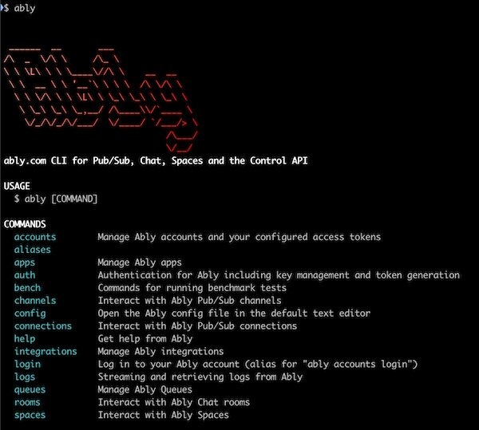

# Ably CLI

[](https://badge.fury.io/js/@ably%2Fcli)

[Ably](https://ably.com) CLI for [Ably Pub/Sub](https://ably.com/pubsub), [Ably Spaces](https://ably.com/spaces), [Ably Chat](https://ably.com/chat) and the [Ably Control API](https://ably.com/docs/account/control-api).



<!-- toc -->
* [Ably CLI](#ably-cli)
* [CLI Usage](#cli-usage)
* [Commands](#commands)
* [Contributing](#contributing)
<!-- tocstop -->

# CLI Usage

> [!NOTE]
> The Ably CLI is currently in Public Preview status. Please [raise an issue](https://github.com/ably/ably-cli/issues) if you have feedback, feature requests or want to report a bug.

<!-- usage -->
```sh-session
$ npm install -g @ably/cli
$ ably COMMAND
running command...
$ ably (--version)
@ably/cli/0.17.0 darwin-arm64 node-v24.4.1
$ ably --help [COMMAND]
USAGE
  $ ably COMMAND
...
```
<!-- usagestop -->

```sh-session
LOGIN (recommended first step)
  $ ably login
```

## Auto-completion

The Ably CLI supports shell auto-completion for bash, zsh, and PowerShell. This helps you discover and use commands more efficiently.

To set up auto-completion:
```sh-session
$ ably autocomplete
```

This will display installation instructions specific to your shell. Follow them to enable tab completion for commands, subcommands, and flags.

For more details, see the [Auto-completion documentation](docs/Auto-completion.md).

## Interactive Mode

The Ably CLI includes an interactive shell mode that provides a more convenient way to work with multiple commands:

```sh-session
$ ably-interactive
```

### Features

- **Command history**: Previous commands are saved and can be accessed with up/down arrows
- **Tab completion**: Full support for command and flag completion
- **Ctrl+C handling**:
  - Single Ctrl+C interrupts the current command and returns to prompt
  - Double Ctrl+C (within 500ms) force quits the shell
- **No "ably" prefix needed**: Commands can be typed directly (e.g., just `channels list` instead of `ably channels list`)

# Commands

<!-- commands -->
* [`ably accounts`](#ably-accounts)
* [`ably accounts current`](#ably-accounts-current)
* [`ably accounts list`](#ably-accounts-list)
* [`ably accounts login [TOKEN]`](#ably-accounts-login-token)
* [`ably accounts logout [ALIAS]`](#ably-accounts-logout-alias)
* [`ably accounts switch [ALIAS]`](#ably-accounts-switch-alias)
* [`ably apps`](#ably-apps)
* [`ably apps create`](#ably-apps-create)
* [`ably apps current`](#ably-apps-current)
* [`ably apps delete [APPID]`](#ably-apps-delete-appid)
* [`ably apps list`](#ably-apps-list)
* [`ably apps rules`](#ably-apps-rules)
* [`ably apps rules create`](#ably-apps-rules-create)
* [`ably apps rules delete NAMEORID`](#ably-apps-rules-delete-nameorid)
* [`ably apps rules list`](#ably-apps-rules-list)
* [`ably apps rules update NAMEORID`](#ably-apps-rules-update-nameorid)
* [`ably apps set-apns-p12 ID`](#ably-apps-set-apns-p12-id)
* [`ably apps switch [APPID]`](#ably-apps-switch-appid)
* [`ably apps update ID`](#ably-apps-update-id)
* [`ably auth`](#ably-auth)
* [`ably auth issue-ably-token`](#ably-auth-issue-ably-token)
* [`ably auth issue-jwt-token`](#ably-auth-issue-jwt-token)
* [`ably auth keys`](#ably-auth-keys)
* [`ably auth keys create`](#ably-auth-keys-create)
* [`ably auth keys current`](#ably-auth-keys-current)
* [`ably auth keys get KEYNAMEORVALUE`](#ably-auth-keys-get-keynameorvalue)
* [`ably auth keys list`](#ably-auth-keys-list)
* [`ably auth keys revoke KEYNAME`](#ably-auth-keys-revoke-keyname)
* [`ably auth keys switch [KEYNAMEORVALUE]`](#ably-auth-keys-switch-keynameorvalue)
* [`ably auth keys update KEYNAME`](#ably-auth-keys-update-keyname)
* [`ably auth revoke-token TOKEN`](#ably-auth-revoke-token-token)
* [`ably autocomplete [SHELL]`](#ably-autocomplete-shell)
* [`ably bench`](#ably-bench)
* [`ably bench publisher CHANNEL`](#ably-bench-publisher-channel)
* [`ably bench subscriber CHANNEL`](#ably-bench-subscriber-channel)
* [`ably channels`](#ably-channels)
* [`ably channels batch-publish [MESSAGE]`](#ably-channels-batch-publish-message)
* [`ably channels history CHANNEL`](#ably-channels-history-channel)
* [`ably channels inspect CHANNEL`](#ably-channels-inspect-channel)
* [`ably channels list`](#ably-channels-list)
* [`ably channels occupancy`](#ably-channels-occupancy)
* [`ably channels occupancy get CHANNEL`](#ably-channels-occupancy-get-channel)
* [`ably channels occupancy subscribe CHANNEL`](#ably-channels-occupancy-subscribe-channel)
* [`ably channels presence`](#ably-channels-presence)
* [`ably channels presence enter CHANNEL`](#ably-channels-presence-enter-channel)
* [`ably channels presence subscribe CHANNEL`](#ably-channels-presence-subscribe-channel)
* [`ably channels publish CHANNEL MESSAGE`](#ably-channels-publish-channel-message)
* [`ably channels subscribe CHANNELS`](#ably-channels-subscribe-channels)
* [`ably config`](#ably-config)
* [`ably config path`](#ably-config-path)
* [`ably config show`](#ably-config-show)
* [`ably connections`](#ably-connections)
* [`ably connections test`](#ably-connections-test)
* [`ably help [COMMANDS]`](#ably-help-commands)
* [`ably integrations`](#ably-integrations)
* [`ably integrations create`](#ably-integrations-create)
* [`ably integrations delete INTEGRATIONID`](#ably-integrations-delete-integrationid)
* [`ably integrations get RULEID`](#ably-integrations-get-ruleid)
* [`ably integrations list`](#ably-integrations-list)
* [`ably integrations update RULEID`](#ably-integrations-update-ruleid)
* [`ably login [TOKEN]`](#ably-login-token)
* [`ably logs`](#ably-logs)
* [`ably logs channel-lifecycle`](#ably-logs-channel-lifecycle)
* [`ably logs channel-lifecycle subscribe`](#ably-logs-channel-lifecycle-subscribe)
* [`ably logs connection-lifecycle`](#ably-logs-connection-lifecycle)
* [`ably logs connection-lifecycle history`](#ably-logs-connection-lifecycle-history)
* [`ably logs connection-lifecycle subscribe`](#ably-logs-connection-lifecycle-subscribe)
* [`ably logs history`](#ably-logs-history)
* [`ably logs push`](#ably-logs-push)
* [`ably logs push history`](#ably-logs-push-history)
* [`ably logs push subscribe`](#ably-logs-push-subscribe)
* [`ably logs subscribe`](#ably-logs-subscribe)
* [`ably queues`](#ably-queues)
* [`ably queues create`](#ably-queues-create)
* [`ably queues delete QUEUEID`](#ably-queues-delete-queueid)
* [`ably queues list`](#ably-queues-list)
* [`ably rooms`](#ably-rooms)
* [`ably rooms list`](#ably-rooms-list)
* [`ably rooms messages`](#ably-rooms-messages)
* [`ably rooms messages history ROOM`](#ably-rooms-messages-history-room)
* [`ably rooms messages reactions`](#ably-rooms-messages-reactions)
* [`ably rooms messages reactions remove ROOM MESSAGESERIAL REACTION`](#ably-rooms-messages-reactions-remove-room-messageserial-reaction)
* [`ably rooms messages reactions send ROOM MESSAGESERIAL REACTION`](#ably-rooms-messages-reactions-send-room-messageserial-reaction)
* [`ably rooms messages reactions subscribe ROOM`](#ably-rooms-messages-reactions-subscribe-room)
* [`ably rooms messages send ROOM TEXT`](#ably-rooms-messages-send-room-text)
* [`ably rooms messages subscribe ROOMS`](#ably-rooms-messages-subscribe-rooms)
* [`ably rooms occupancy`](#ably-rooms-occupancy)
* [`ably rooms occupancy get ROOM`](#ably-rooms-occupancy-get-room)
* [`ably rooms occupancy subscribe ROOM`](#ably-rooms-occupancy-subscribe-room)
* [`ably rooms presence`](#ably-rooms-presence)
* [`ably rooms presence enter ROOM`](#ably-rooms-presence-enter-room)
* [`ably rooms presence subscribe ROOM`](#ably-rooms-presence-subscribe-room)
* [`ably rooms reactions`](#ably-rooms-reactions)
* [`ably rooms reactions send ROOM EMOJI`](#ably-rooms-reactions-send-room-emoji)
* [`ably rooms reactions subscribe ROOM`](#ably-rooms-reactions-subscribe-room)
* [`ably rooms typing`](#ably-rooms-typing)
* [`ably rooms typing keystroke ROOM`](#ably-rooms-typing-keystroke-room)
* [`ably rooms typing subscribe ROOM`](#ably-rooms-typing-subscribe-room)
* [`ably spaces`](#ably-spaces)
* [`ably spaces cursors`](#ably-spaces-cursors)
* [`ably spaces cursors get-all SPACE`](#ably-spaces-cursors-get-all-space)
* [`ably spaces cursors set SPACE`](#ably-spaces-cursors-set-space)
* [`ably spaces cursors subscribe SPACE`](#ably-spaces-cursors-subscribe-space)
* [`ably spaces list`](#ably-spaces-list)
* [`ably spaces locations`](#ably-spaces-locations)
* [`ably spaces locations get-all SPACE`](#ably-spaces-locations-get-all-space)
* [`ably spaces locations set SPACE`](#ably-spaces-locations-set-space)
* [`ably spaces locations subscribe SPACE`](#ably-spaces-locations-subscribe-space)
* [`ably spaces locks`](#ably-spaces-locks)
* [`ably spaces locks acquire SPACE LOCKID`](#ably-spaces-locks-acquire-space-lockid)
* [`ably spaces locks get SPACE LOCKID`](#ably-spaces-locks-get-space-lockid)
* [`ably spaces locks get-all SPACE`](#ably-spaces-locks-get-all-space)
* [`ably spaces locks subscribe SPACE`](#ably-spaces-locks-subscribe-space)
* [`ably spaces members`](#ably-spaces-members)
* [`ably spaces members enter SPACE`](#ably-spaces-members-enter-space)
* [`ably spaces members subscribe SPACE`](#ably-spaces-members-subscribe-space)
* [`ably stats`](#ably-stats)
* [`ably stats account`](#ably-stats-account)
* [`ably stats app [ID]`](#ably-stats-app-id)
* [`ably status`](#ably-status)
* [`ably support`](#ably-support)
* [`ably support ask QUESTION`](#ably-support-ask-question)
* [`ably support contact`](#ably-support-contact)

## `ably accounts`

Manage Ably accounts and your configured access tokens

```
USAGE
  $ ably accounts

DESCRIPTION
  Manage Ably accounts and your configured access tokens

EXAMPLES
  $ ably accounts login

  $ ably accounts list

  $ ably accounts current

  $ ably accounts logout

  $ ably accounts switch my-account

COMMANDS
  ably accounts current  Show the current Ably account
  ably accounts list     List locally configured Ably accounts
  ably accounts login    Log in to your Ably account
  ably accounts logout   Log out from an Ably account
  ably accounts switch   Switch to a different Ably account
```

_See code: [src/commands/accounts/index.ts](https://github.com/ably/ably-cli/blob/v0.17.0/src/commands/accounts/index.ts)_

## `ably accounts current`

Show the current Ably account

```
USAGE
  $ ably accounts current [-v] [--json | --pretty-json]

FLAGS
  -v, --verbose      Output verbose logs
      --json         Output in JSON format
      --pretty-json  Output in colorized JSON format

DESCRIPTION
  Show the current Ably account

EXAMPLES
  $ ably accounts current

  $ ably accounts current --json

  $ ably accounts current --pretty-json
```

_See code: [src/commands/accounts/current.ts](https://github.com/ably/ably-cli/blob/v0.17.0/src/commands/accounts/current.ts)_

## `ably accounts list`

List locally configured Ably accounts

```
USAGE
  $ ably accounts list [-v] [--json | --pretty-json]

FLAGS
  -v, --verbose      Output verbose logs
      --json         Output in JSON format
      --pretty-json  Output in colorized JSON format

DESCRIPTION
  List locally configured Ably accounts

EXAMPLES
  $ ably accounts list

  $ ably accounts list --json

  $ ably accounts list --pretty-json
```

_See code: [src/commands/accounts/list.ts](https://github.com/ably/ably-cli/blob/v0.17.0/src/commands/accounts/list.ts)_

## `ably accounts login [TOKEN]`

Log in to your Ably account

```
USAGE
  $ ably accounts login [TOKEN] [-v] [--json | --pretty-json] [-a <value>] [--no-browser]

ARGUMENTS
  TOKEN  Access token (if not provided, will prompt for it)

FLAGS
  -a, --alias=<value>  Alias for this account (default account if not specified)
  -v, --verbose        Output verbose logs
      --json           Output in JSON format
      --no-browser     Do not open a browser
      --pretty-json    Output in colorized JSON format

DESCRIPTION
  Log in to your Ably account

EXAMPLES
  $ ably accounts login

  $ ably accounts login --alias mycompany

  $ ably accounts login --json

  $ ably accounts login --pretty-json
```

_See code: [src/commands/accounts/login.ts](https://github.com/ably/ably-cli/blob/v0.17.0/src/commands/accounts/login.ts)_

## `ably accounts logout [ALIAS]`

Log out from an Ably account

```
USAGE
  $ ably accounts logout [ALIAS] [-v] [--json | --pretty-json] [-f]

ARGUMENTS
  ALIAS  Alias of the account to log out from (defaults to current account)

FLAGS
  -f, --force        Force logout without confirmation
  -v, --verbose      Output verbose logs
      --json         Output in JSON format
      --pretty-json  Output in colorized JSON format

DESCRIPTION
  Log out from an Ably account

EXAMPLES
  $ ably accounts logout

  $ ably accounts logout mycompany

  $ ably accounts logout --json

  $ ably accounts logout --pretty-json
```

_See code: [src/commands/accounts/logout.ts](https://github.com/ably/ably-cli/blob/v0.17.0/src/commands/accounts/logout.ts)_

## `ably accounts switch [ALIAS]`

Switch to a different Ably account

```
USAGE
  $ ably accounts switch [ALIAS] [-v] [--json | --pretty-json]

ARGUMENTS
  ALIAS  Alias of the account to switch to

FLAGS
  -v, --verbose      Output verbose logs
      --json         Output in JSON format
      --pretty-json  Output in colorized JSON format

DESCRIPTION
  Switch to a different Ably account

EXAMPLES
  $ ably accounts switch

  $ ably accounts switch mycompany

  $ ably accounts switch --json

  $ ably accounts switch --pretty-json
```

_See code: [src/commands/accounts/switch.ts](https://github.com/ably/ably-cli/blob/v0.17.0/src/commands/accounts/switch.ts)_

## `ably apps`

Manage Ably apps

```
USAGE
  $ ably apps

DESCRIPTION
  Manage Ably apps

EXAMPLES
  $ ably apps list

  $ ably apps create

  $ ably apps update

  $ ably apps delete

  $ ably apps set-apns-p12

  $ ably apps rules list

  $ ably apps switch my-app

COMMANDS
  ably apps create        Create a new app
  ably apps current       Show the currently selected app
  ably apps delete        Delete an app
  ably apps list          List all apps in the current account
  ably apps rules         Manage Ably channel rules (namespaces)
  ably apps set-apns-p12  Upload Apple Push Notification Service P12 certificate for an app
  ably apps switch        Switch to a different Ably app
  ably apps update        Update an app
```

_See code: [src/commands/apps/index.ts](https://github.com/ably/ably-cli/blob/v0.17.0/src/commands/apps/index.ts)_

## `ably apps create`

Create a new app

```
USAGE
  $ ably apps create --name <value> [-v] [--json | --pretty-json] [--tls-only]

FLAGS
  -v, --verbose       Output verbose logs
      --json          Output in JSON format
      --name=<value>  (required) Name of the app
      --pretty-json   Output in colorized JSON format
      --tls-only      Whether the app should accept TLS connections only

DESCRIPTION
  Create a new app

EXAMPLES
  $ ably apps create --name "My New App"

  $ ably apps create --name "My New App" --tls-only

  $ ably apps create --name "My New App" --json

  $ ABLY_ACCESS_TOKEN="YOUR_ACCESS_TOKEN" ably apps create --name "My New App"
```

_See code: [src/commands/apps/create.ts](https://github.com/ably/ably-cli/blob/v0.17.0/src/commands/apps/create.ts)_

## `ably apps current`

Show the currently selected app

```
USAGE
  $ ably apps current [-v] [--json | --pretty-json]

FLAGS
  -v, --verbose      Output verbose logs
      --json         Output in JSON format
      --pretty-json  Output in colorized JSON format

DESCRIPTION
  Show the currently selected app

EXAMPLES
  $ ably apps current

  $ ably apps current --json

  $ ably apps current --pretty-json
```

_See code: [src/commands/apps/current.ts](https://github.com/ably/ably-cli/blob/v0.17.0/src/commands/apps/current.ts)_

## `ably apps delete [APPID]`

Delete an app

```
USAGE
  $ ably apps delete [APPID] [-v] [--json | --pretty-json] [-f] [--app <value>]

ARGUMENTS
  APPID  App ID to delete (uses current app if not specified)

FLAGS
  -f, --force        Skip confirmation prompt
  -v, --verbose      Output verbose logs
      --app=<value>  The app ID or name (defaults to current app)
      --json         Output in JSON format
      --pretty-json  Output in colorized JSON format

DESCRIPTION
  Delete an app

EXAMPLES
  $ ably apps delete

  $ ably apps delete app-id

  $ ably apps delete --app app-id

  $ ABLY_ACCESS_TOKEN="YOUR_ACCESS_TOKEN" ably apps delete app-id

  $ ably apps delete app-id --force

  $ ably apps delete app-id --json

  $ ably apps delete app-id --pretty-json
```

_See code: [src/commands/apps/delete.ts](https://github.com/ably/ably-cli/blob/v0.17.0/src/commands/apps/delete.ts)_

## `ably apps list`

List all apps in the current account

```
USAGE
  $ ably apps list [-v] [--json | --pretty-json]

FLAGS
  -v, --verbose      Output verbose logs
      --json         Output in JSON format
      --pretty-json  Output in colorized JSON format

DESCRIPTION
  List all apps in the current account

EXAMPLES
  $ ably apps list

  $ ably apps list --json

  $ ably apps list --pretty-json
```

_See code: [src/commands/apps/list.ts](https://github.com/ably/ably-cli/blob/v0.17.0/src/commands/apps/list.ts)_

## `ably apps rules`

Manage Ably channel rules (namespaces)

```
USAGE
  $ ably apps rules

DESCRIPTION
  Manage Ably channel rules (namespaces)

EXAMPLES
  $ ably apps rules list

  $ ably apps rules create --name "chat" --persisted

  $ ably apps rules update chat --push-enabled

  $ ably apps rules delete chat
```

_See code: [src/commands/apps/rules/index.ts](https://github.com/ably/ably-cli/blob/v0.17.0/src/commands/apps/rules/index.ts)_

## `ably apps rules create`

Create a channel rule

```
USAGE
  $ ably apps rules create --name <value> [-v] [--json | --pretty-json] [--app <value>] [--authenticated]
    [--batching-enabled] [--batching-interval <value>] [--conflation-enabled] [--conflation-interval <value>]
    [--conflation-key <value>] [--expose-time-serial] [--mutable-messages] [--persist-last] [--persisted]
    [--populate-channel-registry] [--push-enabled] [--tls-only]

FLAGS
  -v, --verbose                      Output verbose logs
      --app=<value>                  The app ID or name (defaults to current app)
      --authenticated                Whether channels matching this rule require clients to be authenticated
      --batching-enabled             Whether to enable batching for messages on channels matching this rule
      --batching-interval=<value>    The batching interval for messages on channels matching this rule
      --conflation-enabled           Whether to enable conflation for messages on channels matching this rule
      --conflation-interval=<value>  The conflation interval for messages on channels matching this rule
      --conflation-key=<value>       The conflation key for messages on channels matching this rule
      --expose-time-serial           Whether to expose the time serial for messages on channels matching this rule
      --json                         Output in JSON format
      --mutable-messages             Whether messages on channels matching this rule can be updated or deleted after
                                     publishing. Automatically enables message persistence.
      --name=<value>                 (required) Name of the channel rule
      --persist-last                 Whether to persist only the last message on channels matching this rule
      --persisted                    Whether messages on channels matching this rule should be persisted
      --populate-channel-registry    Whether to populate the channel registry for channels matching this rule
      --pretty-json                  Output in colorized JSON format
      --push-enabled                 Whether push notifications should be enabled for channels matching this rule
      --tls-only                     Whether to enforce TLS for channels matching this rule

DESCRIPTION
  Create a channel rule

EXAMPLES
  $ ably apps rules create --name "chat" --persisted

  $ ably apps rules create --name "chat" --mutable-messages

  $ ably apps rules create --name "events" --push-enabled

  $ ably apps rules create --name "notifications" --persisted --push-enabled --app "My App"

  $ ably apps rules create --name "chat" --persisted --json
```

_See code: [src/commands/apps/rules/create.ts](https://github.com/ably/ably-cli/blob/v0.17.0/src/commands/apps/rules/create.ts)_

## `ably apps rules delete NAMEORID`

Delete a channel rule

```
USAGE
  $ ably apps rules delete NAMEORID [-v] [--json | --pretty-json] [--app <value>] [-f]

ARGUMENTS
  NAMEORID  Name or ID of the channel rule to delete

FLAGS
  -f, --force        Force deletion without confirmation
  -v, --verbose      Output verbose logs
      --app=<value>  The app ID or name (defaults to current app)
      --json         Output in JSON format
      --pretty-json  Output in colorized JSON format

DESCRIPTION
  Delete a channel rule

EXAMPLES
  $ ably apps rules delete chat

  $ ably apps rules delete events --app "My App"

  $ ably apps rules delete notifications --force

  $ ably apps rules delete chat --json

  $ ably apps rules delete chat --pretty-json
```

_See code: [src/commands/apps/rules/delete.ts](https://github.com/ably/ably-cli/blob/v0.17.0/src/commands/apps/rules/delete.ts)_

## `ably apps rules list`

List channel rules for an app

```
USAGE
  $ ably apps rules list [-v] [--json | --pretty-json] [--app <value>]

FLAGS
  -v, --verbose      Output verbose logs
      --app=<value>  The app ID or name (defaults to current app)
      --json         Output in JSON format
      --pretty-json  Output in colorized JSON format

DESCRIPTION
  List channel rules for an app

EXAMPLES
  $ ably apps rules list

  $ ably apps rules list --app my-app-id

  $ ably apps rules list --json

  $ ably apps rules list --pretty-json
```

_See code: [src/commands/apps/rules/list.ts](https://github.com/ably/ably-cli/blob/v0.17.0/src/commands/apps/rules/list.ts)_

## `ably apps rules update NAMEORID`

Update a channel rule

```
USAGE
  $ ably apps rules update NAMEORID [-v] [--json | --pretty-json] [--app <value>] [--authenticated]
    [--batching-enabled] [--batching-interval <value>] [--conflation-enabled] [--conflation-interval <value>]
    [--conflation-key <value>] [--expose-time-serial] [--mutable-messages] [--persist-last] [--persisted]
    [--populate-channel-registry] [--push-enabled] [--tls-only]

ARGUMENTS
  NAMEORID  Name or ID of the channel rule to update

FLAGS
  -v, --verbose                         Output verbose logs
      --app=<value>                     The app ID or name (defaults to current app)
      --[no-]authenticated              Whether channels matching this rule require clients to be authenticated
      --[no-]batching-enabled           Whether to enable batching for messages on channels matching this rule
      --batching-interval=<value>       The batching interval for messages on channels matching this rule
      --[no-]conflation-enabled         Whether to enable conflation for messages on channels matching this rule
      --conflation-interval=<value>     The conflation interval for messages on channels matching this rule
      --conflation-key=<value>          The conflation key for messages on channels matching this rule
      --[no-]expose-time-serial         Whether to expose the time serial for messages on channels matching this rule
      --json                            Output in JSON format
      --[no-]mutable-messages           Whether messages on channels matching this rule can be updated or deleted after
                                        publishing. Automatically enables message persistence.
      --[no-]persist-last               Whether to persist only the last message on channels matching this rule
      --[no-]persisted                  Whether messages on channels matching this rule should be persisted
      --[no-]populate-channel-registry  Whether to populate the channel registry for channels matching this rule
      --pretty-json                     Output in colorized JSON format
      --[no-]push-enabled               Whether push notifications should be enabled for channels matching this rule
      --[no-]tls-only                   Whether to enforce TLS for channels matching this rule

DESCRIPTION
  Update a channel rule

EXAMPLES
  $ ably apps rules update chat --persisted

  $ ably apps rules update chat --mutable-messages

  $ ably apps rules update events --push-enabled=false

  $ ably apps rules update notifications --persisted --push-enabled --app "My App"

  $ ably apps rules update chat --persisted --json
```

_See code: [src/commands/apps/rules/update.ts](https://github.com/ably/ably-cli/blob/v0.17.0/src/commands/apps/rules/update.ts)_

## `ably apps set-apns-p12 ID`

Upload Apple Push Notification Service P12 certificate for an app

```
USAGE
  $ ably apps set-apns-p12 ID --certificate <value> [-v] [--json | --pretty-json] [--password <value>]
    [--use-for-sandbox]

ARGUMENTS
  ID  App ID to set the APNS certificate for

FLAGS
  -v, --verbose              Output verbose logs
      --certificate=<value>  (required) Path to the P12 certificate file
      --json                 Output in JSON format
      --password=<value>     Password for the P12 certificate
      --pretty-json          Output in colorized JSON format
      --use-for-sandbox      Whether to use this certificate for the APNS sandbox environment

DESCRIPTION
  Upload Apple Push Notification Service P12 certificate for an app

EXAMPLES
  $ ably apps set-apns-p12 app-id --certificate /path/to/certificate.p12

  $ ably apps set-apns-p12 app-id --certificate /path/to/certificate.p12 --password "YOUR_CERTIFICATE_PASSWORD"

  $ ably apps set-apns-p12 app-id --certificate /path/to/certificate.p12 --use-for-sandbox

  $ ably apps set-apns-p12 app-id --certificate /path/to/certificate.p12 --json
```

_See code: [src/commands/apps/set-apns-p12.ts](https://github.com/ably/ably-cli/blob/v0.17.0/src/commands/apps/set-apns-p12.ts)_

## `ably apps switch [APPID]`

Switch to a different Ably app

```
USAGE
  $ ably apps switch [APPID] [-v] [--json | --pretty-json]

ARGUMENTS
  APPID  ID of the app to switch to

FLAGS
  -v, --verbose      Output verbose logs
      --json         Output in JSON format
      --pretty-json  Output in colorized JSON format

DESCRIPTION
  Switch to a different Ably app

EXAMPLES
  $ ably apps switch APP_ID

  $ ably apps switch

  $ ably apps switch APP_ID --json
```

_See code: [src/commands/apps/switch.ts](https://github.com/ably/ably-cli/blob/v0.17.0/src/commands/apps/switch.ts)_

## `ably apps update ID`

Update an app

```
USAGE
  $ ably apps update ID [-v] [--json | --pretty-json] [--name <value>] [--tls-only]

ARGUMENTS
  ID  App ID to update

FLAGS
  -v, --verbose       Output verbose logs
      --json          Output in JSON format
      --name=<value>  New name for the app
      --pretty-json   Output in colorized JSON format
      --tls-only      Whether the app should accept TLS connections only

DESCRIPTION
  Update an app

EXAMPLES
  $ ably apps update app-id --name "Updated App Name"

  $ ably apps update app-id --tls-only

  $ ably apps update app-id --name "Updated App Name" --json

  $ ABLY_ACCESS_TOKEN="YOUR_ACCESS_TOKEN" ably apps update app-id --name "Updated App Name"
```

_See code: [src/commands/apps/update.ts](https://github.com/ably/ably-cli/blob/v0.17.0/src/commands/apps/update.ts)_

## `ably auth`

Manage authentication, keys and tokens

```
USAGE
  $ ably auth

DESCRIPTION
  Manage authentication, keys and tokens

EXAMPLES
  $ ably auth keys list

  $ ably auth issue-jwt-token

  $ ably auth issue-ably-token

COMMANDS
  ably auth issue-ably-token  Create an Ably Token with capabilities
  ably auth issue-jwt-token   Create an Ably JWT token with capabilities
  ably auth keys              Key management commands
  ably auth revoke-token      Revoke a token
```

_See code: [src/commands/auth/index.ts](https://github.com/ably/ably-cli/blob/v0.17.0/src/commands/auth/index.ts)_

## `ably auth issue-ably-token`

Create an Ably Token with capabilities

```
USAGE
  $ ably auth issue-ably-token [-v] [--json | --pretty-json] [--app <value>] [--capability <value>] [--client-id <value>]
    [--token-only] [--ttl <value>]

FLAGS
  -v, --verbose             Output verbose logs
      --app=<value>         The app ID or name (defaults to current app)
      --capability=<value>  [default: {"*":["*"]}] Capabilities JSON string (e.g. {"channel":["publish","subscribe"]})
      --client-id=<value>   Client ID to associate with the token. Use "none" to explicitly issue a token with no client
                            ID, otherwise a default will be generated.
      --json                Output in JSON format
      --pretty-json         Output in colorized JSON format
      --token-only          Output only the token string without any formatting or additional information
      --ttl=<value>         [default: 3600] Time to live in seconds (default: 3600, 1 hour)

DESCRIPTION
  Create an Ably Token with capabilities

EXAMPLES
  $ ably auth issue-ably-token

  $ ably auth issue-ably-token --capability '{"*":["*"]}'

  $ ably auth issue-ably-token --capability '{"chat:*":["publish","subscribe"], "status:*":["subscribe"]}' --ttl 3600

  $ ably auth issue-ably-token --client-id client123 --ttl 86400

  $ ably auth issue-ably-token --client-id "none" --ttl 3600

  $ ably auth issue-ably-token --json

  $ ably auth issue-ably-token --pretty-json

  $ ably auth issue-ably-token --token-only

  $ ABLY_TOKEN="$(ably auth issue-ably-token --token-only)" ably channels publish my-channel "Hello"
```

_See code: [src/commands/auth/issue-ably-token.ts](https://github.com/ably/ably-cli/blob/v0.17.0/src/commands/auth/issue-ably-token.ts)_

## `ably auth issue-jwt-token`

Create an Ably JWT token with capabilities

```
USAGE
  $ ably auth issue-jwt-token [-v] [--json | --pretty-json] [--app <value>] [--capability <value>] [--client-id <value>]
    [--token-only] [--ttl <value>]

FLAGS
  -v, --verbose             Output verbose logs
      --app=<value>         The app ID or name (defaults to current app)
      --capability=<value>  [default: {"*":["*"]}] Capabilities JSON string (e.g. {"channel":["publish","subscribe"]})
      --client-id=<value>   Client ID to associate with the token. Use "none" to explicitly issue a token with no client
                            ID, otherwise a default will be generated.
      --json                Output in JSON format
      --pretty-json         Output in colorized JSON format
      --token-only          Output only the token string without any formatting or additional information
      --ttl=<value>         [default: 3600] Time to live in seconds (default: 3600, 1 hour)

DESCRIPTION
  Create an Ably JWT token with capabilities

EXAMPLES
  $ ably auth issue-jwt-token

  $ ably auth issue-jwt-token --capability '{"*":["*"]}'

  $ ably auth issue-jwt-token --capability '{"chat:*":["publish","subscribe"], "status:*":["subscribe"]}' --ttl 3600

  $ ably auth issue-jwt-token --client-id client123 --ttl 86400

  $ ably auth issue-jwt-token --json

  $ ably auth issue-jwt-token --pretty-json

  $ ably auth issue-jwt-token --token-only

  $ ABLY_TOKEN="$(ably auth issue-jwt-token --token-only)" ably channels publish my-channel "Hello"
```

_See code: [src/commands/auth/issue-jwt-token.ts](https://github.com/ably/ably-cli/blob/v0.17.0/src/commands/auth/issue-jwt-token.ts)_

## `ably auth keys`

Key management commands

```
USAGE
  $ ably auth keys

DESCRIPTION
  Key management commands

EXAMPLES
  $ ably auth keys list

  $ ably auth keys create --name "My New Key"

  $ ably auth keys get KEY_ID

  $ ably auth keys revoke KEY_ID

  $ ably auth keys update KEY_ID

  $ ably auth keys switch KEY_ID
```

_See code: [src/commands/auth/keys/index.ts](https://github.com/ably/ably-cli/blob/v0.17.0/src/commands/auth/keys/index.ts)_

## `ably auth keys create`

Create a new API key for an app

```
USAGE
  $ ably auth keys create --name <value> [-v] [--json | --pretty-json] [--app <value>] [--capabilities <value>]

FLAGS
  -v, --verbose               Output verbose logs
      --app=<value>           The app ID or name (defaults to current app)
      --capabilities=<value>  [default: {"*":["*"]}] Capability object as a JSON string. Example:
                              '{"channel:*":["publish"]}'
      --json                  Output in JSON format
      --name=<value>          (required) Name of the key
      --pretty-json           Output in colorized JSON format

DESCRIPTION
  Create a new API key for an app

EXAMPLES
  $ ably auth keys create --name "My New Key"

  $ ably auth keys create --name "My New Key" --app APP_ID

  $ ably auth keys create --name "My New Key" --capabilities '{"*":["*"]}'

  $ ably auth keys create --name "My New Key" --capabilities '{"channel1":["publish","subscribe"],"channel2":["history"]}'

  $ ably auth keys create --name "My New Key" --json

  $ ably auth keys create --name "My New Key" --pretty-json

  $ ably auth keys create --app <appId> --name "MyKey" --capabilities '{"channel:*":["publish"]}'

  $ ably auth keys create --app <appId> --name "MyOtherKey" --capabilities '{"channel:chat-*":["subscribe"],"channel:updates":["publish"]}' --ttl 86400

  $ ably auth keys create --name "My New Key" --capabilities '{"channel1":["publish","subscribe"],"channel2":["history"]}'
```

_See code: [src/commands/auth/keys/create.ts](https://github.com/ably/ably-cli/blob/v0.17.0/src/commands/auth/keys/create.ts)_

## `ably auth keys current`

Show the current API key for the selected app

```
USAGE
  $ ably auth keys current [-v] [--json | --pretty-json] [--app <value>]

FLAGS
  -v, --verbose      Output verbose logs
      --app=<value>  The app ID (defaults to current app)
      --json         Output in JSON format
      --pretty-json  Output in colorized JSON format

DESCRIPTION
  Show the current API key for the selected app

EXAMPLES
  $ ably auth keys current

  $ ably auth keys current --app APP_ID

  $ ably auth keys current --json

  $ ably auth keys current --pretty-json
```

_See code: [src/commands/auth/keys/current.ts](https://github.com/ably/ably-cli/blob/v0.17.0/src/commands/auth/keys/current.ts)_

## `ably auth keys get KEYNAMEORVALUE`

Get details for a specific key

```
USAGE
  $ ably auth keys get KEYNAMEORVALUE [-v] [--json | --pretty-json] [--app <value>]

ARGUMENTS
  KEYNAMEORVALUE  Key name (APP_ID.KEY_ID), key ID, key label (e.g. Root), or full key value to get details for

FLAGS
  -v, --verbose      Output verbose logs
      --app=<value>  The app ID or name (defaults to current app)
      --json         Output in JSON format
      --pretty-json  Output in colorized JSON format

DESCRIPTION
  Get details for a specific key

EXAMPLES
  $ ably auth keys get APP_ID.KEY_ID

  $ ably auth keys get Root --app APP_ID

  $ ably auth keys get KEY_ID --app APP_ID

  $ ably auth keys get APP_ID.KEY_ID --json
```

_See code: [src/commands/auth/keys/get.ts](https://github.com/ably/ably-cli/blob/v0.17.0/src/commands/auth/keys/get.ts)_

## `ably auth keys list`

List all keys in the app

```
USAGE
  $ ably auth keys list [-v] [--json | --pretty-json] [--app <value>]

FLAGS
  -v, --verbose      Output verbose logs
      --app=<value>  The app ID (defaults to current app)
      --json         Output in JSON format
      --pretty-json  Output in colorized JSON format

DESCRIPTION
  List all keys in the app

EXAMPLES
  $ ably auth keys list

  $ ably auth keys list --app APP_ID

  $ ably auth keys list --json

  $ ably auth keys list --pretty-json
```

_See code: [src/commands/auth/keys/list.ts](https://github.com/ably/ably-cli/blob/v0.17.0/src/commands/auth/keys/list.ts)_

## `ably auth keys revoke KEYNAME`

Revoke an API key (permanently disables the key)

```
USAGE
  $ ably auth keys revoke KEYNAME [-v] [--json | --pretty-json] [--app <value>] [--force]

ARGUMENTS
  KEYNAME  Key name (APP_ID.KEY_ID) of the key to revoke

FLAGS
  -v, --verbose      Output verbose logs
      --app=<value>  The app ID (defaults to current app)
      --force        Skip confirmation prompt
      --json         Output in JSON format
      --pretty-json  Output in colorized JSON format

DESCRIPTION
  Revoke an API key (permanently disables the key)

EXAMPLES
  $ ably auth keys revoke APP_ID.KEY_ID

  $ ably auth keys revoke KEY_ID --app APP_ID

  $ ably auth keys revoke APP_ID.KEY_ID --force

  $ ably auth keys revoke APP_ID.KEY_ID --json

  $ ably auth keys revoke APP_ID.KEY_ID --pretty-json
```

_See code: [src/commands/auth/keys/revoke.ts](https://github.com/ably/ably-cli/blob/v0.17.0/src/commands/auth/keys/revoke.ts)_

## `ably auth keys switch [KEYNAMEORVALUE]`

Switch to a different API key for the current app

```
USAGE
  $ ably auth keys switch [KEYNAMEORVALUE] [-v] [--json | --pretty-json] [--app <value>]

ARGUMENTS
  KEYNAMEORVALUE  Key name (APP_ID.KEY_ID) or full value of the key to switch to

FLAGS
  -v, --verbose      Output verbose logs
      --app=<value>  The app ID or name (defaults to current app)
      --json         Output in JSON format
      --pretty-json  Output in colorized JSON format

DESCRIPTION
  Switch to a different API key for the current app

EXAMPLES
  $ ably auth keys switch

  $ ably auth keys switch APP_ID.KEY_ID

  $ ably auth keys switch KEY_ID --app APP_ID

  $ ably auth keys switch --json
```

_See code: [src/commands/auth/keys/switch.ts](https://github.com/ably/ably-cli/blob/v0.17.0/src/commands/auth/keys/switch.ts)_

## `ably auth keys update KEYNAME`

Update a key's properties

```
USAGE
  $ ably auth keys update KEYNAME [-v] [--json | --pretty-json] [--app <value>] [--capabilities <value>] [--name
    <value>]

ARGUMENTS
  KEYNAME  Key name (APP_ID.KEY_ID) of the key to update

FLAGS
  -v, --verbose               Output verbose logs
      --app=<value>           The app ID (defaults to current app)
      --capabilities=<value>  New capabilities for the key (comma-separated list)
      --json                  Output in JSON format
      --name=<value>          New name for the key
      --pretty-json           Output in colorized JSON format

DESCRIPTION
  Update a key's properties

EXAMPLES
  $ ably auth keys update APP_ID.KEY_ID --name "New Name"

  $ ably auth keys update KEY_ID --app APP_ID --capabilities "publish,subscribe"

  $ ably auth keys update APP_ID.KEY_ID --name "New Name" --capabilities "publish,subscribe"

  $ ably auth keys update APP_ID.KEY_ID --name "New Name" --json
```

_See code: [src/commands/auth/keys/update.ts](https://github.com/ably/ably-cli/blob/v0.17.0/src/commands/auth/keys/update.ts)_

## `ably auth revoke-token TOKEN`

Revoke a token

```
USAGE
  $ ably auth revoke-token TOKEN [-v] [--json | --pretty-json] [--app <value>] [-c <value>]

ARGUMENTS
  TOKEN  Token to revoke

FLAGS
  -c, --client-id=<value>  Client ID to revoke tokens for
  -v, --verbose            Output verbose logs
      --app=<value>        The app ID or name (defaults to current app)
      --json               Output in JSON format
      --pretty-json        Output in colorized JSON format

DESCRIPTION
  Revoke a token

EXAMPLES
  $ ably auth revoke-token TOKEN

  $ ably auth revoke-token TOKEN --client-id clientid

  $ ably auth revoke-token TOKEN --json

  $ ably auth revoke-token TOKEN --pretty-json
```

_See code: [src/commands/auth/revoke-token.ts](https://github.com/ably/ably-cli/blob/v0.17.0/src/commands/auth/revoke-token.ts)_

## `ably autocomplete [SHELL]`

Display autocomplete installation instructions.

```
USAGE
  $ ably autocomplete [SHELL] [-r]

ARGUMENTS
  SHELL  (zsh|bash|powershell) Shell type

FLAGS
  -r, --refresh-cache  Refresh cache (ignores displaying instructions)

DESCRIPTION
  Display autocomplete installation instructions.

EXAMPLES
  $ ably autocomplete

  $ ably autocomplete bash

  $ ably autocomplete zsh

  $ ably autocomplete powershell

  $ ably autocomplete --refresh-cache
```

_See code: [@oclif/plugin-autocomplete](https://github.com/oclif/plugin-autocomplete/blob/v3.2.30/src/commands/autocomplete/index.ts)_

## `ably bench`

Commands for running benchmark tests

```
USAGE
  $ ably bench

DESCRIPTION
  Commands for running benchmark tests

EXAMPLES
  $ ably bench publisher my-channel

  $ ably bench subscriber my-channel

COMMANDS
  ably bench publisher   Run a publisher benchmark test
  ably bench subscriber  Run a subscriber benchmark test
```

_See code: [src/commands/bench/index.ts](https://github.com/ably/ably-cli/blob/v0.17.0/src/commands/bench/index.ts)_

## `ably bench publisher CHANNEL`

Run a publisher benchmark test

```
USAGE
  $ ably bench publisher CHANNEL [-v] [--json | --pretty-json] [--client-id <value>] [--message-size <value>] [-m
    <value>] [-r <value>] [-t rest|realtime] [--wait-for-subscribers]

ARGUMENTS
  CHANNEL  The channel name to publish to

FLAGS
  -m, --messages=<value>      [default: 1000] Number of messages to publish (max 10,000)
  -r, --rate=<value>          [default: 15] Messages per second to publish (max 20)
  -t, --transport=<option>    [default: realtime] Transport to use for publishing
                              <options: rest|realtime>
  -v, --verbose               Output verbose logs
      --client-id=<value>     Overrides any default client ID when using API authentication. Use "none" to explicitly
                              set no client ID. Not applicable when using token authentication.
      --json                  Output in JSON format
      --message-size=<value>  [default: 100] Size of the message payload in bytes
      --pretty-json           Output in colorized JSON format
      --wait-for-subscribers  Wait for subscribers to be present before starting

DESCRIPTION
  Run a publisher benchmark test

EXAMPLES
  $ ably bench publisher my-channel

  $ ably bench publisher --messages 5000 --rate 10 my-channel

  $ ably bench publisher --transport realtime my-channel

  $ ably bench publisher my-channel --json
```

_See code: [src/commands/bench/publisher.ts](https://github.com/ably/ably-cli/blob/v0.17.0/src/commands/bench/publisher.ts)_

## `ably bench subscriber CHANNEL`

Run a subscriber benchmark test

```
USAGE
  $ ably bench subscriber CHANNEL [-v] [--json | --pretty-json] [--client-id <value>] [-D <value>]

ARGUMENTS
  CHANNEL  The channel name to subscribe to

FLAGS
  -D, --duration=<value>   Automatically exit after N seconds
  -v, --verbose            Output verbose logs
      --client-id=<value>  Overrides any default client ID when using API authentication. Use "none" to explicitly set
                           no client ID. Not applicable when using token authentication.
      --json               Output in JSON format
      --pretty-json        Output in colorized JSON format

DESCRIPTION
  Run a subscriber benchmark test

EXAMPLES
  $ ably bench subscriber my-channel

  $ ably bench subscriber my-channel --json
```

_See code: [src/commands/bench/subscriber.ts](https://github.com/ably/ably-cli/blob/v0.17.0/src/commands/bench/subscriber.ts)_

## `ably channels`

Interact with Ably Pub/Sub channels

```
USAGE
  $ ably channels

DESCRIPTION
  Interact with Ably Pub/Sub channels

EXAMPLES
  $ ably channels publish my-channel '{"name":"message","data":"Hello, World"}'

  $ ably channels subscribe my-channel

  $ ably channels list

COMMANDS
  ably channels batch-publish  Publish messages to multiple Ably channels with a single request
  ably channels history        Retrieve message history for a channel
  ably channels inspect        Open the Ably dashboard to inspect a specific channel
  ably channels list           List active channels using the channel enumeration API
  ably channels occupancy      Get occupancy metrics for a channel
  ably channels presence       Manage presence on Ably channels
  ably channels publish        Publish a message to an Ably channel
  ably channels subscribe      Subscribe to messages published on one or more Ably channels
```

_See code: [src/commands/channels/index.ts](https://github.com/ably/ably-cli/blob/v0.17.0/src/commands/channels/index.ts)_

## `ably channels batch-publish [MESSAGE]`

Publish messages to multiple Ably channels with a single request

```
USAGE
  $ ably channels batch-publish [MESSAGE] [-v] [--json | --pretty-json] [--channels <value> | --channels-json <value> |
    --spec <value>] [-e <value> | ] [-n <value> | ]

ARGUMENTS
  MESSAGE  The message to publish (JSON format or plain text, not needed if using --spec)

FLAGS
  -e, --encoding=<value>       The encoding for the message (not used with --spec)
  -n, --name=<value>           The event name (if not specified in the message JSON, not used with --spec)
  -v, --verbose                Output verbose logs
      --channels=<value>       Comma-separated list of channel names to publish to (mutually exclusive with
                               --channels-json and --spec)
      --channels-json=<value>  JSON array of channel names to publish to (mutually exclusive with --channels and --spec)
      --json                   Output in JSON format
      --pretty-json            Output in colorized JSON format
      --spec=<value>           Complete batch spec JSON (either a single BatchSpec object or an array of BatchSpec
                               objects). When used, --channels, --channels-json, --name, and --encoding are ignored

DESCRIPTION
  Publish messages to multiple Ably channels with a single request

EXAMPLES
  $ ably channels batch-publish --channels channel1,channel2 '{"data":"Message to multiple channels"}'

  $ ably channels batch-publish --channels channel1,channel2 --name event '{"text":"Hello World"}'

  $ ably channels batch-publish --channels-json '["channel1", "channel2"]' '{"data":"Using JSON array for channels"}'

  $ ably channels batch-publish --spec '{"channels": ["channel1", "channel2"], "messages": {"data": "Using complete batch spec"}}'

  $ ably channels batch-publish --spec '[{"channels": "channel1", "messages": {"data": "First spec"}}, {"channels": "channel2", "messages": {"data": "Second spec"}}]'

  $ ably channels batch-publish --channels channel1,channel2 '{"data":"Message"}' --json

  $ ably channels batch-publish --channels channel1,channel2 '{"data":"Message"}' --pretty-json
```

_See code: [src/commands/channels/batch-publish.ts](https://github.com/ably/ably-cli/blob/v0.17.0/src/commands/channels/batch-publish.ts)_

## `ably channels history CHANNEL`

Retrieve message history for a channel

```
USAGE
  $ ably channels history CHANNEL [-v] [--json | --pretty-json] [--cipher <value>] [--direction backwards|forwards]
    [--end <value>] [--start <value>] [--limit <value>]

ARGUMENTS
  CHANNEL  Channel name to retrieve history for

FLAGS
  -v, --verbose             Output verbose logs
      --cipher=<value>      Decryption key for encrypted messages (AES-128)
      --direction=<option>  [default: backwards] Direction of message retrieval (default: backwards)
                            <options: backwards|forwards>
      --end=<value>         End time as ISO 8601, Unix ms, or relative (e.g., "1h", "30m", "2d")
      --json                Output in JSON format
      --limit=<value>       [default: 50] Maximum number of results to return (default: 50)
      --pretty-json         Output in colorized JSON format
      --start=<value>       Start time as ISO 8601, Unix ms, or relative (e.g., "1h", "30m", "2d")

DESCRIPTION
  Retrieve message history for a channel

EXAMPLES
  $ ably channels history my-channel

  $ ably channels history my-channel --json

  $ ably channels history my-channel --pretty-json

  $ ably channels history my-channel --start "2023-01-01T00:00:00Z" --end "2023-01-02T00:00:00Z"

  $ ably channels history my-channel --start 1h

  $ ably channels history my-channel --limit 100

  $ ably channels history my-channel --direction forward
```

_See code: [src/commands/channels/history.ts](https://github.com/ably/ably-cli/blob/v0.17.0/src/commands/channels/history.ts)_

## `ably channels inspect CHANNEL`

Open the Ably dashboard to inspect a specific channel

```
USAGE
  $ ably channels inspect CHANNEL [-v] [--json | --pretty-json] [--app <value>]

ARGUMENTS
  CHANNEL  The name of the channel to inspect in the Ably dashboard

FLAGS
  -v, --verbose      Output verbose logs
      --app=<value>  The app ID or name (defaults to current app)
      --json         Output in JSON format
      --pretty-json  Output in colorized JSON format

DESCRIPTION
  Open the Ably dashboard to inspect a specific channel

EXAMPLES
  $ ably channels inspect my-channel
```

_See code: [src/commands/channels/inspect.ts](https://github.com/ably/ably-cli/blob/v0.17.0/src/commands/channels/inspect.ts)_

## `ably channels list`

List active channels using the channel enumeration API

```
USAGE
  $ ably channels list [-v] [--json | --pretty-json] [--limit <value>] [-p <value>]

FLAGS
  -p, --prefix=<value>  Filter channels by prefix
  -v, --verbose         Output verbose logs
      --json            Output in JSON format
      --limit=<value>   [default: 100] Maximum number of results to return (default: 100)
      --pretty-json     Output in colorized JSON format

DESCRIPTION
  List active channels using the channel enumeration API

EXAMPLES
  $ ably channels list

  $ ably channels list --prefix my-channel

  $ ably channels list --limit 50

  $ ably channels list --json

  $ ably channels list --pretty-json
```

_See code: [src/commands/channels/list.ts](https://github.com/ably/ably-cli/blob/v0.17.0/src/commands/channels/list.ts)_

## `ably channels occupancy`

Get occupancy metrics for a channel

```
USAGE
  $ ably channels occupancy

DESCRIPTION
  Get occupancy metrics for a channel

EXAMPLES
  $ ably channels occupancy get my-channel

  $ ably channels occupancy subscribe my-channel
```

_See code: [src/commands/channels/occupancy.ts](https://github.com/ably/ably-cli/blob/v0.17.0/src/commands/channels/occupancy.ts)_

## `ably channels occupancy get CHANNEL`

Get current occupancy metrics for a channel

```
USAGE
  $ ably channels occupancy get CHANNEL [-v] [--json | --pretty-json]

ARGUMENTS
  CHANNEL  Channel name to get occupancy for

FLAGS
  -v, --verbose      Output verbose logs
      --json         Output in JSON format
      --pretty-json  Output in colorized JSON format

DESCRIPTION
  Get current occupancy metrics for a channel

EXAMPLES
  $ ably channels occupancy get my-channel

  $ ably channels occupancy get my-channel --json

  $ ably channels occupancy get my-channel --pretty-json

  $ ABLY_API_KEY="YOUR_API_KEY" ably channels occupancy get my-channel
```

_See code: [src/commands/channels/occupancy/get.ts](https://github.com/ably/ably-cli/blob/v0.17.0/src/commands/channels/occupancy/get.ts)_

## `ably channels occupancy subscribe CHANNEL`

Subscribe to occupancy events on a channel

```
USAGE
  $ ably channels occupancy subscribe CHANNEL [-v] [--json | --pretty-json] [--client-id <value>] [-D <value>]

ARGUMENTS
  CHANNEL  Channel name to subscribe to occupancy events

FLAGS
  -D, --duration=<value>   Automatically exit after N seconds
  -v, --verbose            Output verbose logs
      --client-id=<value>  Overrides any default client ID when using API authentication. Use "none" to explicitly set
                           no client ID. Not applicable when using token authentication.
      --json               Output in JSON format
      --pretty-json        Output in colorized JSON format

DESCRIPTION
  Subscribe to occupancy events on a channel

EXAMPLES
  $ ably channels occupancy subscribe my-channel

  $ ably channels occupancy subscribe my-channel --json

  $ ably channels occupancy subscribe my-channel --pretty-json

  $ ably channels occupancy subscribe my-channel --duration 30

  $ ABLY_API_KEY="YOUR_API_KEY" ably channels occupancy subscribe my-channel
```

_See code: [src/commands/channels/occupancy/subscribe.ts](https://github.com/ably/ably-cli/blob/v0.17.0/src/commands/channels/occupancy/subscribe.ts)_

## `ably channels presence`

Manage presence on Ably channels

```
USAGE
  $ ably channels presence

DESCRIPTION
  Manage presence on Ably channels

EXAMPLES
  $ ably channels presence enter my-channel

  $ ably channels presence subscribe my-channel
```

_See code: [src/commands/channels/presence.ts](https://github.com/ably/ably-cli/blob/v0.17.0/src/commands/channels/presence.ts)_

## `ably channels presence enter CHANNEL`

Enter presence on a channel and listen for presence events

```
USAGE
  $ ably channels presence enter CHANNEL [-v] [--json | --pretty-json] [--client-id <value>] [--data <value>] [-D <value>]
    [--show-others] [--sequence-numbers]

ARGUMENTS
  CHANNEL  Channel to enter presence on

FLAGS
  -D, --duration=<value>   Automatically exit after N seconds
  -v, --verbose            Output verbose logs
      --client-id=<value>  Overrides any default client ID when using API authentication. Use "none" to explicitly set
                           no client ID. Not applicable when using token authentication.
      --data=<value>       Optional JSON data to associate with the presence
      --json               Output in JSON format
      --pretty-json        Output in colorized JSON format
      --sequence-numbers   Include sequence numbers in output
      --show-others        Show other presence events while present (default: false)

DESCRIPTION
  Enter presence on a channel and listen for presence events

EXAMPLES
  $ ably channels presence enter my-channel --client-id "client123"

  $ ably channels presence enter my-channel --client-id "client123" --data '{"name":"John","status":"online"}'

  $ ably channels presence enter my-channel --show-others

  $ ably channels presence enter my-channel --json

  $ ably channels presence enter my-channel --pretty-json

  $ ably channels presence enter my-channel --duration 30

  $ ABLY_API_KEY="YOUR_API_KEY" ably channels presence enter my-channel
```

_See code: [src/commands/channels/presence/enter.ts](https://github.com/ably/ably-cli/blob/v0.17.0/src/commands/channels/presence/enter.ts)_

## `ably channels presence subscribe CHANNEL`

Subscribe to presence events on a channel

```
USAGE
  $ ably channels presence subscribe CHANNEL [-v] [--json | --pretty-json] [--client-id <value>] [-D <value>]

ARGUMENTS
  CHANNEL  Channel name to subscribe to presence events

FLAGS
  -D, --duration=<value>   Automatically exit after N seconds
  -v, --verbose            Output verbose logs
      --client-id=<value>  Overrides any default client ID when using API authentication. Use "none" to explicitly set
                           no client ID. Not applicable when using token authentication.
      --json               Output in JSON format
      --pretty-json        Output in colorized JSON format

DESCRIPTION
  Subscribe to presence events on a channel

EXAMPLES
  $ ably channels presence subscribe my-channel

  $ ably channels presence subscribe my-channel --client-id "filter123"

  $ ably channels presence subscribe my-channel --json

  $ ably channels presence subscribe my-channel --pretty-json

  $ ably channels presence subscribe my-channel --duration 30

  $ ABLY_API_KEY="YOUR_API_KEY" ably channels presence subscribe my-channel
```

_See code: [src/commands/channels/presence/subscribe.ts](https://github.com/ably/ably-cli/blob/v0.17.0/src/commands/channels/presence/subscribe.ts)_

## `ably channels publish CHANNEL MESSAGE`

Publish a message to an Ably channel

```
USAGE
  $ ably channels publish CHANNEL MESSAGE [-v] [--json | --pretty-json] [--client-id <value>] [-c <value>] [-d
    <value>] [-e <value>] [-n <value>] [--transport rest|realtime]

ARGUMENTS
  CHANNEL  The channel name to publish to
  MESSAGE  The message to publish (JSON format or plain text)

FLAGS
  -c, --count=<value>       [default: 1] Number of messages to publish (default: 1)
  -d, --delay=<value>       [default: 40] Delay between messages in milliseconds (default: 40ms, max 25 msgs/sec)
  -e, --encoding=<value>    The encoding for the message
  -n, --name=<value>        The event name (if not specified in the message JSON)
  -v, --verbose             Output verbose logs
      --client-id=<value>   Overrides any default client ID when using API authentication. Use "none" to explicitly set
                            no client ID. Not applicable when using token authentication.
      --json                Output in JSON format
      --pretty-json         Output in colorized JSON format
      --transport=<option>  Transport method to use for publishing (rest or realtime)
                            <options: rest|realtime>

DESCRIPTION
  Publish a message to an Ably channel

EXAMPLES
  $ ably channels publish my-channel '{"name":"event","data":"Hello World"}'

  $ ably channels publish --name event my-channel '{"text":"Hello World"}'

  $ ably channels publish my-channel "Hello World"

  $ ably channels publish --name event my-channel "Plain text message"

  $ ably channels publish --count 5 my-channel "Message number {{.Count}}"

  $ ably channels publish --count 10 --delay 1000 my-channel "Message at {{.Timestamp}}"

  $ ably channels publish --transport realtime my-channel "Using realtime transport"

  $ ably channels publish my-channel "Hello World" --json

  $ ably channels publish my-channel "Hello World" --pretty-json

  $ ably channels publish my-channel '{"data":"Push notification","extras":{"push":{"notification":{"title":"Hello","body":"World"}}}}'

  $ ABLY_API_KEY="YOUR_API_KEY" ably channels publish my-channel '{"data":"Simple message"}'
```

_See code: [src/commands/channels/publish.ts](https://github.com/ably/ably-cli/blob/v0.17.0/src/commands/channels/publish.ts)_

## `ably channels subscribe CHANNELS`

Subscribe to messages published on one or more Ably channels

```
USAGE
  $ ably channels subscribe CHANNELS... [-v] [--json | --pretty-json] [--client-id <value>] [-D <value>] [--rewind
    <value>] [--cipher-algorithm <value>] [--cipher-key <value>] [--cipher-key-length <value>] [--cipher-mode <value>]
    [--delta] [--sequence-numbers]

ARGUMENTS
  CHANNELS...  Channel name(s) to subscribe to

FLAGS
  -D, --duration=<value>           Automatically exit after N seconds
  -v, --verbose                    Output verbose logs
      --cipher-algorithm=<value>   [default: aes] Encryption algorithm to use (default: aes)
      --cipher-key=<value>         Encryption key for decrypting messages (hex-encoded)
      --cipher-key-length=<value>  [default: 256] Length of encryption key in bits (default: 256)
      --cipher-mode=<value>        [default: cbc] Cipher mode to use (default: cbc)
      --client-id=<value>          Overrides any default client ID when using API authentication. Use "none" to
                                   explicitly set no client ID. Not applicable when using token authentication.
      --delta                      Enable delta compression for messages
      --json                       Output in JSON format
      --pretty-json                Output in colorized JSON format
      --rewind=<value>             Number of messages to rewind when subscribing (default: 0)
      --sequence-numbers           Include sequence numbers in output

DESCRIPTION
  Subscribe to messages published on one or more Ably channels

EXAMPLES
  $ ably channels subscribe my-channel

  $ ably channels subscribe my-channel another-channel

  $ ably channels subscribe --rewind 10 my-channel

  $ ably channels subscribe --delta my-channel

  $ ably channels subscribe --cipher-key YOUR_CIPHER_KEY my-channel

  $ ably channels subscribe my-channel --json

  $ ably channels subscribe my-channel --pretty-json

  $ ably channels subscribe my-channel --duration 30

  $ ABLY_API_KEY="YOUR_API_KEY" ably channels subscribe my-channel
```

_See code: [src/commands/channels/subscribe.ts](https://github.com/ably/ably-cli/blob/v0.17.0/src/commands/channels/subscribe.ts)_

## `ably config`

Manage Ably CLI configuration

```
USAGE
  $ ably config

DESCRIPTION
  Manage Ably CLI configuration

EXAMPLES
  $ ably config path

  $ ably config show

COMMANDS
  ably config path  Print the path to the Ably CLI config file
  ably config show  Display the contents of the Ably CLI config file
```

_See code: [src/commands/config/index.ts](https://github.com/ably/ably-cli/blob/v0.17.0/src/commands/config/index.ts)_

## `ably config path`

Print the path to the Ably CLI config file

```
USAGE
  $ ably config path [-v] [--json | --pretty-json]

FLAGS
  -v, --verbose      Output verbose logs
      --json         Output in JSON format
      --pretty-json  Output in colorized JSON format

DESCRIPTION
  Print the path to the Ably CLI config file

EXAMPLES
  $ ably config path

  $ ably config path --json

  # Open in your preferred editor:

  code $(ably config path)

  vim $(ably config path)
```

_See code: [src/commands/config/path.ts](https://github.com/ably/ably-cli/blob/v0.17.0/src/commands/config/path.ts)_

## `ably config show`

Display the contents of the Ably CLI config file

```
USAGE
  $ ably config show [-v] [--json | --pretty-json]

FLAGS
  -v, --verbose      Output verbose logs
      --json         Output in JSON format
      --pretty-json  Output in colorized JSON format

DESCRIPTION
  Display the contents of the Ably CLI config file

EXAMPLES
  $ ably config show

  $ ably config show --json
```

_See code: [src/commands/config/show.ts](https://github.com/ably/ably-cli/blob/v0.17.0/src/commands/config/show.ts)_

## `ably connections`

Interact with Ably Pub/Sub connections

```
USAGE
  $ ably connections

DESCRIPTION
  Interact with Ably Pub/Sub connections

EXAMPLES
  $ ably connections logs connections-lifecycle

  $ ably connections test

COMMANDS
  ably connections test  Test connection to Ably
```

_See code: [src/commands/connections/index.ts](https://github.com/ably/ably-cli/blob/v0.17.0/src/commands/connections/index.ts)_

## `ably connections test`

Test connection to Ably

```
USAGE
  $ ably connections test [-v] [--json | --pretty-json] [--client-id <value>] [--transport ws|xhr|all]

FLAGS
  -v, --verbose             Output verbose logs
      --client-id=<value>   Overrides any default client ID when using API authentication. Use "none" to explicitly set
                            no client ID. Not applicable when using token authentication.
      --json                Output in JSON format
      --pretty-json         Output in colorized JSON format
      --transport=<option>  [default: all] Transport protocol to use (ws for WebSockets, xhr for HTTP)
                            <options: ws|xhr|all>

DESCRIPTION
  Test connection to Ably

EXAMPLES
  $ ably connections test

  $ ably connections test --transport ws

  $ ably connections test --transport xhr

  $ ably connections test --json
```

_See code: [src/commands/connections/test.ts](https://github.com/ably/ably-cli/blob/v0.17.0/src/commands/connections/test.ts)_

## `ably help [COMMANDS]`

Display help for ably

```
USAGE
  $ ably help [COMMANDS...]

ARGUMENTS
  COMMANDS...  Command to show help for

DESCRIPTION
  Display help for ably

EXAMPLES
  $ ably help

  $ ably help channels

  $ ably help channels publish
```

_See code: [src/commands/help.ts](https://github.com/ably/ably-cli/blob/v0.17.0/src/commands/help.ts)_

## `ably integrations`

Manage Ably integrations

```
USAGE
  $ ably integrations

DESCRIPTION
  Manage Ably integrations

EXAMPLES
  $ ably integrations list

  $ ably integrations get rule123

  $ ably integrations create

COMMANDS
  ably integrations create  Create an integration
  ably integrations delete  Delete an integration
  ably integrations get     Get an integration rule by ID
  ably integrations list    List all integrations
  ably integrations update  Update an integration rule
```

_See code: [src/commands/integrations/index.ts](https://github.com/ably/ably-cli/blob/v0.17.0/src/commands/integrations/index.ts)_

## `ably integrations create`

Create an integration

```
USAGE
  $ ably integrations create --rule-type http|amqp|kinesis|firehose|pulsar|kafka|azure|azure-functions|mqtt|cloudmqtt
    --source-type channel.message|channel.presence|channel.lifecycle|presence.message [-v] [--json | --pretty-json]
    [--app <value>] [--channel-filter <value>] [--request-mode single|batch] [--status enabled|disabled] [--target-url
    <value>]

FLAGS
  -v, --verbose                 Output verbose logs
      --app=<value>             The app ID or name (defaults to current app)
      --channel-filter=<value>  Channel filter pattern
      --json                    Output in JSON format
      --pretty-json             Output in colorized JSON format
      --request-mode=<option>   [default: single] Request mode for the integration (default: single)
                                <options: single|batch>
      --rule-type=<option>      (required) Type of integration (http, amqp, etc.)
                                <options: http|amqp|kinesis|firehose|pulsar|kafka|azure|azure-functions|mqtt|cloudmqtt>
      --source-type=<option>    (required) The event source type
                                <options: channel.message|channel.presence|channel.lifecycle|presence.message>
      --status=<option>         [default: enabled] Initial status of the integration (default: enabled)
                                <options: enabled|disabled>
      --target-url=<value>      Target URL for HTTP integrations

DESCRIPTION
  Create an integration

EXAMPLES
  $ ably integrations create --rule-type "http" --source-type "channel.message" --target-url "https://example.com/webhook"

  $ ably integrations create --rule-type "amqp" --source-type "channel.message" --channel-filter "chat:*"

  $ ably integrations create --rule-type "http" --source-type "channel.message" --target-url "https://example.com/webhook" --json
```

_See code: [src/commands/integrations/create.ts](https://github.com/ably/ably-cli/blob/v0.17.0/src/commands/integrations/create.ts)_

## `ably integrations delete INTEGRATIONID`

Delete an integration

```
USAGE
  $ ably integrations delete INTEGRATIONID [-v] [--json | --pretty-json] [--app <value>] [-f]

ARGUMENTS
  INTEGRATIONID  The integration ID to delete

FLAGS
  -f, --force        Force deletion without confirmation
  -v, --verbose      Output verbose logs
      --app=<value>  The app ID or name (defaults to current app)
      --json         Output in JSON format
      --pretty-json  Output in colorized JSON format

DESCRIPTION
  Delete an integration

EXAMPLES
  $ ably integrations delete integration123

  $ ably integrations delete integration123 --app "My App"

  $ ably integrations delete integration123 --force

  $ ably integrations delete integration123 --json
```

_See code: [src/commands/integrations/delete.ts](https://github.com/ably/ably-cli/blob/v0.17.0/src/commands/integrations/delete.ts)_

## `ably integrations get RULEID`

Get an integration rule by ID

```
USAGE
  $ ably integrations get RULEID [-v] [--json | --pretty-json] [--app <value>]

ARGUMENTS
  RULEID  The rule ID to get

FLAGS
  -v, --verbose      Output verbose logs
      --app=<value>  The app ID or name (defaults to current app)
      --json         Output in JSON format
      --pretty-json  Output in colorized JSON format

DESCRIPTION
  Get an integration rule by ID

EXAMPLES
  $ ably integrations get rule123

  $ ably integrations get rule123 --json

  $ ably integrations get rule123 --app "My App" --pretty-json
```

_See code: [src/commands/integrations/get.ts](https://github.com/ably/ably-cli/blob/v0.17.0/src/commands/integrations/get.ts)_

## `ably integrations list`

List all integrations

```
USAGE
  $ ably integrations list [-v] [--json | --pretty-json] [--app <value>]

FLAGS
  -v, --verbose      Output verbose logs
      --app=<value>  The app ID or name (defaults to current app)
      --json         Output in JSON format
      --pretty-json  Output in colorized JSON format

DESCRIPTION
  List all integrations

EXAMPLES
  $ ably integrations list

  $ ably integrations list --app "My App" --json

  $ ably integrations list --app "My App" --pretty-json
```

_See code: [src/commands/integrations/list.ts](https://github.com/ably/ably-cli/blob/v0.17.0/src/commands/integrations/list.ts)_

## `ably integrations update RULEID`

Update an integration rule

```
USAGE
  $ ably integrations update RULEID [-v] [--json | --pretty-json] [--app <value>] [--channel-filter <value>] [--status
    enabled|disabled] [--target-url <value>] [--request-mode <value>] [--source <value>] [--target <value>]

ARGUMENTS
  RULEID  The rule ID to update

FLAGS
  -v, --verbose                 Output verbose logs
      --app=<value>             The app ID or name (defaults to current app)
      --channel-filter=<value>  Channel filter pattern
      --json                    Output in JSON format
      --pretty-json             Output in colorized JSON format
      --request-mode=<value>    Request mode of the rule
      --source=<value>          Source of the rule
      --status=<option>         Status of the rule
                                <options: enabled|disabled>
      --target=<value>          Target of the rule
      --target-url=<value>      Target URL for HTTP rules

DESCRIPTION
  Update an integration rule

EXAMPLES
  $ ably integrations update rule123 --status disabled

  $ ably integrations update rule123 --channel-filter "chat:*"

  $ ably integrations update rule123 --target-url "https://new-example.com/webhook"

  $ ably integrations update rule123 --status disabled --json
```

_See code: [src/commands/integrations/update.ts](https://github.com/ably/ably-cli/blob/v0.17.0/src/commands/integrations/update.ts)_

## `ably login [TOKEN]`

Log in to your Ably account (alias for "ably accounts login")

```
USAGE
  $ ably login [TOKEN] [-v] [--json | --pretty-json] [-a <value>] [--no-browser]

ARGUMENTS
  TOKEN  Access token (if not provided, will prompt for it)

FLAGS
  -a, --alias=<value>  Alias for this account (default account if not specified)
  -v, --verbose        Output verbose logs
      --json           Output in JSON format
      --no-browser     Do not open a browser
      --pretty-json    Output in colorized JSON format

DESCRIPTION
  Log in to your Ably account (alias for "ably accounts login")

EXAMPLES
  $ ably login

  $ ably login --alias mycompany
```

_See code: [src/commands/login.ts](https://github.com/ably/ably-cli/blob/v0.17.0/src/commands/login.ts)_

## `ably logs`

Streaming and retrieving logs from Ably

```
USAGE
  $ ably logs

DESCRIPTION
  Streaming and retrieving logs from Ably

EXAMPLES
  $ ably logs subscribe

  $ ably logs history

  $ ably logs channel-lifecycle subscribe

COMMANDS
  ably logs channel-lifecycle     Stream logs from [meta]channel.lifecycle meta channel
  ably logs connection-lifecycle  Stream logs from [meta]connection.lifecycle meta channel
  ably logs history               Retrieve application log history
  ably logs push                  Stream or retrieve push notification logs from [meta]log:push
  ably logs subscribe             Subscribe to live app logs
```

_See code: [src/commands/logs/index.ts](https://github.com/ably/ably-cli/blob/v0.17.0/src/commands/logs/index.ts)_

## `ably logs channel-lifecycle`

Stream logs from [meta]channel.lifecycle meta channel

```
USAGE
  $ ably logs channel-lifecycle

DESCRIPTION
  Stream logs from [meta]channel.lifecycle meta channel

EXAMPLES
  $ ably logs channel-lifecycle subscribe

  $ ably logs channel-lifecycle subscribe --rewind 10
```

_See code: [src/commands/logs/channel-lifecycle/index.ts](https://github.com/ably/ably-cli/blob/v0.17.0/src/commands/logs/channel-lifecycle/index.ts)_

## `ably logs channel-lifecycle subscribe`

Stream logs from [meta]channel.lifecycle meta channel

```
USAGE
  $ ably logs channel-lifecycle subscribe [-v] [--json | --pretty-json] [--client-id <value>] [-D <value>] [--rewind
  <value>]

FLAGS
  -D, --duration=<value>   Automatically exit after N seconds
  -v, --verbose            Output verbose logs
      --client-id=<value>  Overrides any default client ID when using API authentication. Use "none" to explicitly set
                           no client ID. Not applicable when using token authentication.
      --json               Output in JSON format
      --pretty-json        Output in colorized JSON format
      --rewind=<value>     Number of messages to rewind when subscribing (default: 0)

DESCRIPTION
  Stream logs from [meta]channel.lifecycle meta channel

EXAMPLES
  $ ably logs channel-lifecycle subscribe

  $ ably logs channel-lifecycle subscribe --rewind 10

  $ ably logs channel-lifecycle subscribe --json
```

_See code: [src/commands/logs/channel-lifecycle/subscribe.ts](https://github.com/ably/ably-cli/blob/v0.17.0/src/commands/logs/channel-lifecycle/subscribe.ts)_

## `ably logs connection-lifecycle`

Stream logs from [meta]connection.lifecycle meta channel

```
USAGE
  $ ably logs connection-lifecycle

DESCRIPTION
  Stream logs from [meta]connection.lifecycle meta channel

EXAMPLES
  $ ably logs connection-lifecycle subscribe

  $ ably logs connection-lifecycle subscribe --rewind 10
```

_See code: [src/commands/logs/connection-lifecycle/index.ts](https://github.com/ably/ably-cli/blob/v0.17.0/src/commands/logs/connection-lifecycle/index.ts)_

## `ably logs connection-lifecycle history`

Retrieve connection lifecycle log history

```
USAGE
  $ ably logs connection-lifecycle history [-v] [--json | --pretty-json] [--end <value>] [--start <value>] [--direction
    backwards|forwards] [--limit <value>]

FLAGS
  -v, --verbose             Output verbose logs
      --direction=<option>  [default: backwards] Direction of log retrieval
                            <options: backwards|forwards>
      --end=<value>         End time as ISO 8601, Unix ms, or relative (e.g., "1h", "30m", "2d")
      --json                Output in JSON format
      --limit=<value>       [default: 100] Maximum number of results to return (default: 100)
      --pretty-json         Output in colorized JSON format
      --start=<value>       Start time as ISO 8601, Unix ms, or relative (e.g., "1h", "30m", "2d")

DESCRIPTION
  Retrieve connection lifecycle log history

EXAMPLES
  $ ably logs connection-lifecycle history

  $ ably logs connection-lifecycle history --limit 20

  $ ably logs connection-lifecycle history --direction forwards

  $ ably logs connection-lifecycle history --json

  $ ably logs connection-lifecycle history --pretty-json

  $ ably logs connection-lifecycle history --start "2023-01-01T00:00:00Z" --end "2023-01-02T00:00:00Z"

  $ ably logs connection-lifecycle history --start 1h
```

_See code: [src/commands/logs/connection-lifecycle/history.ts](https://github.com/ably/ably-cli/blob/v0.17.0/src/commands/logs/connection-lifecycle/history.ts)_

## `ably logs connection-lifecycle subscribe`

Subscribe to live connection lifecycle logs

```
USAGE
  $ ably logs connection-lifecycle subscribe [-v] [--json | --pretty-json] [--client-id <value>] [-D <value>] [--rewind
  <value>]

FLAGS
  -D, --duration=<value>   Automatically exit after N seconds
  -v, --verbose            Output verbose logs
      --client-id=<value>  Overrides any default client ID when using API authentication. Use "none" to explicitly set
                           no client ID. Not applicable when using token authentication.
      --json               Output in JSON format
      --pretty-json        Output in colorized JSON format
      --rewind=<value>     Number of messages to rewind when subscribing (default: 0)

DESCRIPTION
  Subscribe to live connection lifecycle logs

EXAMPLES
  $ ably logs connection-lifecycle subscribe

  $ ably logs connection-lifecycle subscribe --json

  $ ably logs connection-lifecycle subscribe --pretty-json

  $ ably logs connection-lifecycle subscribe --duration 30
```

_See code: [src/commands/logs/connection-lifecycle/subscribe.ts](https://github.com/ably/ably-cli/blob/v0.17.0/src/commands/logs/connection-lifecycle/subscribe.ts)_

## `ably logs history`

Retrieve application log history

```
USAGE
  $ ably logs history [-v] [--json | --pretty-json] [--end <value>] [--start <value>] [--direction
    backwards|forwards] [--limit <value>]

FLAGS
  -v, --verbose             Output verbose logs
      --direction=<option>  [default: backwards] Direction of log retrieval
                            <options: backwards|forwards>
      --end=<value>         End time as ISO 8601, Unix ms, or relative (e.g., "1h", "30m", "2d")
      --json                Output in JSON format
      --limit=<value>       [default: 100] Maximum number of results to return (default: 100)
      --pretty-json         Output in colorized JSON format
      --start=<value>       Start time as ISO 8601, Unix ms, or relative (e.g., "1h", "30m", "2d")

DESCRIPTION
  Retrieve application log history

EXAMPLES
  $ ably logs history

  $ ably logs history --limit 20

  $ ably logs history --direction forwards

  $ ably logs history --json

  $ ably logs history --pretty-json

  $ ably logs history --start "2023-01-01T00:00:00Z" --end "2023-01-02T00:00:00Z"

  $ ably logs history --start 1h
```

_See code: [src/commands/logs/history.ts](https://github.com/ably/ably-cli/blob/v0.17.0/src/commands/logs/history.ts)_

## `ably logs push`

Stream or retrieve push notification logs from [meta]log:push

```
USAGE
  $ ably logs push

DESCRIPTION
  Stream or retrieve push notification logs from [meta]log:push

EXAMPLES
  $ ably logs push subscribe

  $ ably logs push subscribe --rewind 10

  $ ably logs push history
```

_See code: [src/commands/logs/push/index.ts](https://github.com/ably/ably-cli/blob/v0.17.0/src/commands/logs/push/index.ts)_

## `ably logs push history`

Retrieve push notification log history

```
USAGE
  $ ably logs push history [-v] [--json | --pretty-json] [--end <value>] [--start <value>] [--direction
    backwards|forwards] [--limit <value>]

FLAGS
  -v, --verbose             Output verbose logs
      --direction=<option>  [default: backwards] Direction of log retrieval
                            <options: backwards|forwards>
      --end=<value>         End time as ISO 8601, Unix ms, or relative (e.g., "1h", "30m", "2d")
      --json                Output in JSON format
      --limit=<value>       [default: 100] Maximum number of results to return (default: 100)
      --pretty-json         Output in colorized JSON format
      --start=<value>       Start time as ISO 8601, Unix ms, or relative (e.g., "1h", "30m", "2d")

DESCRIPTION
  Retrieve push notification log history

EXAMPLES
  $ ably logs push history

  $ ably logs push history --limit 20

  $ ably logs push history --direction forwards

  $ ably logs push history --json

  $ ably logs push history --pretty-json

  $ ably logs push history --start "2023-01-01T00:00:00Z" --end "2023-01-02T00:00:00Z"

  $ ably logs push history --start 1h
```

_See code: [src/commands/logs/push/history.ts](https://github.com/ably/ably-cli/blob/v0.17.0/src/commands/logs/push/history.ts)_

## `ably logs push subscribe`

Stream logs from the push notifications meta channel [meta]log:push

```
USAGE
  $ ably logs push subscribe [-v] [--json | --pretty-json] [--client-id <value>] [-D <value>] [--rewind <value>]

FLAGS
  -D, --duration=<value>   Automatically exit after N seconds
  -v, --verbose            Output verbose logs
      --client-id=<value>  Overrides any default client ID when using API authentication. Use "none" to explicitly set
                           no client ID. Not applicable when using token authentication.
      --json               Output in JSON format
      --pretty-json        Output in colorized JSON format
      --rewind=<value>     Number of messages to rewind when subscribing (default: 0)

DESCRIPTION
  Stream logs from the push notifications meta channel [meta]log:push

EXAMPLES
  $ ably logs push subscribe

  $ ably logs push subscribe --rewind 10

  $ ably logs push subscribe --json
```

_See code: [src/commands/logs/push/subscribe.ts](https://github.com/ably/ably-cli/blob/v0.17.0/src/commands/logs/push/subscribe.ts)_

## `ably logs subscribe`

Subscribe to live app logs

```
USAGE
  $ ably logs subscribe [-v] [--json | --pretty-json] [--client-id <value>] [-D <value>] [--rewind <value>] [--type
    channel.lifecycle|channel.occupancy|channel.presence|connection.lifecycle|push.publish]

FLAGS
  -D, --duration=<value>   Automatically exit after N seconds
  -v, --verbose            Output verbose logs
      --client-id=<value>  Overrides any default client ID when using API authentication. Use "none" to explicitly set
                           no client ID. Not applicable when using token authentication.
      --json               Output in JSON format
      --pretty-json        Output in colorized JSON format
      --rewind=<value>     Number of messages to rewind when subscribing (default: 0)
      --type=<option>      Filter by log type
                           <options:
                           channel.lifecycle|channel.occupancy|channel.presence|connection.lifecycle|push.publish>

DESCRIPTION
  Subscribe to live app logs

EXAMPLES
  $ ably logs subscribe

  $ ably logs subscribe --rewind 10

  $ ably logs subscribe --type channel.lifecycle

  $ ably logs subscribe --json

  $ ably logs subscribe --pretty-json

  $ ably logs subscribe --duration 30
```

_See code: [src/commands/logs/subscribe.ts](https://github.com/ably/ably-cli/blob/v0.17.0/src/commands/logs/subscribe.ts)_

## `ably queues`

Manage Ably Queues

```
USAGE
  $ ably queues

DESCRIPTION
  Manage Ably Queues

EXAMPLES
  $ ably queues list

  $ ably queues create --name "my-queue"

  $ ably queues delete my-queue

COMMANDS
  ably queues create  Create a queue
  ably queues delete  Delete a queue
  ably queues list    List all queues
```

_See code: [src/commands/queues/index.ts](https://github.com/ably/ably-cli/blob/v0.17.0/src/commands/queues/index.ts)_

## `ably queues create`

Create a queue

```
USAGE
  $ ably queues create --name <value> [-v] [--json | --pretty-json] [--app <value>] [--max-length <value>]
    [--region <value>] [--ttl <value>]

FLAGS
  -v, --verbose             Output verbose logs
      --app=<value>         The app ID or name (defaults to current app)
      --json                Output in JSON format
      --max-length=<value>  [default: 10000] Maximum number of messages in the queue (default: 10000)
      --name=<value>        (required) Name of the queue
      --pretty-json         Output in colorized JSON format
      --region=<value>      [default: us-east-1-a] Region for the queue (default: us-east-1-a)
      --ttl=<value>         [default: 60] Time to live for messages in seconds (default: 60)

DESCRIPTION
  Create a queue

EXAMPLES
  $ ably queues create --name "my-queue"

  $ ably queues create --name "my-queue" --ttl 3600 --max-length 100000

  $ ably queues create --name "my-queue" --region "eu-west-1-a" --app "My App"

  $ ably queues create --name "my-queue" --json
```

_See code: [src/commands/queues/create.ts](https://github.com/ably/ably-cli/blob/v0.17.0/src/commands/queues/create.ts)_

## `ably queues delete QUEUEID`

Delete a queue

```
USAGE
  $ ably queues delete QUEUEID [-v] [--json | --pretty-json] [--app <value>] [-f]

ARGUMENTS
  QUEUEID  ID of the queue to delete

FLAGS
  -f, --force        Force deletion without confirmation
  -v, --verbose      Output verbose logs
      --app=<value>  The app ID or name (defaults to current app)
      --json         Output in JSON format
      --pretty-json  Output in colorized JSON format

DESCRIPTION
  Delete a queue

EXAMPLES
  $ ably queues delete appAbc:us-east-1-a:foo

  $ ably queues delete appAbc:us-east-1-a:foo --app "My App"

  $ ably queues delete appAbc:us-east-1-a:foo --force

  $ ably queues delete appAbc:us-east-1-a:foo --json
```

_See code: [src/commands/queues/delete.ts](https://github.com/ably/ably-cli/blob/v0.17.0/src/commands/queues/delete.ts)_

## `ably queues list`

List all queues

```
USAGE
  $ ably queues list [-v] [--json | --pretty-json] [--app <value>]

FLAGS
  -v, --verbose      Output verbose logs
      --app=<value>  The app ID or name (defaults to current app)
      --json         Output in JSON format
      --pretty-json  Output in colorized JSON format

DESCRIPTION
  List all queues

EXAMPLES
  $ ably queues list

  $ ably queues list --json

  $ ably queues list --app "My App" --pretty-json
```

_See code: [src/commands/queues/list.ts](https://github.com/ably/ably-cli/blob/v0.17.0/src/commands/queues/list.ts)_

## `ably rooms`

Interact with Ably Chat rooms

```
USAGE
  $ ably rooms

DESCRIPTION
  Interact with Ably Chat rooms

EXAMPLES
  $ ably rooms list

  $ ably rooms messages send my-room "Hello world!"

  $ ably rooms messages subscribe my-room

COMMANDS
  ably rooms list       List active chat rooms
  ably rooms messages   Commands for working with chat messages in rooms
  ably rooms occupancy  Commands for monitoring room occupancy
  ably rooms presence   Manage presence on Ably chat rooms
  ably rooms reactions  Manage reactions in Ably chat rooms
  ably rooms typing     Commands for working with typing indicators in chat rooms
```

_See code: [src/commands/rooms/index.ts](https://github.com/ably/ably-cli/blob/v0.17.0/src/commands/rooms/index.ts)_

## `ably rooms list`

List active chat rooms

```
USAGE
  $ ably rooms list [-v] [--json | --pretty-json] [--limit <value>] [-p <value>]

FLAGS
  -p, --prefix=<value>  Filter rooms by prefix
  -v, --verbose         Output verbose logs
      --json            Output in JSON format
      --limit=<value>   [default: 100] Maximum number of results to return (default: 100)
      --pretty-json     Output in colorized JSON format

DESCRIPTION
  List active chat rooms

EXAMPLES
  $ ably rooms list

  $ ably rooms list --prefix my-room

  $ ably rooms list --limit 50

  $ ably rooms list --json

  $ ably rooms list --pretty-json
```

_See code: [src/commands/rooms/list.ts](https://github.com/ably/ably-cli/blob/v0.17.0/src/commands/rooms/list.ts)_

## `ably rooms messages`

Commands for working with chat messages in rooms

```
USAGE
  $ ably rooms messages

DESCRIPTION
  Commands for working with chat messages in rooms

EXAMPLES
  $ ably rooms messages send my-room "Hello world!"

  $ ably rooms messages subscribe my-room

  $ ably rooms messages history my-room
```

_See code: [src/commands/rooms/messages/index.ts](https://github.com/ably/ably-cli/blob/v0.17.0/src/commands/rooms/messages/index.ts)_

## `ably rooms messages history ROOM`

Get historical messages from an Ably Chat room

```
USAGE
  $ ably rooms messages history ROOM [-v] [--json | --pretty-json] [--end <value>] [--start <value>] [-l <value>] [--order
    oldestFirst|newestFirst] [--show-metadata]

ARGUMENTS
  ROOM  The room to get message history from

FLAGS
  -l, --limit=<value>   [default: 50] Maximum number of results to return (default: 50)
  -v, --verbose         Output verbose logs
      --end=<value>     End time as ISO 8601, Unix ms, or relative (e.g., "1h", "30m", "2d")
      --json            Output in JSON format
      --order=<option>  [default: newestFirst] Query direction: oldestFirst or newestFirst (default: newestFirst)
                        <options: oldestFirst|newestFirst>
      --pretty-json     Output in colorized JSON format
      --show-metadata   Display message metadata if available
      --start=<value>   Start time as ISO 8601, Unix ms, or relative (e.g., "1h", "30m", "2d")

DESCRIPTION
  Get historical messages from an Ably Chat room

EXAMPLES
  $ ably rooms messages history my-room

  $ ABLY_API_KEY="YOUR_API_KEY" ably rooms messages history my-room

  $ ably rooms messages history --limit 50 my-room

  $ ably rooms messages history --show-metadata my-room

  $ ably rooms messages history my-room --start "2025-01-01T00:00:00Z"

  $ ably rooms messages history my-room --start "2025-01-01T00:00:00Z" --end "2025-01-02T00:00:00Z"

  $ ably rooms messages history my-room --start 1h

  $ ably rooms messages history my-room --order newestFirst

  $ ably rooms messages history my-room --json

  $ ably rooms messages history my-room --pretty-json
```

_See code: [src/commands/rooms/messages/history.ts](https://github.com/ably/ably-cli/blob/v0.17.0/src/commands/rooms/messages/history.ts)_

## `ably rooms messages reactions`

Commands for working with message reactions in chat rooms

```
USAGE
  $ ably rooms messages reactions

DESCRIPTION
  Commands for working with message reactions in chat rooms

EXAMPLES
  $ ably rooms messages reactions send my-room "message-id" "👍"

  $ ably rooms messages reactions subscribe my-room
```

_See code: [src/commands/rooms/messages/reactions/index.ts](https://github.com/ably/ably-cli/blob/v0.17.0/src/commands/rooms/messages/reactions/index.ts)_

## `ably rooms messages reactions remove ROOM MESSAGESERIAL REACTION`

Remove a reaction from a message in a chat room

```
USAGE
  $ ably rooms messages reactions remove ROOM MESSAGESERIAL REACTION [-v] [--json | --pretty-json] [--client-id <value>] [--type
    unique|distinct|multiple]

ARGUMENTS
  ROOM           The room where the message is located
  MESSAGESERIAL  The serial ID of the message to remove reaction from
  REACTION       The reaction to remove (e.g. 👍, ❤️, 😂)

FLAGS
  -v, --verbose            Output verbose logs
      --client-id=<value>  Overrides any default client ID when using API authentication. Use "none" to explicitly set
                           no client ID. Not applicable when using token authentication.
      --json               Output in JSON format
      --pretty-json        Output in colorized JSON format
      --type=<option>      The type of reaction (unique, distinct, or multiple)
                           <options: unique|distinct|multiple>

DESCRIPTION
  Remove a reaction from a message in a chat room

EXAMPLES
  $ ably rooms messages reactions remove my-room message-serial 👍

  $ ABLY_API_KEY="YOUR_API_KEY" ably rooms messages reactions remove my-room message-serial ❤️

  $ ably rooms messages reactions remove my-room message-serial 👍 --type unique

  $ ably rooms messages reactions remove my-room message-serial 👍 --json
```

_See code: [src/commands/rooms/messages/reactions/remove.ts](https://github.com/ably/ably-cli/blob/v0.17.0/src/commands/rooms/messages/reactions/remove.ts)_

## `ably rooms messages reactions send ROOM MESSAGESERIAL REACTION`

Send a reaction to a message in a chat room

```
USAGE
  $ ably rooms messages reactions send ROOM MESSAGESERIAL REACTION [-v] [--json | --pretty-json] [--client-id <value>] [--count
    <value> --type unique|distinct|multiple]

ARGUMENTS
  ROOM           The room where the message is located
  MESSAGESERIAL  The serial ID of the message to react to
  REACTION       The reaction to send (e.g. 👍, ❤️, 😂)

FLAGS
  -v, --verbose            Output verbose logs
      --client-id=<value>  Overrides any default client ID when using API authentication. Use "none" to explicitly set
                           no client ID. Not applicable when using token authentication.
      --count=<value>      Count value for Multiple type reactions
      --json               Output in JSON format
      --pretty-json        Output in colorized JSON format
      --type=<option>      The type of reaction (unique, distinct, or multiple)
                           <options: unique|distinct|multiple>

DESCRIPTION
  Send a reaction to a message in a chat room

EXAMPLES
  $ ably rooms messages reactions send my-room message-serial 👍

  $ ABLY_API_KEY="YOUR_API_KEY" ably rooms messages reactions send my-room message-serial ❤️

  $ ably rooms messages reactions send my-room message-serial 👍 --type multiple --count 10

  $ ably rooms messages reactions send my-room message-serial 👍 --type unique

  $ ably rooms messages reactions send my-room message-serial 👍 --json
```

_See code: [src/commands/rooms/messages/reactions/send.ts](https://github.com/ably/ably-cli/blob/v0.17.0/src/commands/rooms/messages/reactions/send.ts)_

## `ably rooms messages reactions subscribe ROOM`

Subscribe to message reactions in a chat room

```
USAGE
  $ ably rooms messages reactions subscribe ROOM [-v] [--json | --pretty-json] [--client-id <value>] [--raw] [-D
  <value>]

ARGUMENTS
  ROOM  Room to subscribe to message reactions in

FLAGS
  -D, --duration=<value>   Automatically exit after N seconds
  -v, --verbose            Output verbose logs
      --client-id=<value>  Overrides any default client ID when using API authentication. Use "none" to explicitly set
                           no client ID. Not applicable when using token authentication.
      --json               Output in JSON format
      --pretty-json        Output in colorized JSON format
      --raw                Subscribe to raw individual reaction events instead of summaries

DESCRIPTION
  Subscribe to message reactions in a chat room

EXAMPLES
  $ ably rooms messages reactions subscribe my-room

  $ ably rooms messages reactions subscribe my-room --raw

  $ ably rooms messages reactions subscribe my-room --json

  $ ably rooms messages reactions subscribe my-room --pretty-json
```

_See code: [src/commands/rooms/messages/reactions/subscribe.ts](https://github.com/ably/ably-cli/blob/v0.17.0/src/commands/rooms/messages/reactions/subscribe.ts)_

## `ably rooms messages send ROOM TEXT`

Send a message to an Ably Chat room

```
USAGE
  $ ably rooms messages send ROOM TEXT [-v] [--json | --pretty-json] [--client-id <value>] [-c <value>] [-d <value>]
    [--metadata <value>]

ARGUMENTS
  ROOM  The room to send the message to
  TEXT  The message text to send

FLAGS
  -c, --count=<value>      [default: 1] Number of messages to send (default: 1)
  -d, --delay=<value>      [default: 40] Delay between messages in milliseconds (default: 40ms, max 25 msgs/sec)
  -v, --verbose            Output verbose logs
      --client-id=<value>  Overrides any default client ID when using API authentication. Use "none" to explicitly set
                           no client ID. Not applicable when using token authentication.
      --json               Output in JSON format
      --metadata=<value>   Additional metadata for the message (JSON format)
      --pretty-json        Output in colorized JSON format

DESCRIPTION
  Send a message to an Ably Chat room

EXAMPLES
  $ ably rooms messages send my-room "Hello World!"

  $ ABLY_API_KEY="YOUR_API_KEY" ably rooms messages send my-room "Welcome to the chat!"

  $ ably rooms messages send --metadata '{"isImportant":true}' my-room "Attention please!"

  $ ably rooms messages send --count 5 my-room "Message number {{.Count}}"

  $ ably rooms messages send --count 10 --delay 1000 my-room "Message at {{.Timestamp}}"

  $ ably rooms messages send my-room "Hello World!" --json

  $ ably rooms messages send my-room "Hello World!" --pretty-json
```

_See code: [src/commands/rooms/messages/send.ts](https://github.com/ably/ably-cli/blob/v0.17.0/src/commands/rooms/messages/send.ts)_

## `ably rooms messages subscribe ROOMS`

Subscribe to messages in one or more Ably Chat rooms

```
USAGE
  $ ably rooms messages subscribe ROOMS... [-v] [--json | --pretty-json] [--client-id <value>] [--show-metadata] [-D <value>]
    [--sequence-numbers]

ARGUMENTS
  ROOMS...  Room name(s) to subscribe to messages from

FLAGS
  -D, --duration=<value>   Automatically exit after N seconds
  -v, --verbose            Output verbose logs
      --client-id=<value>  Overrides any default client ID when using API authentication. Use "none" to explicitly set
                           no client ID. Not applicable when using token authentication.
      --json               Output in JSON format
      --pretty-json        Output in colorized JSON format
      --sequence-numbers   Include sequence numbers in output
      --show-metadata      Display message metadata if available

DESCRIPTION
  Subscribe to messages in one or more Ably Chat rooms

EXAMPLES
  $ ably rooms messages subscribe my-room

  $ ably rooms messages subscribe room1 room2 room3

  $ ABLY_API_KEY="YOUR_API_KEY" ably rooms messages subscribe my-room

  $ ably rooms messages subscribe --show-metadata my-room

  $ ably rooms messages subscribe my-room --duration 30

  $ ably rooms messages subscribe my-room --json

  $ ably rooms messages subscribe my-room --pretty-json
```

_See code: [src/commands/rooms/messages/subscribe.ts](https://github.com/ably/ably-cli/blob/v0.17.0/src/commands/rooms/messages/subscribe.ts)_

## `ably rooms occupancy`

Commands for monitoring room occupancy

```
USAGE
  $ ably rooms occupancy

DESCRIPTION
  Commands for monitoring room occupancy

EXAMPLES
  $ ably rooms occupancy get my-room

  $ ably rooms occupancy subscribe my-room
```

_See code: [src/commands/rooms/occupancy/index.ts](https://github.com/ably/ably-cli/blob/v0.17.0/src/commands/rooms/occupancy/index.ts)_

## `ably rooms occupancy get ROOM`

Get current occupancy metrics for a room

```
USAGE
  $ ably rooms occupancy get ROOM [-v] [--json | --pretty-json] [--client-id <value>]

ARGUMENTS
  ROOM  Room to get occupancy for

FLAGS
  -v, --verbose            Output verbose logs
      --client-id=<value>  Overrides any default client ID when using API authentication. Use "none" to explicitly set
                           no client ID. Not applicable when using token authentication.
      --json               Output in JSON format
      --pretty-json        Output in colorized JSON format

DESCRIPTION
  Get current occupancy metrics for a room

EXAMPLES
  $ ably rooms occupancy get my-room

  $ ABLY_API_KEY="YOUR_API_KEY" ably rooms occupancy get my-room

  $ ably rooms occupancy get my-room --json

  $ ably rooms occupancy get my-room --pretty-json
```

_See code: [src/commands/rooms/occupancy/get.ts](https://github.com/ably/ably-cli/blob/v0.17.0/src/commands/rooms/occupancy/get.ts)_

## `ably rooms occupancy subscribe ROOM`

Subscribe to real-time occupancy metrics for a room

```
USAGE
  $ ably rooms occupancy subscribe ROOM [-v] [--json | --pretty-json] [--client-id <value>] [-D <value>]

ARGUMENTS
  ROOM  Room to subscribe to occupancy for

FLAGS
  -D, --duration=<value>   Automatically exit after N seconds
  -v, --verbose            Output verbose logs
      --client-id=<value>  Overrides any default client ID when using API authentication. Use "none" to explicitly set
                           no client ID. Not applicable when using token authentication.
      --json               Output in JSON format
      --pretty-json        Output in colorized JSON format

DESCRIPTION
  Subscribe to real-time occupancy metrics for a room

EXAMPLES
  $ ably rooms occupancy subscribe my-room

  $ ably rooms occupancy subscribe my-room --json

  $ ably rooms occupancy subscribe --pretty-json my-room
```

_See code: [src/commands/rooms/occupancy/subscribe.ts](https://github.com/ably/ably-cli/blob/v0.17.0/src/commands/rooms/occupancy/subscribe.ts)_

## `ably rooms presence`

Manage presence on Ably chat rooms

```
USAGE
  $ ably rooms presence

DESCRIPTION
  Manage presence on Ably chat rooms

EXAMPLES
  $ ably rooms presence enter my-room

  $ ably rooms presence subscribe my-room
```

_See code: [src/commands/rooms/presence/index.ts](https://github.com/ably/ably-cli/blob/v0.17.0/src/commands/rooms/presence/index.ts)_

## `ably rooms presence enter ROOM`

Enter presence in a chat room and remain present until terminated

```
USAGE
  $ ably rooms presence enter ROOM [-v] [--json | --pretty-json] [--client-id <value>] [--show-others] [-D <value>]
    [--data <value>] [--sequence-numbers]

ARGUMENTS
  ROOM  Room to enter presence on

FLAGS
  -D, --duration=<value>   Automatically exit after N seconds
  -v, --verbose            Output verbose logs
      --client-id=<value>  Overrides any default client ID when using API authentication. Use "none" to explicitly set
                           no client ID. Not applicable when using token authentication.
      --data=<value>       Data to include with the member (JSON format)
      --json               Output in JSON format
      --pretty-json        Output in colorized JSON format
      --sequence-numbers   Include sequence numbers in output
      --show-others        Show other presence events while present (default: false)

DESCRIPTION
  Enter presence in a chat room and remain present until terminated

EXAMPLES
  $ ably rooms presence enter my-room

  $ ably rooms presence enter my-room --data '{"name":"User","status":"active"}'

  $ ably rooms presence enter my-room --show-others

  $ ably rooms presence enter my-room --duration 30

  $ ably rooms presence enter my-room --json
```

_See code: [src/commands/rooms/presence/enter.ts](https://github.com/ably/ably-cli/blob/v0.17.0/src/commands/rooms/presence/enter.ts)_

## `ably rooms presence subscribe ROOM`

Subscribe to presence events in a chat room

```
USAGE
  $ ably rooms presence subscribe ROOM [-v] [--json | --pretty-json] [--client-id <value>] [-D <value>]

ARGUMENTS
  ROOM  Room to subscribe to presence for

FLAGS
  -D, --duration=<value>   Automatically exit after N seconds
  -v, --verbose            Output verbose logs
      --client-id=<value>  Overrides any default client ID when using API authentication. Use "none" to explicitly set
                           no client ID. Not applicable when using token authentication.
      --json               Output in JSON format
      --pretty-json        Output in colorized JSON format

DESCRIPTION
  Subscribe to presence events in a chat room

EXAMPLES
  $ ably rooms presence subscribe my-room

  $ ably rooms presence subscribe my-room --json

  $ ably rooms presence subscribe my-room --pretty-json
```

_See code: [src/commands/rooms/presence/subscribe.ts](https://github.com/ably/ably-cli/blob/v0.17.0/src/commands/rooms/presence/subscribe.ts)_

## `ably rooms reactions`

Manage reactions in Ably chat rooms

```
USAGE
  $ ably rooms reactions

DESCRIPTION
  Manage reactions in Ably chat rooms

EXAMPLES
  $ ably rooms reactions send my-room thumbs_up

  $ ably rooms reactions subscribe my-room
```

_See code: [src/commands/rooms/reactions/index.ts](https://github.com/ably/ably-cli/blob/v0.17.0/src/commands/rooms/reactions/index.ts)_

## `ably rooms reactions send ROOM EMOJI`

Send a reaction in a chat room

```
USAGE
  $ ably rooms reactions send ROOM EMOJI [-v] [--json | --pretty-json] [--client-id <value>] [--metadata <value>]

ARGUMENTS
  ROOM   The room to send the reaction to
  EMOJI  The emoji reaction to send (e.g. 👍, ❤️, 😂)

FLAGS
  -v, --verbose            Output verbose logs
      --client-id=<value>  Overrides any default client ID when using API authentication. Use "none" to explicitly set
                           no client ID. Not applicable when using token authentication.
      --json               Output in JSON format
      --metadata=<value>   Additional metadata to send with the reaction (as JSON string)
      --pretty-json        Output in colorized JSON format

DESCRIPTION
  Send a reaction in a chat room

EXAMPLES
  $ ably rooms reactions send my-room 👍

  $ ABLY_API_KEY="YOUR_API_KEY" ably rooms reactions send my-room 🎉

  $ ably rooms reactions send my-room ❤️ --json

  $ ably rooms reactions send my-room 😂 --pretty-json
```

_See code: [src/commands/rooms/reactions/send.ts](https://github.com/ably/ably-cli/blob/v0.17.0/src/commands/rooms/reactions/send.ts)_

## `ably rooms reactions subscribe ROOM`

Subscribe to reactions in a chat room

```
USAGE
  $ ably rooms reactions subscribe ROOM [-v] [--json | --pretty-json] [--client-id <value>] [-D <value>]

ARGUMENTS
  ROOM  Room to subscribe to reactions in

FLAGS
  -D, --duration=<value>   Automatically exit after N seconds
  -v, --verbose            Output verbose logs
      --client-id=<value>  Overrides any default client ID when using API authentication. Use "none" to explicitly set
                           no client ID. Not applicable when using token authentication.
      --json               Output in JSON format
      --pretty-json        Output in colorized JSON format

DESCRIPTION
  Subscribe to reactions in a chat room

EXAMPLES
  $ ably rooms reactions subscribe my-room

  $ ably rooms reactions subscribe my-room --json

  $ ably rooms reactions subscribe my-room --pretty-json
```

_See code: [src/commands/rooms/reactions/subscribe.ts](https://github.com/ably/ably-cli/blob/v0.17.0/src/commands/rooms/reactions/subscribe.ts)_

## `ably rooms typing`

Commands for working with typing indicators in chat rooms

```
USAGE
  $ ably rooms typing

DESCRIPTION
  Commands for working with typing indicators in chat rooms

EXAMPLES
  $ ably rooms typing subscribe my-room

  $ ably rooms typing keystroke my-room
```

_See code: [src/commands/rooms/typing/index.ts](https://github.com/ably/ably-cli/blob/v0.17.0/src/commands/rooms/typing/index.ts)_

## `ably rooms typing keystroke ROOM`

Send a typing indicator in an Ably Chat room (use --auto-type to keep typing automatically until terminated)

```
USAGE
  $ ably rooms typing keystroke ROOM [-v] [--json | --pretty-json] [--client-id <value>] [--auto-type] [-D <value>]

ARGUMENTS
  ROOM  The room to start typing in

FLAGS
  -D, --duration=<value>   Automatically exit after N seconds
  -v, --verbose            Output verbose logs
      --auto-type          Automatically keep typing indicator active
      --client-id=<value>  Overrides any default client ID when using API authentication. Use "none" to explicitly set
                           no client ID. Not applicable when using token authentication.
      --json               Output in JSON format
      --pretty-json        Output in colorized JSON format

DESCRIPTION
  Send a typing indicator in an Ably Chat room (use --auto-type to keep typing automatically until terminated)

EXAMPLES
  $ ably rooms typing keystroke my-room

  $ ably rooms typing keystroke my-room --auto-type

  $ ABLY_API_KEY="YOUR_API_KEY" ably rooms typing keystroke my-room

  $ ably rooms typing keystroke my-room --json

  $ ably rooms typing keystroke my-room --pretty-json
```

_See code: [src/commands/rooms/typing/keystroke.ts](https://github.com/ably/ably-cli/blob/v0.17.0/src/commands/rooms/typing/keystroke.ts)_

## `ably rooms typing subscribe ROOM`

Subscribe to typing indicators in an Ably Chat room

```
USAGE
  $ ably rooms typing subscribe ROOM [-v] [--json | --pretty-json] [--client-id <value>] [-D <value>]

ARGUMENTS
  ROOM  The room to subscribe to typing indicators from

FLAGS
  -D, --duration=<value>   Automatically exit after N seconds
  -v, --verbose            Output verbose logs
      --client-id=<value>  Overrides any default client ID when using API authentication. Use "none" to explicitly set
                           no client ID. Not applicable when using token authentication.
      --json               Output in JSON format
      --pretty-json        Output in colorized JSON format

DESCRIPTION
  Subscribe to typing indicators in an Ably Chat room

EXAMPLES
  $ ably rooms typing subscribe my-room

  $ ABLY_API_KEY="YOUR_API_KEY" ably rooms typing subscribe my-room

  $ ably rooms typing subscribe my-room --json

  $ ably rooms typing subscribe my-room --pretty-json
```

_See code: [src/commands/rooms/typing/subscribe.ts](https://github.com/ably/ably-cli/blob/v0.17.0/src/commands/rooms/typing/subscribe.ts)_

## `ably spaces`

Interact with Ably Spaces

```
USAGE
  $ ably spaces

DESCRIPTION
  Interact with Ably Spaces

EXAMPLES
  $ ably spaces list

  $ ably spaces members enter my-space

  $ ably spaces locations set my-space

COMMANDS
  ably spaces cursors    Commands for interacting with Cursors in Ably Spaces
  ably spaces list       List active spaces
  ably spaces locations  Commands for location management in Ably Spaces
  ably spaces locks      Commands for component locking in Ably Spaces
  ably spaces members    Commands for managing members in Ably Spaces
```

_See code: [src/commands/spaces/index.ts](https://github.com/ably/ably-cli/blob/v0.17.0/src/commands/spaces/index.ts)_

## `ably spaces cursors`

Commands for interacting with Cursors in Ably Spaces

```
USAGE
  $ ably spaces cursors

DESCRIPTION
  Commands for interacting with Cursors in Ably Spaces

EXAMPLES
  $ ably spaces cursors set my-space --x 100 --y 200

  $ ably spaces cursors subscribe my-space

  $ ably spaces cursors get-all my-space
```

_See code: [src/commands/spaces/cursors/index.ts](https://github.com/ably/ably-cli/blob/v0.17.0/src/commands/spaces/cursors/index.ts)_

## `ably spaces cursors get-all SPACE`

Get all current cursors in a space

```
USAGE
  $ ably spaces cursors get-all SPACE [-v] [--json | --pretty-json] [--client-id <value>]

ARGUMENTS
  SPACE  Space to get cursors from

FLAGS
  -v, --verbose            Output verbose logs
      --client-id=<value>  Overrides any default client ID when using API authentication. Use "none" to explicitly set
                           no client ID. Not applicable when using token authentication.
      --json               Output in JSON format
      --pretty-json        Output in colorized JSON format

DESCRIPTION
  Get all current cursors in a space

EXAMPLES
  $ ably spaces cursors get-all my-space

  $ ably spaces cursors get-all my-space --json

  $ ably spaces cursors get-all my-space --pretty-json
```

_See code: [src/commands/spaces/cursors/get-all.ts](https://github.com/ably/ably-cli/blob/v0.17.0/src/commands/spaces/cursors/get-all.ts)_

## `ably spaces cursors set SPACE`

Set a cursor with position data in a space

```
USAGE
  $ ably spaces cursors set SPACE [-v] [--json | --pretty-json] [--client-id <value>] [--data <value>] [--x <value>]
    [--y <value>] [--simulate] [-D <value>]

ARGUMENTS
  SPACE  The space to set cursor in

FLAGS
  -D, --duration=<value>   Automatically exit after N seconds
  -v, --verbose            Output verbose logs
      --client-id=<value>  Overrides any default client ID when using API authentication. Use "none" to explicitly set
                           no client ID. Not applicable when using token authentication.
      --data=<value>       The cursor data to set (as JSON string)
      --json               Output in JSON format
      --pretty-json        Output in colorized JSON format
      --simulate           Simulate cursor movement every 250ms with random positions
      --x=<value>          The x coordinate for cursor position
      --y=<value>          The y coordinate for cursor position

DESCRIPTION
  Set a cursor with position data in a space

EXAMPLES
  $ ably spaces cursors set my-space --x 100 --y 200

  $ ably spaces cursors set my-space --x 100 --y 200 --data '{"name": "John", "color": "#ff0000"}'

  $ ably spaces cursors set my-space --simulate

  $ ably spaces cursors set my-space --simulate --x 500 --y 500

  $ ably spaces cursors set my-space --data '{"position": {"x": 100, "y": 200}}'

  $ ably spaces cursors set my-space --data '{"position": {"x": 100, "y": 200}, "data": {"name": "John", "color": "#ff0000"}}'

  $ ABLY_API_KEY="YOUR_API_KEY" ably spaces cursors set my-space --x 100 --y 200

  $ ably spaces cursors set my-space --x 100 --y 200 --json

  $ ably spaces cursors set my-space --x 100 --y 200 --pretty-json
```

_See code: [src/commands/spaces/cursors/set.ts](https://github.com/ably/ably-cli/blob/v0.17.0/src/commands/spaces/cursors/set.ts)_

## `ably spaces cursors subscribe SPACE`

Subscribe to cursor movements in a space

```
USAGE
  $ ably spaces cursors subscribe SPACE [-v] [--json | --pretty-json] [--client-id <value>] [-D <value>]

ARGUMENTS
  SPACE  Space to subscribe to cursors for

FLAGS
  -D, --duration=<value>   Automatically exit after N seconds
  -v, --verbose            Output verbose logs
      --client-id=<value>  Overrides any default client ID when using API authentication. Use "none" to explicitly set
                           no client ID. Not applicable when using token authentication.
      --json               Output in JSON format
      --pretty-json        Output in colorized JSON format

DESCRIPTION
  Subscribe to cursor movements in a space

EXAMPLES
  $ ably spaces cursors subscribe my-space

  $ ably spaces cursors subscribe my-space --json

  $ ably spaces cursors subscribe my-space --pretty-json

  $ ably spaces cursors subscribe my-space --duration 30
```

_See code: [src/commands/spaces/cursors/subscribe.ts](https://github.com/ably/ably-cli/blob/v0.17.0/src/commands/spaces/cursors/subscribe.ts)_

## `ably spaces list`

List active spaces

```
USAGE
  $ ably spaces list [-v] [--json | --pretty-json] [--limit <value>] [-p <value>]

FLAGS
  -p, --prefix=<value>  Filter spaces by prefix
  -v, --verbose         Output verbose logs
      --json            Output in JSON format
      --limit=<value>   [default: 100] Maximum number of results to return (default: 100)
      --pretty-json     Output in colorized JSON format

DESCRIPTION
  List active spaces

EXAMPLES
  $ ably spaces list

  $ ably spaces list --prefix my-space

  $ ably spaces list --limit 50

  $ ably spaces list --json

  $ ably spaces list --pretty-json
```

_See code: [src/commands/spaces/list.ts](https://github.com/ably/ably-cli/blob/v0.17.0/src/commands/spaces/list.ts)_

## `ably spaces locations`

Commands for location management in Ably Spaces

```
USAGE
  $ ably spaces locations

DESCRIPTION
  Commands for location management in Ably Spaces

EXAMPLES
  $ ably spaces locations set my-space

  $ ably spaces locations subscribe my-space

  $ ably spaces locations get-all my-space
```

_See code: [src/commands/spaces/locations/index.ts](https://github.com/ably/ably-cli/blob/v0.17.0/src/commands/spaces/locations/index.ts)_

## `ably spaces locations get-all SPACE`

Get all current locations in a space

```
USAGE
  $ ably spaces locations get-all SPACE [-v] [--json | --pretty-json] [--client-id <value>]

ARGUMENTS
  SPACE  Space to get locations from

FLAGS
  -v, --verbose            Output verbose logs
      --client-id=<value>  Overrides any default client ID when using API authentication. Use "none" to explicitly set
                           no client ID. Not applicable when using token authentication.
      --json               Output in JSON format
      --pretty-json        Output in colorized JSON format

DESCRIPTION
  Get all current locations in a space

EXAMPLES
  $ ably spaces locations get-all my-space

  $ ably spaces locations get-all my-space --json

  $ ably spaces locations get-all my-space --pretty-json
```

_See code: [src/commands/spaces/locations/get-all.ts](https://github.com/ably/ably-cli/blob/v0.17.0/src/commands/spaces/locations/get-all.ts)_

## `ably spaces locations set SPACE`

Set your location in a space

```
USAGE
  $ ably spaces locations set SPACE --location <value> [-v] [--json | --pretty-json] [--client-id <value>] [-D <value>]

ARGUMENTS
  SPACE  Space to set location in

FLAGS
  -D, --duration=<value>   Automatically exit after N seconds
  -v, --verbose            Output verbose logs
      --client-id=<value>  Overrides any default client ID when using API authentication. Use "none" to explicitly set
                           no client ID. Not applicable when using token authentication.
      --json               Output in JSON format
      --location=<value>   (required) Location data to set (JSON format)
      --pretty-json        Output in colorized JSON format

DESCRIPTION
  Set your location in a space

EXAMPLES
  $ ably spaces locations set my-space --location '{"x":10,"y":20}'

  $ ably spaces locations set my-space --location '{"sectionId":"section1"}'

  $ ably spaces locations set my-space --location '{"x":10,"y":20}' --json
```

_See code: [src/commands/spaces/locations/set.ts](https://github.com/ably/ably-cli/blob/v0.17.0/src/commands/spaces/locations/set.ts)_

## `ably spaces locations subscribe SPACE`

Subscribe to location updates for members in a space

```
USAGE
  $ ably spaces locations subscribe SPACE [-v] [--json | --pretty-json] [--client-id <value>] [-D <value>]

ARGUMENTS
  SPACE  Space to subscribe to locations for

FLAGS
  -D, --duration=<value>   Automatically exit after N seconds
  -v, --verbose            Output verbose logs
      --client-id=<value>  Overrides any default client ID when using API authentication. Use "none" to explicitly set
                           no client ID. Not applicable when using token authentication.
      --json               Output in JSON format
      --pretty-json        Output in colorized JSON format

DESCRIPTION
  Subscribe to location updates for members in a space

EXAMPLES
  $ ably spaces locations subscribe my-space

  $ ably spaces locations subscribe my-space --json

  $ ably spaces locations subscribe my-space --pretty-json

  $ ably spaces locations subscribe my-space --duration 30
```

_See code: [src/commands/spaces/locations/subscribe.ts](https://github.com/ably/ably-cli/blob/v0.17.0/src/commands/spaces/locations/subscribe.ts)_

## `ably spaces locks`

Commands for component locking in Ably Spaces

```
USAGE
  $ ably spaces locks

DESCRIPTION
  Commands for component locking in Ably Spaces

EXAMPLES
  $ ably spaces locks acquire my-space my-lock-id

  $ ably spaces locks subscribe my-space

  $ ably spaces locks get my-space my-lock-id

  $ ably spaces locks get-all my-space
```

_See code: [src/commands/spaces/locks/index.ts](https://github.com/ably/ably-cli/blob/v0.17.0/src/commands/spaces/locks/index.ts)_

## `ably spaces locks acquire SPACE LOCKID`

Acquire a lock in a space

```
USAGE
  $ ably spaces locks acquire SPACE LOCKID [-v] [--json | --pretty-json] [--client-id <value>] [--data <value>] [-D
    <value>]

ARGUMENTS
  SPACE   Space to acquire lock in
  LOCKID  ID of the lock to acquire

FLAGS
  -D, --duration=<value>   Automatically exit after N seconds
  -v, --verbose            Output verbose logs
      --client-id=<value>  Overrides any default client ID when using API authentication. Use "none" to explicitly set
                           no client ID. Not applicable when using token authentication.
      --data=<value>       Optional data to associate with the lock (JSON format)
      --json               Output in JSON format
      --pretty-json        Output in colorized JSON format

DESCRIPTION
  Acquire a lock in a space

EXAMPLES
  $ ably spaces locks acquire my-space my-lock-id

  $ ably spaces locks acquire my-space my-lock-id --data '{"type":"editor"}'

  $ ably spaces locks acquire my-space my-lock-id --json
```

_See code: [src/commands/spaces/locks/acquire.ts](https://github.com/ably/ably-cli/blob/v0.17.0/src/commands/spaces/locks/acquire.ts)_

## `ably spaces locks get SPACE LOCKID`

Get a lock in a space

```
USAGE
  $ ably spaces locks get SPACE LOCKID [-v] [--json | --pretty-json] [--client-id <value>]

ARGUMENTS
  SPACE   Space to get lock from
  LOCKID  Lock ID to get

FLAGS
  -v, --verbose            Output verbose logs
      --client-id=<value>  Overrides any default client ID when using API authentication. Use "none" to explicitly set
                           no client ID. Not applicable when using token authentication.
      --json               Output in JSON format
      --pretty-json        Output in colorized JSON format

DESCRIPTION
  Get a lock in a space

EXAMPLES
  $ ably spaces locks get my-space my-lock

  $ ably spaces locks get my-space my-lock --json

  $ ably spaces locks get my-space my-lock --pretty-json
```

_See code: [src/commands/spaces/locks/get.ts](https://github.com/ably/ably-cli/blob/v0.17.0/src/commands/spaces/locks/get.ts)_

## `ably spaces locks get-all SPACE`

Get all current locks in a space

```
USAGE
  $ ably spaces locks get-all SPACE [-v] [--json | --pretty-json] [--client-id <value>]

ARGUMENTS
  SPACE  Space to get locks from

FLAGS
  -v, --verbose            Output verbose logs
      --client-id=<value>  Overrides any default client ID when using API authentication. Use "none" to explicitly set
                           no client ID. Not applicable when using token authentication.
      --json               Output in JSON format
      --pretty-json        Output in colorized JSON format

DESCRIPTION
  Get all current locks in a space

EXAMPLES
  $ ably spaces locks get-all my-space

  $ ably spaces locks get-all my-space --json

  $ ably spaces locks get-all my-space --pretty-json
```

_See code: [src/commands/spaces/locks/get-all.ts](https://github.com/ably/ably-cli/blob/v0.17.0/src/commands/spaces/locks/get-all.ts)_

## `ably spaces locks subscribe SPACE`

Subscribe to lock events in a space

```
USAGE
  $ ably spaces locks subscribe SPACE [-v] [--json | --pretty-json] [--client-id <value>] [-D <value>]

ARGUMENTS
  SPACE  Space to subscribe to locks for

FLAGS
  -D, --duration=<value>   Automatically exit after N seconds
  -v, --verbose            Output verbose logs
      --client-id=<value>  Overrides any default client ID when using API authentication. Use "none" to explicitly set
                           no client ID. Not applicable when using token authentication.
      --json               Output in JSON format
      --pretty-json        Output in colorized JSON format

DESCRIPTION
  Subscribe to lock events in a space

EXAMPLES
  $ ably spaces locks subscribe my-space

  $ ably spaces locks subscribe my-space --json

  $ ably spaces locks subscribe my-space --pretty-json

  $ ably spaces locks subscribe my-space --duration 30
```

_See code: [src/commands/spaces/locks/subscribe.ts](https://github.com/ably/ably-cli/blob/v0.17.0/src/commands/spaces/locks/subscribe.ts)_

## `ably spaces members`

Commands for managing members in Ably Spaces

```
USAGE
  $ ably spaces members

DESCRIPTION
  Commands for managing members in Ably Spaces

EXAMPLES
  $ ably spaces members enter my-space

  $ ably spaces members subscribe my-space

  $ ably spaces members get-all my-space
```

_See code: [src/commands/spaces/members/index.ts](https://github.com/ably/ably-cli/blob/v0.17.0/src/commands/spaces/members/index.ts)_

## `ably spaces members enter SPACE`

Enter a space and remain present until terminated

```
USAGE
  $ ably spaces members enter SPACE [-v] [--json | --pretty-json] [--client-id <value>] [--profile <value>] [-D <value>]

ARGUMENTS
  SPACE  Space to enter

FLAGS
  -D, --duration=<value>   Automatically exit after N seconds
  -v, --verbose            Output verbose logs
      --client-id=<value>  Overrides any default client ID when using API authentication. Use "none" to explicitly set
                           no client ID. Not applicable when using token authentication.
      --json               Output in JSON format
      --pretty-json        Output in colorized JSON format
      --profile=<value>    Optional profile data to include with the member (JSON format)

DESCRIPTION
  Enter a space and remain present until terminated

EXAMPLES
  $ ably spaces members enter my-space

  $ ably spaces members enter my-space --profile '{"name":"User","status":"active"}'

  $ ably spaces members enter my-space --duration 30

  $ ably spaces members enter my-space --json
```

_See code: [src/commands/spaces/members/enter.ts](https://github.com/ably/ably-cli/blob/v0.17.0/src/commands/spaces/members/enter.ts)_

## `ably spaces members subscribe SPACE`

Subscribe to member presence events in a space

```
USAGE
  $ ably spaces members subscribe SPACE [-v] [--json | --pretty-json] [--client-id <value>] [-D <value>]

ARGUMENTS
  SPACE  Space to subscribe to members for

FLAGS
  -D, --duration=<value>   Automatically exit after N seconds
  -v, --verbose            Output verbose logs
      --client-id=<value>  Overrides any default client ID when using API authentication. Use "none" to explicitly set
                           no client ID. Not applicable when using token authentication.
      --json               Output in JSON format
      --pretty-json        Output in colorized JSON format

DESCRIPTION
  Subscribe to member presence events in a space

EXAMPLES
  $ ably spaces members subscribe my-space

  $ ably spaces members subscribe my-space --json

  $ ably spaces members subscribe my-space --pretty-json

  $ ably spaces members subscribe my-space --duration 30
```

_See code: [src/commands/spaces/members/subscribe.ts](https://github.com/ably/ably-cli/blob/v0.17.0/src/commands/spaces/members/subscribe.ts)_

## `ably stats`

View statistics for your Ably account or apps

```
USAGE
  $ ably stats

DESCRIPTION
  View statistics for your Ably account or apps

EXAMPLES
  $ ably stats account

  $ ably stats account --unit hour

  $ ably stats account --live

  $ ably stats app

  $ ably stats app my-app-id

  $ ably stats app --live

COMMANDS
  ably stats account  Get account stats with optional live updates
  ably stats app      Get app stats with optional live updates
```

_See code: [src/commands/stats/index.ts](https://github.com/ably/ably-cli/blob/v0.17.0/src/commands/stats/index.ts)_

## `ably stats account`

Get account stats with optional live updates

```
USAGE
  $ ably stats account [-v] [--json | --pretty-json] [--debug] [--end <value>] [--start <value>] [--interval
    <value>] [--limit <value>] [--live] [--unit minute|hour|day|month]

FLAGS
  -v, --verbose           Output verbose logs
      --debug             Show debug information for live stats polling
      --end=<value>       End time as ISO 8601, Unix ms, or relative (e.g., "1h", "30m", "2d")
      --interval=<value>  [default: 6] Polling interval in seconds (only used with --live)
      --json              Output in JSON format
      --limit=<value>     [default: 10] Maximum number of results to return (default: 10)
      --live              Subscribe to live stats updates (uses minute interval)
      --pretty-json       Output in colorized JSON format
      --start=<value>     Start time as ISO 8601, Unix ms, or relative (e.g., "1h", "30m", "2d")
      --unit=<option>     [default: minute] Time unit for stats
                          <options: minute|hour|day|month>

DESCRIPTION
  Get account stats with optional live updates

EXAMPLES
  $ ably stats account

  $ ably stats account --unit hour

  $ ably stats account --start "2023-01-01T00:00:00Z" --end "2023-01-02T00:00:00Z"

  $ ably stats account --start 1h

  $ ably stats account --limit 10

  $ ably stats account --json

  $ ably stats account --pretty-json

  $ ably stats account --live

  $ ably stats account --live --interval 15
```

_See code: [src/commands/stats/account.ts](https://github.com/ably/ably-cli/blob/v0.17.0/src/commands/stats/account.ts)_

## `ably stats app [ID]`

Get app stats with optional live updates

```
USAGE
  $ ably stats app [ID] [-v] [--json | --pretty-json] [--debug] [--end <value>] [--start <value>] [--interval
    <value>] [--limit <value>] [--live] [--unit minute|hour|day|month]

ARGUMENTS
  ID  App ID to get stats for (uses default app if not provided)

FLAGS
  -v, --verbose           Output verbose logs
      --debug             Show debug information for live stats polling
      --end=<value>       End time as ISO 8601, Unix ms, or relative (e.g., "1h", "30m", "2d")
      --interval=<value>  [default: 6] Polling interval in seconds (only used with --live)
      --json              Output in JSON format
      --limit=<value>     [default: 10] Maximum number of results to return (default: 10)
      --live              Subscribe to live stats updates (uses minute interval)
      --pretty-json       Output in colorized JSON format
      --start=<value>     Start time as ISO 8601, Unix ms, or relative (e.g., "1h", "30m", "2d")
      --unit=<option>     [default: minute] Time unit for stats
                          <options: minute|hour|day|month>

DESCRIPTION
  Get app stats with optional live updates

EXAMPLES
  $ ably stats app

  $ ably stats app app-id

  $ ably stats app --unit hour

  $ ably stats app app-id --unit hour

  $ ably stats app app-id --start "2023-01-01T00:00:00Z" --end "2023-01-02T00:00:00Z"

  $ ably stats app app-id --start 1h

  $ ably stats app app-id --limit 10

  $ ably stats app app-id --json

  $ ably stats app app-id --pretty-json

  $ ably stats app --live

  $ ably stats app app-id --live

  $ ably stats app --live --interval 15
```

_See code: [src/commands/stats/app.ts](https://github.com/ably/ably-cli/blob/v0.17.0/src/commands/stats/app.ts)_

## `ably status`

Check the status of the Ably service

```
USAGE
  $ ably status [-v] [--json | --pretty-json] [-o]

FLAGS
  -o, --open         Open the Ably status page in a browser
  -v, --verbose      Output verbose logs
      --json         Output in JSON format
      --pretty-json  Output in colorized JSON format

DESCRIPTION
  Check the status of the Ably service

EXAMPLES
  $ ably status

  $ ably status --json
```

_See code: [src/commands/status.ts](https://github.com/ably/ably-cli/blob/v0.17.0/src/commands/status.ts)_

## `ably support`

Get support and help from Ably

```
USAGE
  $ ably support

DESCRIPTION
  Get support and help from Ably

EXAMPLES
  $ ably support ask "How do I publish to a channel?"

  $ ably support contact

  $ ably support info

COMMANDS
  ably support ask      Ask a question to the Ably AI agent for help
  ably support contact  Contact Ably for assistance
```

_See code: [src/commands/support/index.ts](https://github.com/ably/ably-cli/blob/v0.17.0/src/commands/support/index.ts)_

## `ably support ask QUESTION`

Ask a question to the Ably AI agent for help

```
USAGE
  $ ably support ask QUESTION [-v] [--json | --pretty-json] [--continue] [-h]

ARGUMENTS
  QUESTION  The question to ask the Ably AI agent

FLAGS
  -h, --help         Show CLI help.
  -v, --verbose      Output verbose logs
      --continue     Continue the previous conversation with the Ably AI agent
      --json         Output in JSON format
      --pretty-json  Output in colorized JSON format

DESCRIPTION
  Ask a question to the Ably AI agent for help

EXAMPLES
  $ ably support ask "How do I get started with Ably?"

  $ ably support ask "What are the available capabilities for tokens?"

  $ ably support ask --continue "Can you explain more about token capabilities?"

  $ ably support ask "How do I get started with Ably?" --json
```

_See code: [src/commands/support/ask.ts](https://github.com/ably/ably-cli/blob/v0.17.0/src/commands/support/ask.ts)_

## `ably support contact`

Contact Ably for assistance

```
USAGE
  $ ably support contact [-h]

FLAGS
  -h, --help  Show CLI help.

DESCRIPTION
  Contact Ably for assistance

EXAMPLES
  $ ably support contact
```

_See code: [src/commands/support/contact.ts](https://github.com/ably/ably-cli/blob/v0.17.0/src/commands/support/contact.ts)_
<!-- commandsstop -->

## JSON Output

All commands support `--json` for machine-readable output and `--pretty-json` for human-readable formatted JSON.

When using `--json`, every record is wrapped in a standard envelope:

- **`type`** — `"result"`, `"event"`, `"error"`, or `"log"`
- **`command`** — the command that produced the record (e.g. `"channels:publish"`)
- **`success`** — `true` or `false` (only on `"result"` and `"error"` types)
- Additional fields are command-specific

Streaming commands (subscribe, logs) emit one JSON object per line (NDJSON).

## Environment Variables

The CLI supports the following environment variables for authentication and configuration:

- `ABLY_ACCESS_TOKEN` - Overrides the default access token used for the Control API
- `ABLY_API_KEY` - Overrides the default API key used for the data plane
- `ABLY_TOKEN` - Authenticate using an Ably Token or JWT instead of an API key
- `ABLY_CLIENT_ID` - Overrides the default client ID assigned
- `ABLY_CONTROL_HOST` - Overrides the default control API host
- `ABLY_ENDPOINT` - Overrides the default data plane endpoint

### Update Notification Environment Variables

The CLI also supports environment variables to control update notifications:

- `ABLY_SKIP_NEW_VERSION_CHECK=1` - Skip automatic version update checks
- `ABLY_FORCE_VERSION_CACHE_UPDATE=1` - Force an immediate version check

# Contributing

Please see [`CONTRIBUTING.md`](CONTRIBUTING.md) for the development workflow, testing requirements, and release process.

For development standards and coding conventions, see [`AGENTS.md`](AGENTS.md).
