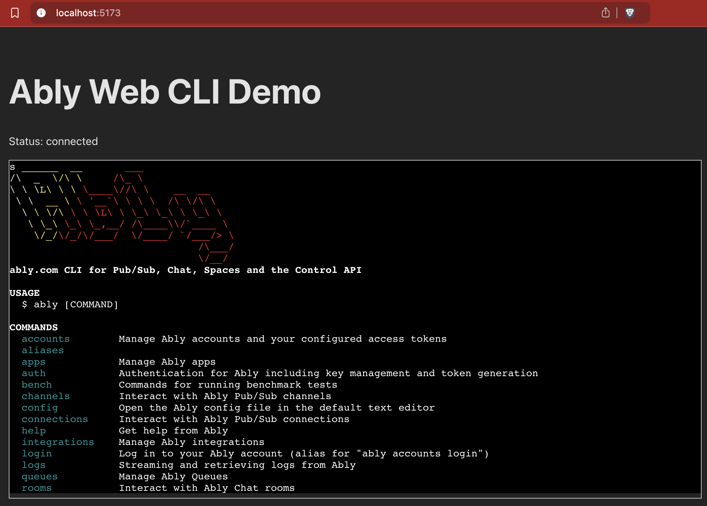

# Ably Web CLI Example

This example demonstrates how to use the `@ably/react-web-cli` component to embed an interactive Ably CLI session within a React web application.

It connects to a local `terminal-server` (provided in the main CLI package) via WebSocket, handles authentication using environment variables or user input, and provides a functional terminal interface powered by Xterm.js.



## Features

- Connects to a WebSocket endpoint for the terminal server.
- Authenticates using `VITE_ABLY_API_KEY` and `VITE_ABLY_ACCESS_TOKEN` environment variables.
- Prompts for API Key and Access Token if environment variables are not set.
- Uses the `@ably/react-web-cli` component to render the terminal.
- Provides a basic "Restart Session" button when the session ends.

## Prerequisites

- Node.js and pnpm installed.
- Docker Desktop running (required by the `terminal-server`).
- The main Ably CLI package built (`pnpm install && pnpm prepare` in the project root).
- The Ably CLI Docker image built (`docker build --no-cache -t ably-cli-sandbox .` in the project root).

## Setup

1. **Environment Variables:**

   - Create a `.env` file in this directory (`examples/web-cli`).
   - Add your Ably credentials:
     ```env
     VITE_ABLY_API_KEY=YOUR_ABLY_API_KEY
     VITE_ABLY_ACCESS_TOKEN=YOUR_ABLY_ACCESS_TOKEN
     VITE_TERMINAL_SERVER_URL=ws://your-custom-server:8080
     ```
   - Replace `YOUR_ABLY_API_KEY` and `YOUR_ABLY_ACCESS_TOKEN` with your actual Ably credentials. You can obtain these from your [Ably dashboard](https://ably.com/dashboard).
   - Optionally specify a custom terminal server URL with `VITE_TERMINAL_SERVER_URL` (defaults to `ws://localhost:8080` if not provided).
   - _Alternatively, you can skip this step and enter the credentials directly in the web UI when prompted._

2. **Install Dependencies:**
   - Navigate to this directory (`examples/web-cli`) in your terminal.
   - Run `pnpm install`. This will also link the local `@ably/react-web-cli` package due to the pnpm workspace setup.

## Running the Example

1. **Start the Terminal Server:**

   - Open a terminal in the **root** of `ably/cli`.
   - Run the command: `pnpm terminal-server`
   - Keep this server running in the background. Ensure Docker Desktop is running.

2. **Start the Web Application:**

   - Open another terminal in **this directory** (`examples/web-cli`).
   - Run the command: `pnpm dev`
   - This will start the Vite development server.

3. **Access the Application:**
   - Open your web browser and navigate to the URL provided by Vite (usually `http://localhost:5173`).
   - If you didn't provide credentials via `.env`, you will be prompted to enter them.
   - Once authenticated, the terminal should connect and display the `$ ` prompt.
   - You can now interact with the Ably CLI (e.g., try `ably --version`). Only `ably` and `exit` commands are permitted.

## Customizing the Terminal Server URL

You can customize the terminal server URL in several ways:

1. **Environment Variable:**
   - Set `VITE_TERMINAL_SERVER_URL` in your `.env` file:
     ```
     VITE_TERMINAL_SERVER_URL=ws://your-custom-server:8080
     ```

2. **Query Parameter:**
   - Append the `serverUrl` parameter to the URL:
     ```
     http://localhost:5173?serverUrl=ws://your-custom-server:8080
     ```
   - This parameter takes precedence over the environment variable.

3. **Default Behavior:**
   - If neither option is provided, the application will default to `ws://localhost:8080`.

This allows for flexible deployment scenarios, including connecting to remote terminal servers or using different ports.

# Using the React Web CLI Component (`@ably/react-web-cli`)

This repository also contains a React component (`@ably/react-web-cli`) that allows you to embed an interactive Ably CLI session directly into your web application. It provides an Xterm.js-based terminal interface that connects to the `terminal-server` via WebSockets.

## Installation
