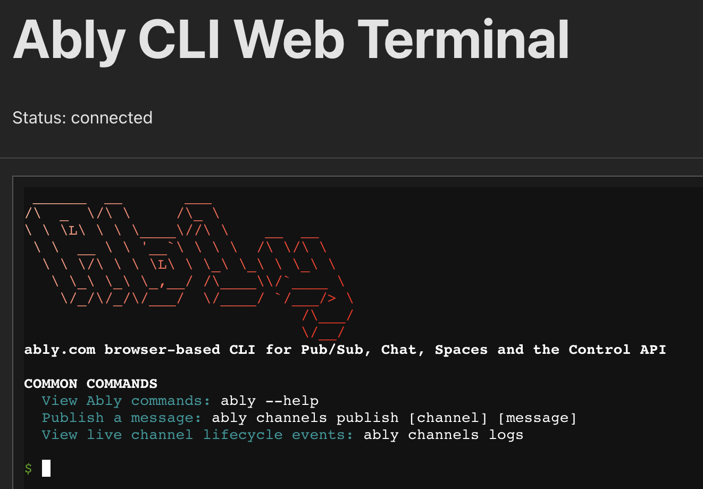

# @ably/react-web-cli


A React component for embedding an interactive Ably CLI terminal in web applications.



## Features

* Embed a **fully-featured Ably CLI** session (xterm.js) inside any React app.
* Secure WebSocket connection to the Ably terminal-server using HMAC-signed authentication with **signedConfig** and **signature**.
* First-class terminal UX:
  * Terminal-native status messages with ANSI colors
  * Animated spinner while (re)connecting
  * Live countdown and clear guidance (press **Enter** to cancel / retry)
  * ASCII modal boxes for important status messages
* Robust connection handling:
  * Automatic exponential-back-off reconnects (0 s, 2 s, 4 s, 8 s …)
  * Configurable maximum reconnection attempts (default: 15) before switching to manual reconnect
  * Proper handling of server-initiated disconnections with specific error codes
* **Session resumption** on page reload or transient network loss (`resumeOnReload`).
* **Split-screen mode** with two independent terminal sessions at once.
* Works in fullscreen or in a resizable drawer (see `examples/web-cli`).
* Written in TypeScript & totally tree-shakable.

## Installation

```bash
# Using npm
npm install @ably/react-web-cli

# Using yarn
yarn add @ably/react-web-cli

# Using pnpm
pnpm add @ably/react-web-cli
```

## Prerequisites

- React 17.0.0 or higher
- A running instance of the Ably CLI terminal server (see [@ably/cli-terminal-server](https://github.com/ably/cli-terminal-server))
- A backend signing endpoint to generate HMAC-signed credentials (see implementation guide below)

## Usage

```tsx
import { useState, useEffect } from "react";
import { AblyCliTerminal } from "@ably/react-web-cli";

export default function MyTerminal() {
  const [status, setStatus] = useState("disconnected");
  const [signedConfig, setSignedConfig] = useState("");
  const [signature, setSignature] = useState("");

  // Sign credentials via your backend endpoint
  // See examples/web-cli/api/sign.ts for implementation reference
  async function signCredentials(apiKey: string) {
    const response = await fetch("/api/sign", {
      method: "POST",
      headers: { "Content-Type": "application/json" },
      body: JSON.stringify({ apiKey }),
    });
    const { signedConfig, signature } = await response.json();
    setSignedConfig(signedConfig);
    setSignature(signature);
  }

  // Authenticate on mount (or when user provides credentials)
  useEffect(() => {
    const apiKey = "YOUR_ABLY_API_KEY"; // Get from user input or config
    signCredentials(apiKey);
  }, []);

  if (!signedConfig || !signature) {
    return <div>Loading...</div>;
  }

  return (
    <div style={{ height: 500 }}>
      <AblyCliTerminal
        websocketUrl="wss://web-cli.ably.com"
        signedConfig={signedConfig}
        signature={signature}
        initialCommand="ably --version"
        onConnectionStatusChange={setStatus}
        onSessionEnd={(reason) => console.log("session ended", reason)}
        onSessionId={(id) => console.log("session id", id)}
        resumeOnReload
        maxReconnectAttempts={15}
      />

      <p>Status: {status}</p>
    </div>
  );
}
```

## Props

| Prop | Type | Required | Default | Description |
|------|------|----------|---------|-------------|
| `websocketUrl` | string | ✅ | - | URL of the WebSocket terminal server |
| `signedConfig` | string | ✅ | - | JSON-encoded signed config containing credentials and metadata (HMAC authenticated) |
| `signature` | string | ✅ | - | HMAC-SHA256 signature of the signedConfig for secure authentication |
| `initialCommand` | string | No | - | Command to run on startup |
| `onConnectionStatusChange` | function | No | - | Callback when connection status changes |
| `onSessionId` | function | No | - | Callback when session ID is received |
| `onSessionEnd` | function | No | - | Callback when session ends |
| `maxReconnectAttempts` | number | No | 15 | Maximum reconnection attempts before giving up |
| `resumeOnReload` | boolean | No | false | Whether to attempt to resume an existing session after page reload |
| `enableSplitScreen` | boolean | No | false | Enable split-screen mode with a second independent terminal |

**Note:** The `signedConfig` and `signature` must be generated by **your backend** using HMAC-SHA256 signing. Never sign credentials in the browser - this would expose your signing secret.

**Reference implementations:**
- **Vercel:** See `examples/web-cli/api/sign.ts` for a serverless function example
- **Node.js:** See `examples/web-cli/server/sign-handler.ts` for the shared signing logic
- **Vite Dev:** See `examples/web-cli/vite.config.ts` for development middleware

Your signing secret must match the terminal server's `SIGNING_SECRET` configuration. Contact your platform team for the secret or refer to the [terminal server documentation](https://github.com/ably/cli-terminal-server).

## Implementing a Signing Endpoint

You **must** implement a backend endpoint to sign credentials. Here's a minimal example:

```typescript
// Example: /api/sign endpoint (Node.js/Express/Vercel)
import crypto from "crypto";

export default function handler(req, res) {
  const { apiKey } = req.body;
  const secret = process.env.SIGNING_SECRET; // From environment variable

  // Build config object
  const config = {
    apiKey,
    timestamp: Date.now(),
  };

  // Sign it with HMAC-SHA256
  const configString = JSON.stringify(config);
  const hmac = crypto.createHmac("sha256", secret);
  hmac.update(configString);
  const signature = hmac.digest("hex");

  res.json({ signedConfig: configString, signature });
}
```

**Security Requirements:**
- ⚠️ **Never** embed your signing secret in client-side code
- ⚠️ **Always** sign on your secure backend server
- ✅ Signing secret must match the terminal server's configuration
- ✅ Use HTTPS in production to protect API keys in transit

**Full implementation examples:**
- See `examples/web-cli/` directory for complete working examples
- Includes Vercel serverless function, Vite dev middleware, and React integration

## Breaking Changes & Migration

### HMAC-Signed Authentication (Breaking Change)

**This is a breaking change.** The authentication mechanism has been updated to use HMAC-signed credentials for improved security.

**Old API (deprecated):**
```tsx
<AblyCliTerminal
  websocketUrl="wss://web-cli.ably.com"
  ablyApiKey="YOUR_ABLY_API_KEY"           // ❌ Removed
  ablyAccessToken="YOUR_ABLY_TOKEN"        // ❌ Removed
  ablyEndpoint="nonprod:sandbox"           // ❌ Removed
  ablyControlHost="staging-control..."     // ❌ Removed
/>
```

**New API (required):**
```tsx
<AblyCliTerminal
  websocketUrl="wss://web-cli.ably.com"
  signedConfig={signedConfig}              // ✅ Required
  signature={signature}                    // ✅ Required
/>
```

**Migration Steps:**

1. **Implement backend signing:** Create a `/api/sign` endpoint on your backend (see "Implementing a Signing Endpoint" section above)
2. **Get signing secret:** Obtain the `SIGNING_SECRET` from your platform team (must match terminal server configuration)
3. **Update your React code:**
   - Remove old props: `ablyApiKey`, `ablyAccessToken`, `ablyEndpoint`, `ablyControlHost`
   - Call your `/api/sign` endpoint to get `signedConfig` and `signature`
   - Pass the signed credentials to `AblyCliTerminal`

**Why this change?**

The new HMAC-signed authentication prevents credential tampering and ensures that configuration settings (like endpoint and control host) are authenticated by the server. This provides better security for embedded terminal sessions.

## Connection States

The component manages several connection states that your application can respond to:

- `initial`: Terminal is initializing
- `connecting`: Attempting to connect to the server
- `connected`: Successfully connected and ready
- `disconnected`: Connection closed by server or manually by user
- `reconnecting`: Attempting to reconnect after a connection drop
- `error`: Connection error or other terminal error

## Server-Initiated Disconnections

The terminal properly handles server-initiated disconnections with specific WebSocket close codes:

| Code | Description | Behavior |
|------|-------------|----------|
| 1000 | Normal closure | Shows reason in terminal, requires manual reconnect |
| 1001 | Server going away | Shows service restart message, requires manual reconnect |
| 1011 | Server error | Shows unexpected condition message, requires manual reconnect |
| 1013 | Service unavailable | Shows service unavailable message, requires manual reconnect |
| 4000 | Generic server disconnect | Shows server-provided reason, requires manual reconnect |
| 4001 | Authentication failed | Shows authentication error with instructions, requires manual reconnect |
| 4008 | Policy violation | Shows auth timeout/format message, requires manual reconnect |
| 4429 | Capacity limit reached | Shows capacity message with CLI install instructions, requires manual reconnect |

For other WebSocket close codes, the terminal will automatically attempt to reconnect using an exponential backoff strategy.

## Session Resumption

When `resumeOnReload` is enabled, the terminal will store the session ID in `sessionStorage` and attempt to resume the session after a page reload. This allows for a seamless experience when navigating away and back to the page.

## Split-Screen Mode

When `enableSplitScreen` is set to `true`, the component displays a split icon in the top-right corner of the terminal. Clicking this icon splits the view into two independent terminal sessions side by side.

Features of split-screen mode:

- Two completely independent terminal sessions sharing the same credentials
- Each terminal has its own tab with a close button
- Both terminals resize automatically to maintain optimal layout
- Status and connection management happens independently for each terminal
- Close either terminal to return to single-pane mode

The feature is designed for developers who need to run multiple commands simultaneously, such as subscribing to a channel in one pane while publishing to it in another.

## Setting Up a Terminal Server

The terminal server required for this component is provided in a separate repository. Please refer to the [@ably/cli-terminal-server](https://github.com/ably/cli-terminal-server) repository for:

- Installation instructions
- Configuration options
- Running the server locally
- Docker deployment instructions

For production use, the Ably Web CLI connects to `wss://web-cli.ably.com` by default, which is a hosted instance of the terminal server.

## Notes

- The terminal requires a container for sizing, so make sure the parent element has a defined height and width.
- The component handles reconnection automatically with exponential backoff.
- Only `ably`, `clear`, and `exit` commands are available in the terminal by default.
- The terminal supports full xterm.js functionality including colors and Unicode.

## Debugging & Verbose Logging

The component ships with a built-in verbose logger that is **disabled by default**.
Enable it in any of the following ways *before* the component mounts:

1. **Query-string flag** – simply add `?cliDebug=true` to the page URL.
  Example: `http://localhost:5173/?cliDebug=true`
  (The flag may be combined with other query parameters.)

2. **Runtime global flag** – from the browser DevTools console run:

```js
window.ABLY_CLI_DEBUG = true;
```

The terminal will now emit detailed lifecycle logs prefixed with
`[AblyCLITerminal DEBUG]`.  Remove the flag or refresh without the query
parameter to return to silent mode.

## Example Project

For a complete example of using this component, see the [web-cli example](https://github.com/ably/ably-cli/tree/main/examples/web-cli) in the Ably CLI repository.

## Development

```bash
# Install dependencies
pnpm install

# Build the package
pnpm build

# Run tests
pnpm test
```

## License

[Apache-2.0](https://github.com/ably/ably-cli/blob/main/LICENSE)
